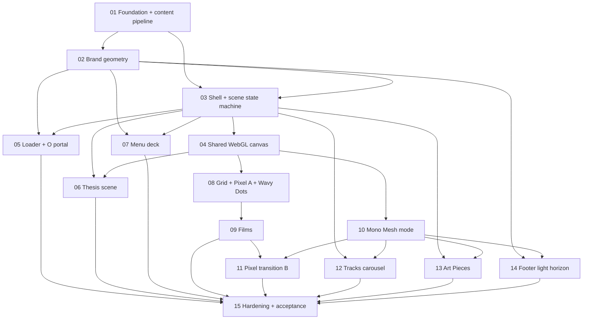

# Ticket breakdown — DROP Immersive Weekly Lens

Fifteen tracer-bullet tickets, one file each, numbered in dependency order. Every ticket is a vertical slice: it cuts through data → component → motion → tests and is demoable on its own. Produced by `/to-tickets` from `docs/spec/drop-immersive-weekly-lens.md`; adversarially reviewed against the master brief before publication.

## Dependency graph

Edges below are exactly the direct "Blocked by" lines in the ticket files — no more, no fewer.

## Working the frontier

Start any ticket whose blockers are all done. After the serial prefix 01 → 02 → 03, wide parallelism opens:

- **05 Loader** needs only 02+03 (it uses its own temporary overlay canvas — see the contract note in ticket 04).
- After **04**: 06 Thesis, 07 Menu deck, the film arc (08 → 09 → 11), and 10 Mono Mesh all run in parallel.
- After **10**: 12 Tracks, 13 Art Pieces, and 14 Footer run in parallel with each other and with the film arc.
- **15 Hardening** integrates everything and owns the cross-scene hand-offs (Pixel B dark beat → Tracks, Tracks→Art mesh continuity, Art→Footer fade).

## Process per ticket

Follow `docs/BUILD-GUIDE.md`: `/tdd` at the three agreed seams, `/code-review` before merge, one branch + PR per ticket, commit to the ticket branch. A ticket is done when its acceptance boxes check and the suite is green.

## Publishing to GitHub Issues

These files are the reviewable source. Once the breakdown is approved, publish each ticket as a GitHub issue in numeric order (blockers first) with the `ready-for-agent` label, wiring blocking edges with GitHub's native issue dependencies — see `docs/agents/issue-tracker.md`. Keep issue titles identical to ticket titles so files and issues stay traceable.
