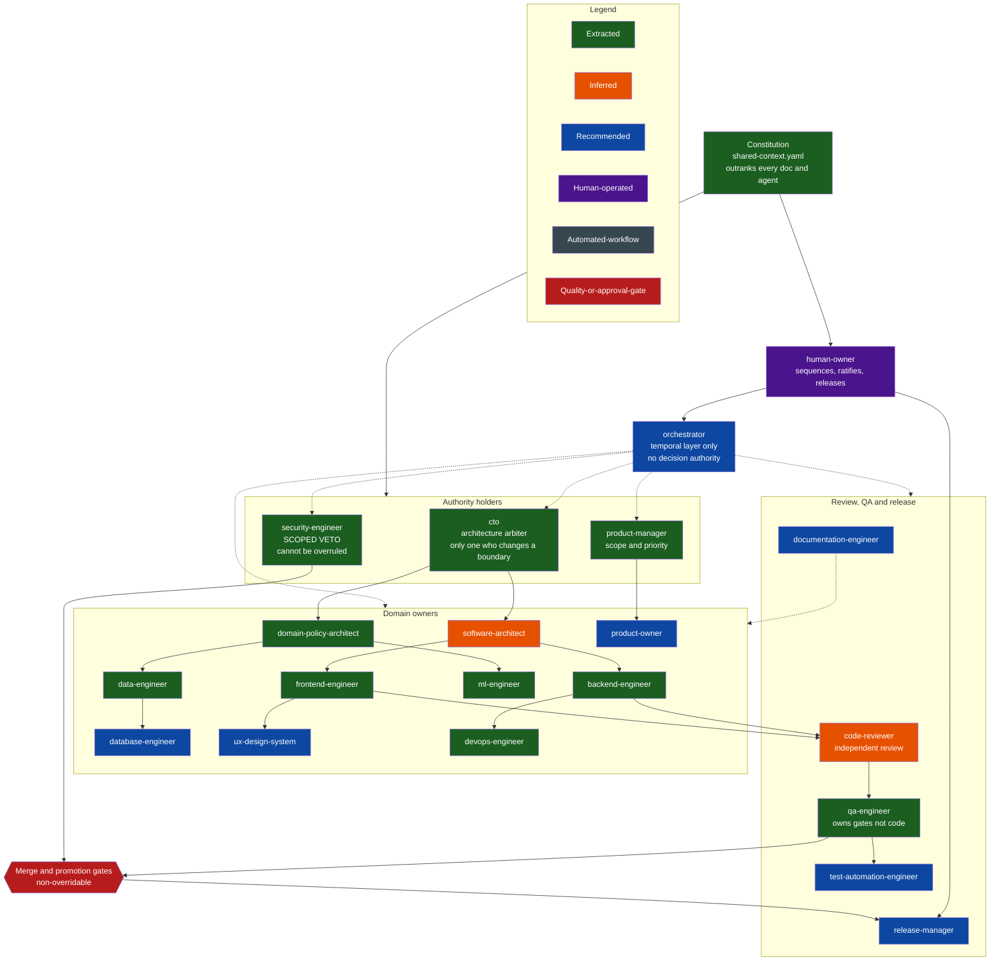
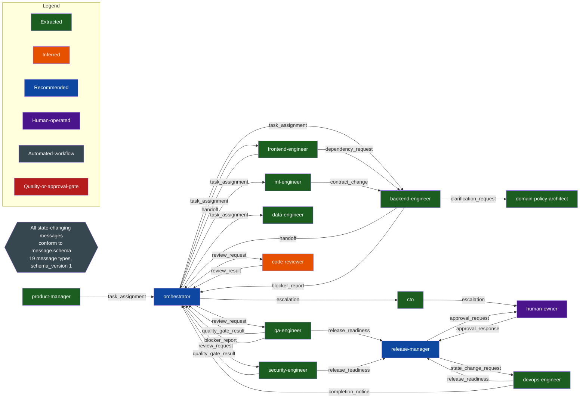
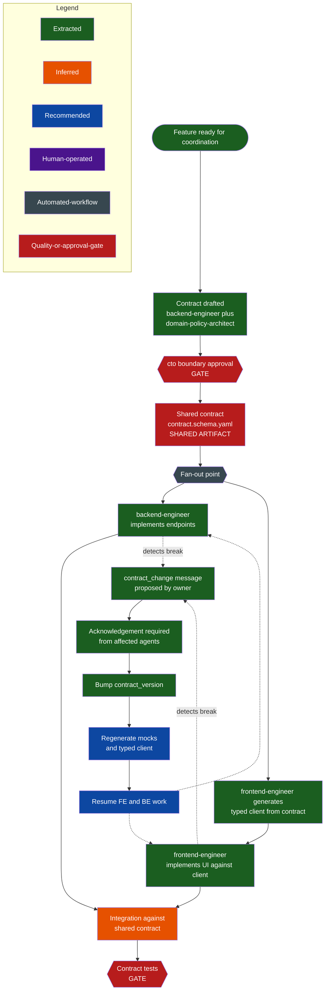
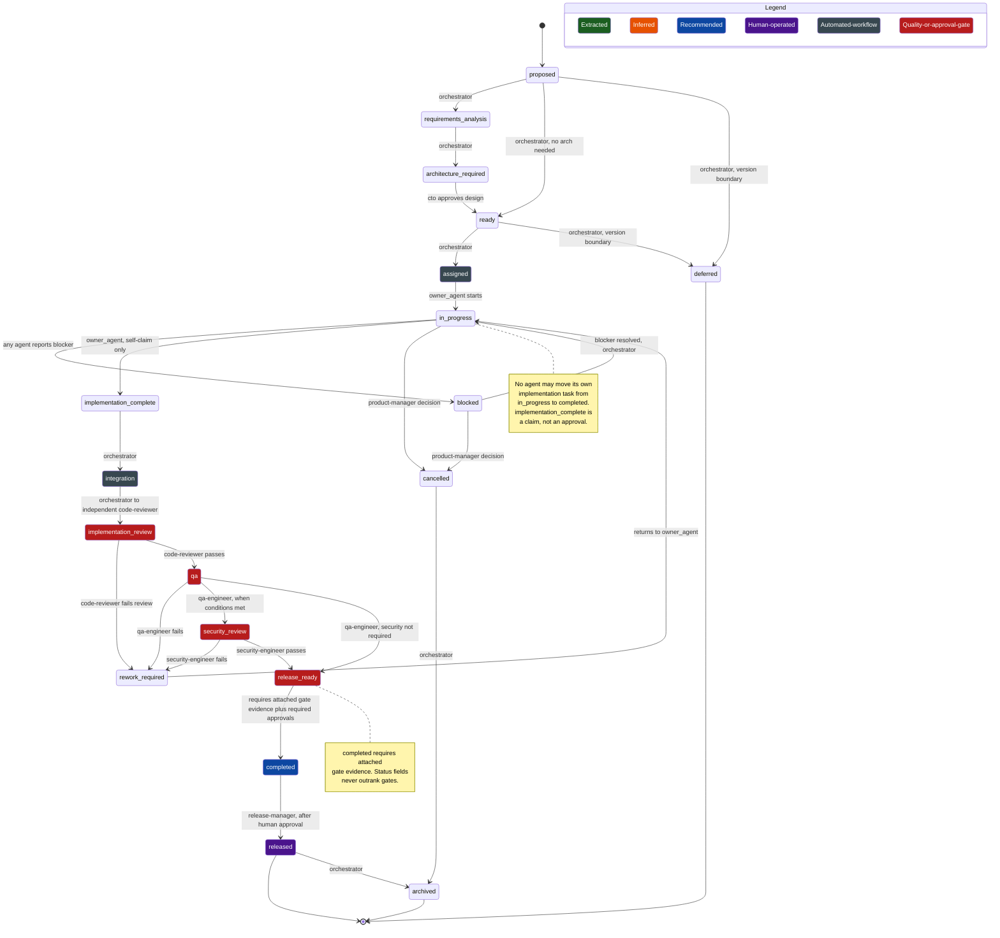
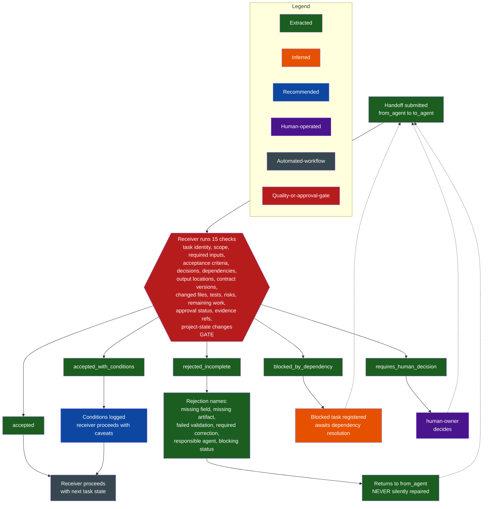
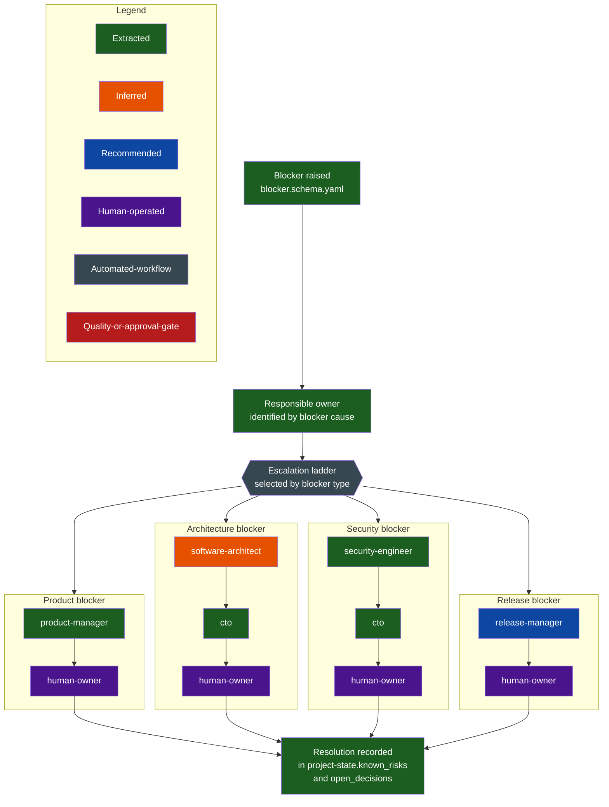
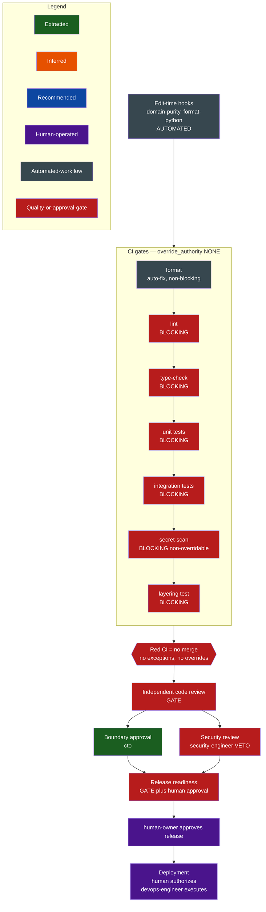
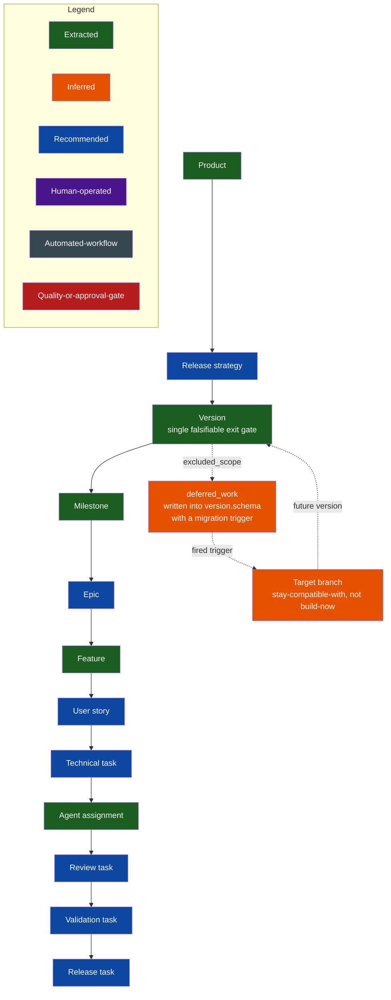
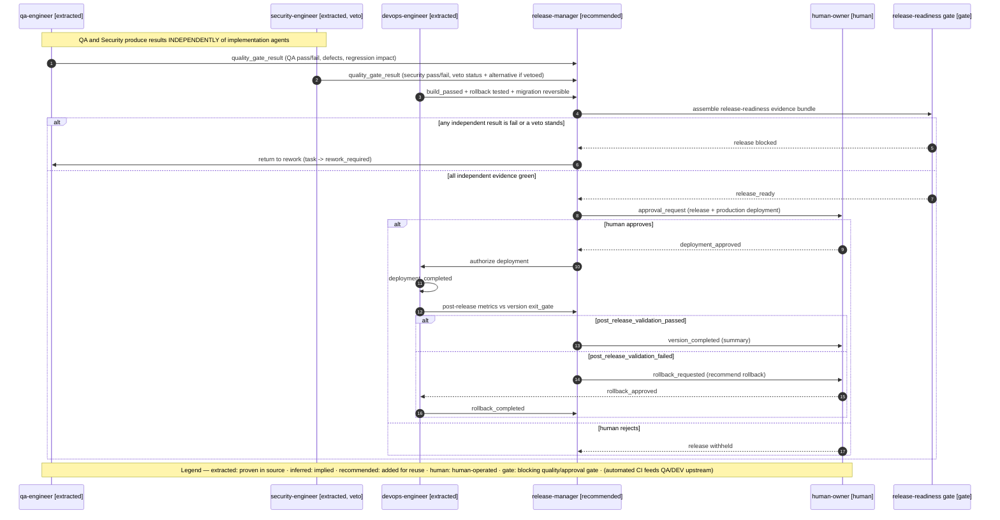

# Virtual Software Organization — Combined Reference
> A single-file, readable compilation of the whole framework. It stitches together the overview, all 18 framework rule documents, the 10 diagrams, and the credit-intelligence worked example. The full package (schemas, templates, fillable state files, and the original evidence) lives in the ZIP.
> Generated: 2026-07-18. Source of truth remains the individual files in the repository.

## Provenance labels used throughout
| Label | Meaning |
|---|---|
| **Extracted** | Directly supported by recorded repository evidence. |
| **Inferred** | Strongly suggested by multiple evidences; not explicitly proven. |
| **Recommended** | A proposed improvement; not present in the source. |
| **Unverified** | Mentioned or suspected; evidence insufficient/contradictory. |
| **Missing** | A needed capability that was searched for but not found. |

## Contents

**PART A — Overview & Setup**
- [1. Framework Overview (README)](#1-framework-overview-readme)
- [2. How to Apply It (USAGE)](#2-how-to-apply-it-usage)
- [3. Extending the Framework (CONTRIBUTING)](#3-extending-the-framework-contributing)
- [4. Change History (CHANGELOG)](#4-change-history-changelog)
- [5. Project Profile — Example (YAML)](#5-project-profile-example-yaml)

**PART B — The Framework Rules (18 method documents)**
- [6. Framework — Index](#6-framework-index)
- [7. 00 · Source Audit Method](#7-00-source-audit-method)
- [8. 01 · Evidence Classification](#8-01-evidence-classification)
- [9. 02 · Canonical Agent Model](#9-02-canonical-agent-model)
- [10. 03 · Communication Architecture](#10-03-communication-architecture)
- [11. 04 · Organization & Authority](#11-04-organization-&-authority)
- [12. 05 · Orchestrator Specification](#12-05-orchestrator-specification)
- [13. 06 · Shared Context Model](#13-06-shared-context-model)
- [14. 07 · Project State Model](#14-07-project-state-model)
- [15. 08 · Message Protocol](#15-08-message-protocol)
- [16. 09 · Handoff Protocol](#16-09-handoff-protocol)
- [17. 10 · Blocker, Escalation & Retry](#17-10-blocker-escalation-&-retry)
- [18. 11 · PRD-to-Production Workflow](#18-11-prd-to-production-workflow)
- [19. 12 · Version & Milestone Model](#19-12-version-&-milestone-model)
- [20. 13 · Contract Governance](#20-13-contract-governance)
- [21. 14 · Quality, Security & Release](#21-14-quality-security-&-release)
- [22. 15 · File Ownership & Parallel Work](#22-15-file-ownership-&-parallel-work)
- [23. 16 · Human Control Model](#23-16-human-control-model)
- [24. 17 · Framework Validation Checklist](#24-17-framework-validation-checklist)

**PART C — Diagrams (Mermaid)**
- [25. Diagram — Organization Chart](#25-diagram-organization-chart)
- [26. Diagram — Communication Network](#26-diagram-communication-network)
- [27. Diagram — PRD to Production](#27-diagram-prd-to-production)
- [28. Diagram — Frontend/Backend Coordination](#28-diagram-frontendbackend-coordination)
- [29. Diagram — Task State Machine](#29-diagram-task-state-machine)
- [30. Diagram — Handoff Validation](#30-diagram-handoff-validation)
- [31. Diagram — Blocker & Escalation](#31-diagram-blocker-&-escalation)
- [32. Diagram — Quality & Approval Gates](#32-diagram-quality-&-approval-gates)
- [33. Diagram — Version & Milestone Breakdown](#33-diagram-version-&-milestone-breakdown)
- [34. Diagram — Release Communication](#34-diagram-release-communication)

**PART D — Worked Example: credit-intelligence**
- [35. Worked Example — System Summary](#35-worked-example-system-summary)
- [36. Worked Example — Agent Inventory](#36-worked-example-agent-inventory)
- [37. Worked Example — Organization & Authority](#37-worked-example-organization-&-authority)
- [38. Worked Example — Orchestrator Config](#38-worked-example-orchestrator-config)
- [39. Worked Example — PRD-to-Production](#39-worked-example-prd-to-production)
- [40. Worked Example — Versions & Milestones](#40-worked-example-versions-&-milestones)
- [41. Worked Example — Quality/Security/Release Gates](#41-worked-example-qualitysecurityrelease-gates)
- [42. Worked Example — Human Approval Model](#42-worked-example-human-approval-model)
- [43. Worked Example — Gaps, Risks & Improvements](#43-worked-example-gaps-risks-&-improvements)
- [44. Worked Example — Claude Code Handoff Prompt](#44-worked-example-claude-code-handoff-prompt)


---

# PART A — Overview & Setup


<a id='1-framework-overview-readme'></a>
## 1. Framework Overview (README)
<sub>source: `README.md`</sub>

# Virtual Software Organization (VSO)

A reusable, technology-independent framework for running software development as an **interconnected
virtual organization of AI agents** — agents that assign and receive tasks, pass work through
validated handoffs, request reviews, return rejected work, report blockers, escalate disagreements,
request human approval, and resume from persistent state, with traceability preserved from PRD
through release.

This is not a collection of role prompts. It is a governance chassis with a drivetrain: a
constitution that outranks every agent, ownership lanes with negative scope, one scoped security
veto, non-overridable quality gates, an orchestrator that coordinates but never decides, and a
persistent task/handoff/state layer that lets multiple agents work in parallel without colliding.

## Where this came from

The framework is **evidence-based**. It was distilled from a prior Claude Code analysis of a real
repository (codenamed `credit-intelligence` — an AI credit-underwriting engine captured at its
documentation-first, pre-code stage, with no git history). That analysis is preserved, audited, and
applied as a single worked reference under `projects/credit-intelligence/`.

Everything in this repository is labeled with one of five provenance classes so you always know what
is proven versus proposed:

| Class | Meaning |
|---|---|
| **Extracted** | Directly supported by recorded repository evidence. |
| **Inferred** | Strongly suggested by multiple evidences; not explicitly proven. |
| **Recommended** | A proposed improvement for the reusable system; not present in the source. |
| **Unverified** | Mentioned or suspected; evidence is insufficient or contradictory. |
| **Missing** | A capability the reusable system needs; searched for, not found in the source. |

**A `Recommended` agent or workflow is never described as something that existed in the source.**
The source repository is treated as *evidence, not as automatically optimal architecture*.

## What is proven vs proposed (one-paragraph honesty note)

The source proved a strong **governance top-half**: a constitution with declared precedence,
ownership lanes with explicit "never touches" scope, a compliance veto the CTO cannot overrule,
architecture-as-ADR with fired-migration-trigger discipline, and completion defined by
non-overridable gates rather than status fields. It was **missing the execution bottom-half**: no
orchestrator, no task/handoff/project-state layer, no release/deploy/rollback tail, and no
per-agent tool permissions. This framework keeps the proven chassis (marked *Extracted*/*Inferred*)
and adds the missing drivetrain (marked *Recommended*), each clearly labeled.

## Repository layout

```
virtual-software-organization/
├── README.md                     # this file
├── USAGE.md                      # how to apply the framework to a project
├── CONTRIBUTING.md               # how to extend framework vs. project layers
├── CHANGELOG.md                  # provenance-tracked change history
├── .gitignore
├── project-profile.example.yaml  # copy → projects/<slug>/project-profile.yaml
│
├── framework/    # 18 reusable, project-independent method documents (00–17 + README)
├── schemas/      # 12 machine-readable schemas for every state-changing artifact
├── templates/    # 15 fillable communication & governance templates
├── diagrams/     # 10 Mermaid diagrams (each with a provenance legend)
└── projects/
    └── credit-intelligence/   # the one worked reference example (evidence source)
        ├── project-profile.yaml
        ├── source-extraction/  # pointer to the READ-ONLY original extraction
        ├── audit/              # source-folder audit + extraction-quality review
        ├── blueprint/          # framework applied to the evidence + Claude Code handoff
        └── state/              # illustrative state/context/log YAML instances
```

- `framework/` — the reusable rules. Project-independent. Start at `framework/README.md`.
- `schemas/` — reusable machine-readable definitions (agent, message, task, handoff, blocker,
  review, approval, quality-gate, project-state, version, contract, event).
- `templates/` — reusable message and governance templates.
- `projects/<slug>/` — project-specific evidence, configuration, and outputs. Never mix
  project-specific claims into the global framework.

## The 19-role organization at a glance

Always-on core: `orchestrator` (coordinates, no authority), `product-manager` (scope), `cto`
(architecture + arbiter), `backend-engineer`, `qa-engineer` (gates), `security-engineer` (scoped
veto), `code-reviewer` (independent review), and the `human-owner`. Conditional specialists —
`software-architect`, `product-owner`, `domain-policy-architect`, `frontend-engineer`,
`ml-engineer`, `data-engineer`, `database-engineer`, `ux-design-system`,
`test-automation-engineer`, `release-manager`, `documentation-engineer` — activate by **project
profile** (`minimal`, `standard`, `high_risk`, `regulated`, `infrastructure_heavy`,
`frontend_only`, `backend_only`, `mobile`, `data_or_ai`, `experimental`). See
`framework/02-canonical-agent-model.md`.

## Non-negotiable invariants

1. The constitution outranks every document and every agent.
2. Every decision has exactly one owner.
3. Implementation and final approval are separate roles — no self-approval.
4. The orchestrator coordinates but holds **no** decision authority.
5. The `security-engineer` holds one scoped veto the arbiter cannot overrule (and it must ship with
   an alternative).
6. A task reaches `completed` only with attached gate evidence — gates outrank status.
7. A failed blocking gate stops progress; no one overrides it.
8. High-risk actions require human approval.
9. Interrupted work resumes from persistent, machine-readable state.
10. An incomplete handoff is never silently repaired.

## Quick start

1. Read `USAGE.md`.
2. Copy `project-profile.example.yaml` to `projects/<your-slug>/project-profile.yaml` and pick a
   profile.
3. Fill `projects/<your-slug>/state/shared-context.yaml` from your PRD.
4. Hand `projects/<your-slug>/blueprint/claude-code-handoff-prompt.md` to Claude Code to scaffold
   the runtime (agents, hooks, commands, skills, schemas, state) on a dedicated framework branch.
5. Drive the PRD-to-production workflow in `framework/11-prd-to-production-workflow.md`.

See `projects/credit-intelligence/` for a complete worked example.


<a id='2-how-to-apply-it-usage'></a>
## 2. How to Apply It (USAGE)
<sub>source: `USAGE.md`</sub>

# USAGE — Applying the Virtual Software Organization to a Project

This guide explains how to take the reusable framework and stand up a governed, multi-agent
development organization for one project — and how to run one project without forking the global
framework for every new one.

## Mental model

- `framework/`, `schemas/`, `templates/`, `diagrams/` are **global and read-mostly**. You reuse
  them across every project. You do not edit them per project.
- `projects/<slug>/` is **per-project**. It holds the project profile, the shared context
  (constitution) filled from your PRD, the live project state, and the blueprint that records how
  the framework is configured for this project.
- A **project profile** decides which agents, gates, and human approvals are active. This is how a
  small project avoids inheriting a large or high-risk organization.

## Step 1 — Create the project

```
mkdir -p projects/<slug>/{audit,blueprint,state,source-extraction}
cp project-profile.example.yaml projects/<slug>/project-profile.yaml
```

Edit `projects/<slug>/project-profile.yaml`:
- Set `project.slug`, `project.name`, `target_application_repository` (or `UNKNOWN`).
- Choose one `profile` (see Step 2).
- Confirm the activated agents/gates/approvals, or override per-project.

## Step 2 — Choose a project profile

Profiles are defined in `framework/02-canonical-agent-model.md` and
`project-profile.example.yaml`. Pick the closest, then adjust:

| Profile | Use when | Adds beyond core |
|---|---|---|
| `minimal` | small tool, one surface, low risk | (core only) |
| `standard` | typical product with UI + API | frontend, devops, release-manager, software-architect (opt) |
| `high_risk` | money, safety, irreversible actions | documentation-engineer; all human approvals on |
| `regulated` | legal/compliance obligations | elevated security + documentation; audit evidence |
| `infrastructure_heavy` | lots of infra, migrations, IaC | devops (elevated), database-engineer, release-manager |
| `frontend_only` | UI library / static site | frontend, ux-design-system; accessibility blocking |
| `backend_only` | service/API, no UI | backend, database-engineer |
| `mobile` | iOS/Android app | frontend (mobile), ux-design-system; store-release checks |
| `data_or_ai` | data pipelines / ML | ml-engineer, data-engineer, database-engineer; leakage/replay/stability/fairness gates |
| `experimental` | spike / throwaway | core minus release-manager; relaxed, non-blocking gates |

Always-on core (every profile): `orchestrator`, `product-manager`, `cto`, an implementation lane,
`qa-engineer`, `security-engineer`, `code-reviewer`, `human-owner`.

## Step 3 — Fill the shared context (constitution) from your PRD

Copy the section list from `framework/06-shared-context-model.md` into
`projects/<slug>/state/shared-context.yaml`. Fill: product overview, PRD, approved scope, goals &
non-goals, user journeys, business rules, acceptance criteria, architecture decisions, API/database
contracts, coding/testing/security standards, git/deployment/release rules, known risks, approved
assumptions. Each section has a **primary owner and required reviewers** — keep those.

The constitution outranks everything. If a later document disagrees with it, that document is a bug.

## Step 4 — Initialize project state

Create `projects/<slug>/state/project-state.yaml` from `schemas/project-state.schema.yaml`, plus
`decision-log.yaml`, `risk-register.yaml`, `contract-registry.yaml`, and `approval-log.yaml`. These
are the persistent, machine-readable memory that lets work resume after an interruption and prevents
duplicate work. Only the `orchestrator` writes coordination fields; approval, gate, security, and
release fields are written by their authorities.

## Step 5 — Scaffold the runtime with Claude Code

Open `projects/<slug>/blueprint/claude-code-handoff-prompt.md`. It is a **self-contained** prompt
that instructs Claude Code to implement the runtime for this project: agents (only where justified),
deterministic behavior as commands/hooks/workflows/validators, skills where reusable reasoning is
needed, the schemas, the shared-context files, the project-state files, message and handoff
validation, blocker/escalation/retry handling, quality-gate enforcement, human-approval
checkpoints, and file-ownership protection — on a dedicated framework branch, with atomic commits,
and **without modifying application code**.

## Step 6 — Run the PRD-to-production workflow

Drive the lifecycle in `framework/11-prd-to-production-workflow.md`:

> PRD → requirements audit → clarification & assumptions → scope approval → release strategy →
> version planning → architecture → contract definition → milestone planning → feature/task
> decomposition → dependency mapping → agent assignment → implementation → integration → code
> review → automated testing → QA → security review → release preparation → **human approval** →
> deployment → post-release validation → closure & lessons learned.

Each stage names its responsible agent, entry/exit criteria, handoff artifact, quality gate, human
approval, and failure/retry/escalation paths. Parallel work is permitted only after contracts and
file ownership are established (`framework/13-contract-governance.md`,
`framework/15-file-ownership-and-parallel-work.md`).

## Step 7 — Operate: handoffs, blockers, retries, approvals

- **Handoffs** are validated, not trusted. The receiver returns exactly one status; an incomplete
  handoff is rejected, never silently repaired (`framework/09-handoff-protocol.md`).
- **Blockers** always have an owner and an escalation path
  (`framework/10-blocker-escalation-and-retry.md`).
- **Failed reviews** return the task to the responsible agent; retry history is recorded in project
  state.
- **Human approvals** are requested as decision-ready summaries, never raw agent chatter
  (`framework/16-human-control-model.md`).

## Running multiple projects

Each project lives under its own `projects/<slug>/`. The global framework, schemas, templates, and
diagrams are shared unchanged. Per-project differences live entirely in the profile, the shared
context, the contract registry, the state, and the risk/approval configuration. Do not copy or fork
`framework/` per project.

## Reruns when the extraction or PRD changes (idempotent operation)

When source material changes, do not regenerate everything blindly. Detect changed/new/removed
inputs, preserve prior human-approved decisions, update the audit, mark affected conclusions stale,
re-evaluate dependents, update traceability, add a `CHANGELOG.md` entry, and request human review
for material blueprint changes. See `CONTRIBUTING.md` → "Idempotent reruns".

## Validate before you trust it

Run the checklist in `framework/17-framework-validation-checklist.md` before relying on any
configured project: every active agent has incoming/outgoing communication rules, every task has an
owner and an independent reviewer, every handoff is validated, every blocker has an escalation path,
failed gates stop progress, high-risk actions require human approval, and agents cannot approve
their own final work.


<a id='3-extending-the-framework-contributing'></a>
## 3. Extending the Framework (CONTRIBUTING)
<sub>source: `CONTRIBUTING.md`</sub>

# CONTRIBUTING

This repository has two layers with different rules. Read this before changing anything.

## The two layers

1. **Global framework layer** — `framework/`, `schemas/`, `templates/`, `diagrams/`, and the
   top-level docs. Project-independent and reusable. Changes here affect every project.
2. **Project layer** — `projects/<slug>/`. Project-specific evidence, configuration, and outputs.

**Never mix project-specific claims into the global framework layer without explicit review.** If a
useful pattern emerges in a project, promote it deliberately: generalize it, strip project nouns,
label its provenance, and review it as a framework change.

## Provenance discipline (the most important rule)

Every claim about the source system carries exactly one of five classes: **Extracted**,
**Inferred**, **Recommended**, **Unverified**, **Missing** (defined in
`framework/01-evidence-classification.md`). Rules:

- A `Recommended` agent, workflow, or capability is **never** written as if it existed in the
  source.
- Do not upgrade a classification without new evidence. The source had **no git history**, so any
  commit/branch/tag/release/authorship claim is `Unverified` by construction — leave it that way.
- Classified items carry `classification`, `evidence_refs`, `confidence` (high|medium|low), and
  `notes`.
- The orchestrator (or any agent) must not rewrite evidence classifications.

## Editing the framework layer

- Keep it technology-stack independent. No language-, cloud-, or vendor-specific assumptions in
  `framework/` or `schemas/`.
- Prefer simple governance over adding agents. Before adding a role, check whether the function
  should instead be a deterministic workflow (no reasoning needed) or a quality gate.
- Preserve the invariants in `framework/README.md` §"invariants". In particular: separation of
  implementation and approval, the orchestrator's lack of decision authority, the scoped security
  veto, gates-over-status, and non-overridable blocking gates.
- Schema changes bump `schema_version` and are noted in `CHANGELOG.md`.
- Diagram changes keep the six-way legend (Extracted / Inferred / Recommended / Human / Automated /
  Gate) and the shared `classDef` colors.

## Editing a project layer

- Treat the source extraction as **read-only**. Do not overwrite or delete source evidence.
- Do not commit secrets, credentials, tokens, personal data, or proprietary source. If the
  extraction contains sensitive content, keep it local or excluded via `.gitignore`.
- Project state and logs are append-only where they record consequential decisions.

## Commits and review

- Work on a dedicated branch (e.g. `framework/<change>` or `project/<slug>/<change>`).
- Produce **reviewable, atomic commits** — one logical change each. A large unreviewable commit is
  approved, not reviewed; this framework exists to prevent exactly that.
- All generated work must be reviewable through Git.
- Application code is out of scope for this repository. If a change would touch a target
  application's code, stop and request human approval first.

## Idempotent reruns

When source material or a PRD changes, do not regenerate the whole system blindly:

1. Detect changed, new, and removed source documents.
2. Preserve prior human-approved outputs and decisions.
3. Update the source audit (`projects/<slug>/audit/`).
4. Mark affected conclusions **stale** rather than silently rewriting them.
5. Re-evaluate dependent findings and update the traceability matrix.
6. Add a `CHANGELOG.md` entry and generate a change summary.
7. Request human review for material blueprint changes.

## Definition of done for a contribution

A change is done when: it carries correct provenance labels; it preserves the invariants; schemas
validate and cross-references resolve; diagrams render with a legend; the framework/project
separation is intact; no secrets are exposed; and it is delivered as atomic, reviewable commits.


<a id='4-change-history-changelog'></a>
## 4. Change History (CHANGELOG)
<sub>source: `CHANGELOG.md`</sub>

# Changelog

All notable changes to the Virtual Software Organization framework are recorded here. Because this
framework is evidence-based, changes note whether they affect **Extracted**, **Inferred**, or
**Recommended** material, and whether any evidence classification changed.

The format is loosely based on Keep a Changelog. Schema-affecting changes bump the relevant
`schema_version`.

## [0.1.0] — 2026-07-13

Initial framework release, distilled from the `credit-intelligence` extraction (documentation-first
repository, no git history).

### Added — framework layer
- 18 method documents in `framework/` (`00`–`17` + `README.md`): source-audit method, evidence
  classification, canonical agent model, communication architecture, organization & authority,
  orchestrator specification, shared-context model, project-state model, message protocol, handoff
  protocol, blocker/escalation/retry, PRD-to-production workflow, version & milestone model,
  contract governance, quality/security/release, file ownership & parallel work, human-control
  model, framework validation checklist.
- 12 machine-readable schemas in `schemas/` (`schema_version: 1`): agent, message, task, handoff,
  blocker, review, approval, quality-gate, project-state, version, contract, event.
- 15 fillable templates in `templates/`.
- 10 Mermaid diagrams in `diagrams/`, each with a six-way provenance legend.
- Top-level `README.md`, `USAGE.md`, `CONTRIBUTING.md`, `.gitignore`, `project-profile.example.yaml`.

### Added — project layer (reference example)
- `projects/credit-intelligence/`: source-folder audit, extraction-quality review, contradictions &
  unverified findings, follow-up investigation tasks, a 16-part blueprint, a self-contained Claude
  Code handoff prompt, and illustrative state/context/log YAML instances.

### Provenance notes
- The 10-role real roster is **Extracted** (three roles renamed for reuse: credit-architect →
  `domain-policy-architect`, ai-engineer → `ml-engineer`, security-architect → `security-engineer`).
- The `orchestrator`, `release-manager`, `product-owner`, `database-engineer`,
  `test-automation-engineer`, `documentation-engineer`, and `ux-design-system` roles are
  **Recommended** additions — they did not exist in the source.
- `software-architect` (split from cto) and `code-reviewer` (formalized from the review system) are
  **Inferred**.
- All version/release history is **Unverified** (source had no git history).
- The task/handoff/project-state layer, the release/deploy/rollback tail, and per-agent tool
  permissions are **Recommended** (they were **Missing** from the source).

### Known limitations carried forward
- The source's execution half was never exercised (no code, no PRD run), so effectiveness in real
  multi-agent operation is `Unverified`, not proven.
- Automation metrics from the source (~37% weighted; 1 of 21 stages fully automated) are
  method-dependent and reproduced with that caveat.


<a id='5-project-profile-example-yaml'></a>
## 5. Project Profile — Example (YAML)
<sub>source: `project-profile.example.yaml`</sub>

# =============================================================================
# Project Profile (EXAMPLE) — copy to projects/<slug>/project-profile.yaml
# =============================================================================
# The project profile decides which agents, gates, and human approvals are
# active for ONE project, so a small project does not inherit a large or
# high-risk organization. The global framework is never forked per project;
# per-project variation lives here and in projects/<slug>/state/.
#
# schema_version follows the framework release; see CHANGELOG.md.
schema_version: 1

project:
  slug: "example-project"                 # kebab-case; matches projects/<slug>/
  name: "Example Project"                 # human-readable
  source_extraction_path: "UNKNOWN"       # path to a prior extraction, or UNKNOWN
  output_repository_path: "UNKNOWN"       # where framework runtime is scaffolded, or UNKNOWN
  target_application_repository: "UNKNOWN" # the app repo this org will build, or UNKNOWN

# One of: minimal | standard | high_risk | regulated | infrastructure_heavy |
#         frontend_only | backend_only | mobile | data_or_ai | experimental
profile: "standard"

# -----------------------------------------------------------------------------
# Agent activation. Core is always on. Conditional specialists activate by
# profile; override here when the default does not fit. Values: active |
# conditional | off. (Provenance in framework/02-canonical-agent-model.md.)
# -----------------------------------------------------------------------------
agents:
  # --- always-on core ---
  orchestrator: active            # Recommended: coordinates, no decision authority
  product-manager: active         # Extracted: owns scope & priority
  cto: active                     # Extracted: architecture authority + arbiter
  qa-engineer: active             # Extracted: owns merge/promotion gates
  security-engineer: active       # Extracted: scoped veto holder
  code-reviewer: active           # Inferred: independent reviewer
  backend-engineer: active        # Extracted: default implementation lane
  # human-owner is implicit and always present (sequencing, merges, release approval)

  # --- conditional specialists (defaults shown for "standard") ---
  software-architect: conditional # Inferred: split from cto at scale
  product-owner: off              # Recommended: carve from PM at scale
  domain-policy-architect: conditional # Extracted: activate when domain decision logic exists
  frontend-engineer: active       # Extracted
  ml-engineer: off                # Extracted (renamed): data_or_ai profile
  data-engineer: off              # Extracted: data_or_ai / infrastructure_heavy
  database-engineer: conditional  # Recommended: activate for heavy schema/migration work
  ux-design-system: off           # Recommended: frontend_only / mobile
  test-automation-engineer: off   # Recommended: when the suite outgrows QA
  devops-engineer: active         # Extracted
  release-manager: active         # Recommended: ship/no-ship authority (off for experimental)
  documentation-engineer: off     # Recommended: high_risk / regulated

# -----------------------------------------------------------------------------
# Quality gates. blocking gates stop progress on failure and are non-overridable
# for CI-stage checks (override_authority: none). Toggle per project; do not set
# CI-stage blocking gates to non-blocking without human sign-off.
# -----------------------------------------------------------------------------
gates:
  requirement_validation: { enabled: true,  blocking: true }
  architecture_review:     { enabled: true,  blocking: true }
  format:                  { enabled: true,  blocking: false } # auto-fix
  lint:                    { enabled: true,  blocking: true }
  type_check:              { enabled: true,  blocking: true }
  unit_tests:              { enabled: true,  blocking: true }
  integration_tests:       { enabled: true,  blocking: true }
  contract_tests:          { enabled: true,  blocking: true }
  e2e_tests:               { enabled: false, blocking: false } # enable for standard+ with UI
  visual_qa:               { enabled: false, blocking: false }
  accessibility:           { enabled: false, blocking: false } # blocking for frontend_only/mobile
  performance:             { enabled: false, blocking: false }
  security_review:         { enabled: true,  blocking: true, override_authority: "none" }
  dependency_check:        { enabled: true,  blocking: true }
  secret_scan:             { enabled: true,  blocking: true, override_authority: "none" }
  migration_validation:    { enabled: false, blocking: true } # enable when a DB exists
  build_verification:      { enabled: true,  blocking: true }
  documentation_completeness: { enabled: false, blocking: false }
  release_readiness:       { enabled: true,  blocking: true, human_approval_required: true }
  deployment_verification: { enabled: true,  blocking: true, human_approval_required: true }
  post_release_validation: { enabled: true,  blocking: true }
  # Domain-correctness gates: project-defined checks that catch "looks-better-when-broken"
  # failures (e.g. data leakage, decision replay, explanation stability, monotonicity).
  domain_correctness:      { enabled: false, blocking: true, defined_in: "state/shared-context.yaml" }

# -----------------------------------------------------------------------------
# Human control points. true = human approval required before proceeding.
# (See framework/16-human-control-model.md.)
# -----------------------------------------------------------------------------
human_approvals:
  product_scope_change: true
  high_risk_assumption: true
  major_architecture_decision: true
  new_external_dependency: true
  destructive_migration: true
  authentication_change: true
  authorization_change: true
  sensitive_data_change: true
  security_exception: true
  production_deployment: true
  production_rollback: true
  release_approval: true
  critical_gate_override: true

# -----------------------------------------------------------------------------
# Retry / escalation thresholds (configurable per project).
# -----------------------------------------------------------------------------
retry:
  max_review_retries: 2           # after N failed reviews, escalate
  escalate_to: ["software-architect", "cto", "product-manager", "human-owner"]
  record_retry_history: true      # persisted in project-state.yaml

# -----------------------------------------------------------------------------
# The one scoped veto. Name the single existential-compliance question for this
# project. If none exists, say so — do not invent one.
# -----------------------------------------------------------------------------
scoped_veto:
  holder: "security-engineer"
  question: "<the single legally/existentially fatal question, e.g. 'does any design move raw regulated data across the tenant boundary?'>"
  cannot_be_overruled_by: ["cto", "orchestrator"]
  requires_alternative: true      # a veto must ship with an alternative
  recorded_as: "decision-log.yaml (ADR-style)"


---

# PART B — The Framework Rules (18 method documents)


<a id='6-framework-index'></a>
## 6. Framework — Index
<sub>source: `framework/README.md`</sub>

# The Framework Layer — Index

**Purpose.** This is the reusable, project-independent core of the Virtual Software Organization
(VSO): the method, the vocabulary, and the rules that let a set of AI agents run software
development as a real organization — assigning work, validating handoffs, gating completion, and
escalating to a human — without being tied to any one product, language, or stack.

> **Provenance banner.** Reusable / project-independent. Claims about the source carry
> Extracted / Inferred / Recommended / Unverified / Missing labels.

## What the framework layer is (and is not)

The `framework/` directory holds the *thinking*. Its sibling directories hold the *machinery* the
thinking produces: `schemas/` (machine-readable artifact definitions), `templates/` (fillable
communication and governance documents), and `diagrams/` (Mermaid pictures of the same structure).
Everything here is written to be lifted whole into a new project of any technology. Nothing here
names a credit product, a Python module, or a specific regulation; when a concrete example is
unavoidable it lives in `projects/credit-intelligence/`, never in these docs.

Two ideas hold the layer together. First, **an organization is defined by its authority, not its
hierarchy** — who owns which *kind of decision*, who may approve it, and who may never approve it.
Second, **every claim about how the source really worked is labeled**, so a reader can always
separate what was proven from what is proposed. The framework is deliberately more than a pile of
role prompts: it is a governance chassis (constitution, lanes, veto, gates, review) welded to a
drivetrain (orchestration, task/handoff/state, release), each part traceable to evidence or marked
as a recommended addition.

The framework is not a runtime, not a client deliverable, and not a description of the source
repository. The source (`credit-intelligence`) is *evidence for what patterns work*, cited but
never treated as automatically optimal.

## Reading order (00 → 17)

Read the method top-to-bottom the first time; after that, treat it as reference. The numbering
encodes dependency — earlier documents fix the vocabulary that later ones consume.

| # | Document | What it fixes |
|---|---|---|
| 00 | `00-source-audit-method.md` | How to audit a prior extraction *before* building on it. The discipline that produced everything downstream. |
| 01 | `01-evidence-classification.md` | The five provenance labels and the classified-item block every other doc uses. The backbone. |
| 02 | `02-canonical-agent-model.md` | The 19-role roster, lifecycle/classification vocabularies, per-role dispositions, overlap rulings, activation matrix. The heart of the org. |
| 03 | `03-communication-architecture.md` | How the agents form one interconnected network: messages, handoffs, events, state, and who may talk to whom. |
| 04 | `04-organization-and-authority.md` | Authority over question types; the responsibility, decision-authority, approval, escalation, and separation-of-duties matrices. |
| 05 | `05-orchestrator-specification.md` | What coordinated the source (nothing dedicated), and the reusable orchestrator's charter and hard limits. |
| 06 | `06-shared-context-model.md` | The constitution that outranks everything; shared-context sections and their section-level owners. |
| 07 | `07-project-state-model.md` | Persistent, machine-readable project state; interrupted-session recovery; field-level ownership. |
| 08 | `08-message-protocol.md` | The message envelope, the 19 message types, and per-agent communication rules. |
| 09 | `09-handoff-protocol.md` | The one handoff format, its 15-item validation, and the five accept/reject outcomes. |
| 10 | `10-blocker-escalation-and-retry.md` | Blockers, escalation ladders that always end at a human, and the retry/rework loop. |
| 11 | `11-prd-to-production-workflow.md` | The original path and the optimized reusable lifecycle, stage by stage, plus events. |
| 12 | `12-version-and-milestone-model.md` | Versions as falsifiable exit gates; the planning hierarchy; deferral and closure rules. |
| 13 | `13-contract-governance.md` | Contract-first parallel work and the cross-lane coordination pairs. |
| 14 | `14-quality-security-and-release.md` | The canonical gate set, the scoped security veto, and release readiness. |
| 15 | `15-file-ownership-and-parallel-work.md` | The file-ownership matrix and the branch/merge rules that make parallelism safe. |
| 16 | `16-human-control-model.md` | The four decision classes and the mandatory human-approval checkpoints. |
| 17 | `17-framework-validation-checklist.md` | The reusable self-check an independent reviewer runs before trusting a configured project. |

If you only read three, read `01`, `02`, and `04`: labels, roles, authority.

## The five provenance labels

Every assertion about the source — every agent, workflow, responsibility, gate, or gap — carries
exactly one of these. Ordinary explanatory prose does not. `01-evidence-classification.md` is the
full treatment; this is the index-level summary.

| Label | Use it when… | Maps from source's own labels |
|---|---|---|
| **Extracted** | The claim is directly supported by recorded repository evidence. | "Explicit repository fact" |
| **Inferred** | Multiple evidences strongly suggest it, but it is not explicitly proven. | "Strong inference" / "Weak inference" |
| **Recommended** | A proposed improvement for the reusable system; it was *not* in the source. | "Recommended improvement/addition" |
| **Unverified** | Mentioned or suspected, but evidence is insufficient or contradictory. | "Could not verify" |
| **Missing** | The reusable system needs it; it was searched for and not found. | "Not found" |

The source repository had **no git history**, so any claim about a commit, branch, tag, release, or
authorship is **Unverified by construction** — no evidence could exist. And a **Recommended** agent
or workflow is *never* described as something that existed in the source. These two rules are
load-bearing everywhere.

## How the docs map to schemas, templates, and diagrams

The framework docs state the rules; the schemas make them machine-checkable; the templates make
them fillable; the diagrams make them legible at a glance.

| Framework doc | Schemas (`schemas/`) | Templates (`templates/`) | Diagrams (`diagrams/`) |
|---|---|---|---|
| 02 agent model | `agent.schema.yaml` | `agent-definition-template.md` | `organization.mmd` |
| 03 communication | `message.schema.yaml`, `event.schema.yaml` | `agent-message-template.md` | `communication-network.mmd` |
| 04 authority | `agent.schema.yaml`, `approval.schema.yaml` | `escalation-template.md`, `human-approval-request-template.md` | `organization.mmd` |
| 05 orchestrator | `project-state.schema.yaml` | `task-assignment-template.md` | `communication-network.mmd` |
| 06 shared context | (described in-doc; instances in `state/shared-context.yaml`) | — | — |
| 07 project state | `project-state.schema.yaml` | — | — |
| 08 message protocol | `message.schema.yaml` | `agent-message-template.md`, `clarification-request-template.md`, `review-request-template.md`, `review-result-template.md` | `communication-network.mmd` |
| 09 handoff | `handoff.schema.yaml` | `agent-handoff-template.md` | `handoff-validation.mmd` |
| 10 blocker/escalation/retry | `blocker.schema.yaml` | `blocker-report-template.md`, `escalation-template.md` | `blocker-escalation.mmd` |
| 11 PRD-to-production | `task.schema.yaml`, `handoff.schema.yaml`, `contract.schema.yaml`, `event.schema.yaml` | (most templates) | `prd-to-production.mmd`, `task-state-machine.mmd` |
| 12 versions/milestones | `version.schema.yaml` | — | `version-milestone-breakdown.mmd` |
| 13 contract governance | `contract.schema.yaml` | `contract-change-template.md` | `frontend-backend-coordination.mmd` |
| 14 quality/security/release | `quality-gate.schema.yaml`, `review.schema.yaml`, `approval.schema.yaml` | `qa-report-template.md`, `security-report-template.md`, `release-readiness-template.md`, `post-release-report-template.md` | `quality-approval-gates.mmd`, `release-communication.mmd` |
| 15 file ownership | `agent.schema.yaml`, `task.schema.yaml` | — | — |
| 16 human control | `approval.schema.yaml` | `human-approval-request-template.md` | — |

Two schemas — `agent.schema.yaml` and `quality-gate.schema.yaml` — are *partially extracted* (a real
source kernel plus a formalized shape). The other ten are **Recommended**: the source coordinated
through prose documents, not structured state, so `task`, `handoff`, `project-state`, `message`,
`event`, `blocker`, `review`, `approval`, `version`, and `contract` are additions this framework
contributes. Every schema states its own provenance in its top comment.

## The non-negotiable invariants

These hold across *every* file in the framework. A generated document that violates one is a bug,
not a variation. This list is the canonical short form; each document owns the full statement.

1. **Constitution supremacy.** A shared constitution outranks every document and every agent; a doc
   that disagrees with it is a bug (`06`).
2. **Single owner per decision.** Every decision has exactly one owner in the decision-authority
   matrix (`04`).
3. **Separation of duties.** Implementation and final approval are different roles; no agent moves
   its own implementation task from `in_progress` to any approval or `completed` state (`08`, `04`).
4. **Orchestrator holds no decision authority.** It schedules, tracks, validates form, and requests
   approvals; it may not approve its own work, set or reprioritize scope, approve architecture,
   override a failed blocking gate, approve a security exception or deployment, suppress reviewer
   findings, mark incomplete work complete, or rewrite classifications (`05`).
5. **The scoped security veto.** The `security-engineer` may veto the one defined
   existential-compliance question; the `cto`/arbiter cannot overrule it; it must ship *with an
   alternative*; it is recorded as a decision/ADR; it is scoped to exactly that one question (`14`).
6. **Gates over status.** A task enters `completed` only with attached gate evidence; status fields
   never outrank gates (`11`, `14`).
7. **Red blocking gate = stop.** No one — including orchestrator or CTO — overrides a failed
   CI-class blocking gate; `quality_gate.override_authority` for CI-stage gates is `none` (`14`).
8. **Human approval required** for product-scope change, high-risk assumption, major architecture
   decision, new external dependency, destructive migration, authn/authz change, sensitive-data
   change, security exception, production deployment, production rollback, release approval, and
   critical gate override (`16`).
9. **No self-approval, no silent handoff repair, no orchestrator scope/architecture edits.** An
   incomplete handoff is named and returned, never quietly fixed (`09`).
10. **Field-level ownership of state.** Only the `orchestrator` writes coordination fields; owning
    agents write their own evidence; approval, gate, security, and release fields belong to their
    authorities, not the orchestrator (`07`).
11. **Provenance discipline.** Extracted vs. Inferred vs. Recommended is preserved in every
    artifact; recommendations are never presented as source behavior (`01`).

## The one worked example

The framework has exactly one applied example, and it lives outside this directory:
`projects/credit-intelligence/`. That folder audits the real source extraction (`audit/`), applies
the framework to it (`blueprint/`, including a Claude Code handoff prompt), and holds illustrative
state instances (`state/`). It is always labeled as the *evidence source*, never as a required part
of the framework. When these docs cite `EXT/<doc>` or `repo:<path>`, they point into that evidence.

## Reusable rules (recap)

- The framework layer is technology- and project-independent; concrete examples belong in
  `projects/`, never in these docs.
- Read `00 → 17` in order the first time; `01`, `02`, `04` are the irreducible core.
- Every claim about the source carries one of five labels; ordinary prose does not.
- No git history means every commit/branch/tag/release claim is **Unverified**; a **Recommended**
  item is never described as pre-existing.
- The eleven invariants are non-negotiable across all files — a violation is a bug.


<a id='7-00-source-audit-method'></a>
## 7. 00 · Source Audit Method
<sub>source: `framework/00-source-audit-method.md`</sub>

# 00 — Source-Audit Method

**Purpose.** The reusable discipline for auditing a prior repository extraction *before* building an
organization on top of it. Nothing downstream is trustworthy if this step is skipped or faked.

> **Provenance banner.** Reusable / project-independent. Claims about the source carry
> Extracted / Inferred / Recommended / Unverified / Missing labels. This method was applied to the
> `credit-intelligence` extraction (105 files); the applied result is in
> `projects/credit-intelligence/audit/`.

## Why audit first

An extraction is a *secondary source*: someone (here, a prior Claude Code run) already read a
repository and wrote it up. Generated Markdown is convenient and confidently worded, which is
exactly why it is dangerous. A summary can overstate automation, invent a workflow that was only
aspirational, give one agent three names, or assert a version history that no git log could support.
The audit exists to rebuild a defensible evidence base and to *refuse to optimize before that base
exists*. The rule is blunt: **do not design the improved system until the source audit is complete.**

## Recursive inventory

Walk the whole extraction tree — not just the files with promising names — and record, for each
file, a fixed set of fields:

- relative path
- file type
- file size (when available)
- apparent purpose
- relevance (to the reconstruction)
- read status (fully read / partially read / not read / inaccessible)
- reason when unread
- related topics
- referenced repository evidence (the original repo paths the file cites)
- possible duplication (does another file assert the same thing?)
- possible staleness (does it contradict a newer or higher-precedence file?)

Open and read the contents of every *relevant* file. Do not infer a file's content from its name or
from another document's summary of it. Filenames lie; summaries drift.

## Required coverage

Prioritize files touching the topics that decide how an engineering organization actually runs:
agents and subagents; agent prompts; skills and commands; hooks; orchestration; product
requirements; architecture; versions, releases, and milestones; epics, features, and task
breakdowns; handoffs; shared context; project state; testing; quality gates; security; DevOps;
deployment; release; git history; evidence indexes; deprecation history; human approval; and
failure/retry handling. If a topic has no file, that absence is itself a finding — classify it
**Missing** and record where you looked.

## Handling unreadable and low-value files honestly

Do not claim you read everything when you did not. Record explicitly: binary files that could not be
meaningfully inspected; unsupported formats; corrupted files; empty files; duplicate files;
generated files that add no new evidence; files deliberately excluded as irrelevant; and files that
another document references but that are **missing**. In practice, OS sidecar noise (for example
`__MACOSX/` AppleDouble entries and `.DS_Store`) is excluded as irrelevant and said so, not silently
dropped.

## Coverage map

Summarize the inventory into a coverage map that a reviewer can audit at a glance:

- documents fully read, partially read, not read, inaccessible
- topics covered and topics not covered
- evidence gaps that require additional investigation of the *original* repository (not the
  extraction) — these become follow-up tasks for a tool like Claude Code

The coverage map is where honesty becomes visible. A reconstruction that read 30% of a large
extraction and says so is more useful than one that implies full coverage and is wrong.

## Evidence priority order

When two sources disagree, prefer them in this order, and never treat all generated Markdown as
equally reliable:

1. Original repository file references and evidence indexes (the strongest — a path and a locator).
2. Extracted source excerpts (quoted repo text).
3. Git-history evidence (commits, tags, blame) — **absent here, so anything needing it is
   Unverified**.
4. Configuration and workflow evidence (CI files, hooks, settings).
5. Architecture and implementation findings.
6. Generated summaries (useful, but secondary).
7. Unsupported speculation (lowest; usually discard or mark Unverified).

## What the audit produces

Four artifacts, all under `projects/<slug>/audit/`:

- `00-source-folder-audit.md` — the inventory, read status, coverage map, unread/inaccessible
  files, missing references, topic coverage, and per-finding evidence quality.
- `01-extraction-quality-review.md` — an assessment of the *extraction's* reliability, not just the
  repo's.
- `02-contradictions-and-unverified-findings.md` — the contradiction and evidence-quality tables.
- `03-follow-up-investigation-tasks.md` — implementation-ready tasks for verifying claims against
  the original repository when the extraction alone is insufficient.

## Reusable rules (recap)

- Audit before you optimize; a faked or skipped audit poisons everything downstream.
- Inventory every file with the fixed field set; read the relevant ones for real.
- Absence is a finding — classify unfound capabilities **Missing** and say where you looked.
- Never claim full coverage you do not have; publish the coverage map.
- Rank evidence; git-dependent claims are **Unverified** when there is no git history.


<a id='8-01-evidence-classification'></a>
## 8. 01 · Evidence Classification
<sub>source: `framework/01-evidence-classification.md`</sub>

# 01 — Evidence Classification

**Purpose.** The five-label provenance system and the classified-item block that every other
framework document, schema, and blueprint uses. This is the backbone: it is what keeps proven fact
separate from proposal.

> **Provenance banner.** Reusable / project-independent. This document *defines* the labels the
> banners use.

## The five labels

Every important finding, agent, workflow, architectural conclusion, gap, or recommendation carries
**exactly one** of these classifications.

**Extracted** — Directly supported by recorded repository evidence in the supplied documents. You
can point at a file path and a quote. Example: "the source has ten explicit subagents" is Extracted;
`EXT/03-agent-inventory.md` lists them, each with a repo path.

**Inferred** — Strongly suggested by multiple pieces of evidence, but not explicitly proven. You are
reasoning across several files, and you state the reasoning. Example: "`credit-architect` is a
generation-0 seed agent later disciplined by the constitution" is Inferred — several structural
signals point to it, none states it outright.

**Recommended** — A proposed improvement for the reusable system. It was **not** in the source. This
is the label that protects honesty: a Recommended agent, gate, or workflow is *never* described as
something that existed. Example: the `orchestrator` role is Recommended — the source had no
orchestrator at all.

**Unverified** — Mentioned or suspected, but the evidence is insufficient or contradictory. Example:
any claim about commit order, authorship, branch history, or release dates in a repository captured
without git history is Unverified — no evidence could settle it.

**Missing** — A capability the reusable system needs that was searched for and not found. Example:
the source's task/handoff/project-state layer is Missing; the release/deploy/rollback tail is
Missing. Missing is a finding about the source; the fix for it is usually a Recommended addition.

## The classified-item block

Attach this to every classified item:

```yaml
classification:  # Extracted | Inferred | Recommended | Unverified | Missing
evidence_refs:   # list of EXT/<doc> and repo:<path> pointers, or "none" for Recommended
confidence:      # high | medium | low
notes:           # one line of reasoning, especially for Inferred/Unverified
```

`confidence` is about *how sure you are of the classification and the claim*, independent of the
label. An Extracted fact with a single clear quote is `high`; an Inferred conclusion resting on two
weak signals is `low`. A Recommended item's `evidence_refs` is `none` by definition — it is a
proposal, and pretending otherwise is the failure this whole system guards against.

## What to classify — and what not to

Classify: findings, agents, workflows, responsibilities, authorities, version-history conclusions,
automation claims, quality gates, gaps, and final blueprint components. Do **not** classify ordinary
explanatory prose — a sentence that teaches a concept needs no label, and littering labels over
teaching text drains them of meaning. The test is whether the sentence *asserts something about the
source or proposes something for the reusable system*. If yes, label it; if it is exposition, leave
it.

## Two load-bearing rules

1. **A Recommended item is never presented as extracted behavior.** This is the single most
   important discipline in the framework. It is why the reader can trust the Extracted claims: they
   are not diluted with wishful ones.
2. **Anything requiring git history is Unverified when there is none.** The reference source was
   captured as a working copy with no `.git`, so its entire version and release chronology is
   Unverified by construction. Do not upgrade such claims without new evidence (for example, the
   original `.git` becoming available).

## Mapping from the source extraction's own labels

The prior extraction used a six-label scheme. This framework maps it to the five above so provenance
survives translation:

| Source label | This framework |
|---|---|
| Explicit repository fact | **Extracted** |
| Strong inference | **Inferred** (confidence high/medium) |
| Weak inference | **Inferred** (confidence low) |
| Recommended improvement / addition | **Recommended** |
| Not found | **Missing** |
| Could not verify | **Unverified** |

## How classifications flow downstream

The label chosen here propagates: into the agent roster (`02-canonical-agent-model.md`), the
authority matrices (`04-organization-and-authority.md`), the gaps register
(`projects/<slug>/blueprint/13-gaps-risks-and-improvements.md`), and the traceability matrix
(`projects/<slug>/blueprint/14-source-traceability-matrix.md`). No agent — including the
orchestrator — may rewrite a classification; changing one requires new evidence and a recorded
decision.

## Reusable rules (recap)

- Exactly one of five labels per classified item: Extracted, Inferred, Recommended, Unverified,
  Missing.
- Attach `classification / evidence_refs / confidence / notes` to each.
- Never label ordinary teaching prose; never present Recommended as pre-existing.
- No git history ⇒ chronology is Unverified.
- Classifications are immutable without new evidence and a recorded decision.


<a id='9-02-canonical-agent-model'></a>
## 9. 02 · Canonical Agent Model
<sub>source: `framework/02-canonical-agent-model.md`</sub>

# 02 — Canonical Agent Model

**Purpose.** The roster. Who the agents are, how each is classified and how long it lives, which
project types activate it, and the rulings that keep the organization from bloating into duplicate
or self-approving roles.

> **Provenance banner.** Reusable / project-independent. The 10-role core is **Extracted** (three
> roles renamed for reuse); two roles are **Inferred**; seven are **Recommended** additions, never
> described as pre-existing.

## The agent definition

Every role is described by one machine-readable record (`schemas/agent.schema.yaml`) and one prose
definition (`templates/agent-definition-template.md`). The record fixes: `canonical_id`,
`canonical_name`, `original_names`, `aliases`, `classification`, `lifecycle_status`,
`project_types`, `versions`, `mission`, `responsibilities`, `decision_authority`,
`prohibited_actions`, `inputs`, `outputs`, `tools`, `permissions`, `restrictions`,
`parent_or_supervisor`, `receives_work_from`, `sends_work_to`, `supported_message_types`,
`handoff_requirements`, `review_responsibilities`, `escalation_path`, `definition_of_done`,
`activation_conditions`, `deactivation_conditions`, `evidence_refs`, `confidence`, and — where it
applies — `veto_authority{scope, who_cannot_overrule}`. The `canonical_id` is kebab-case and stable;
it is the name every message, task, handoff, and matrix uses.

A note the source itself made necessary: in the reference repository **no agent declared `tools` or
`permissions`** — all ten inherited full tool access, so their lanes were *normative*, not
*technical* (a real gap, classified High-severity in the source risk register). This framework keeps
`tools`/`permissions` as first-class fields precisely so a reusable deployment can scope them.

## The 19-role canonical roster

`Cls` = framework classification; `Life` = default lifecycle. The ten **Extracted** rows are the
real source roster (three renamed to drop domain nouns: `credit-architect → domain-policy-architect`,
`ai-engineer → ml-engineer`, `security-architect → security-engineer`).

| canonical_id | Cls | Life | Mission (one line) | Activation |
|---|---|---|---|---|
| `orchestrator` | Recommended | active | Owns the temporal layer: intake, decomposition, dispatch, state, handoff validation, retries. **No decision authority.** | always-on |
| `product-manager` | Extracted | active | Owns product scope and priority — "the agent that says not now". | always-on |
| `product-owner` | Recommended | conditional | Execution half of product: backlog refinement, story acceptance, per-iteration priority. | scale |
| `cto` | Extracted | active | Architecture authority and final arbiter; only role that changes a boundary. | always-on |
| `software-architect` | Inferred | conditional | Working architect: ADRs, service boundaries, phase split, migration triggers. CTO approves. | scale |
| `domain-policy-architect` | Extracted | active | Converts model/domain outputs into business decisions; owns thresholds/policy. | domain logic exists |
| `backend-engineer` | Extracted | active | Services, APIs, domain code, persistence, audit/decision log. Implements policy, never authors it. | most projects |
| `frontend-engineer` | Extracted | active | User-facing surface; barred from redefining API contracts or output semantics. | has a UI |
| `ml-engineer` | Extracted | conditional | Models and feature definitions; produces predictions, never business thresholds. | data/AI |
| `data-engineer` | Extracted | conditional | Data substrate, ingestion, contracts, lineage. Owns substrate, not feature definitions. | data/AI, infra-heavy |
| `database-engineer` | Recommended | conditional | Dedicated schema/migration lane; reversible migrations, module-owned schemas, ports not JOINs. | heavy DB work |
| `ux-design-system` | Recommended | conditional | Steward of design tokens, component library, interaction states, accessibility. | frontend-heavy |
| `qa-engineer` | Extracted | active | Owns merge and promotion **gates** (not code). Verifies acceptance criteria; gates non-overridable. | always-on |
| `test-automation-engineer` | Recommended | conditional | Hands-on suite build/maintenance; flaky-test policy; wires domain gates. | suite outgrows QA |
| `code-reviewer` | Inferred | active | Standing independent reviewer; verify-don't-tick; names the owning agent per finding. | always-on |
| `security-engineer` | Extracted | active | Security/privacy/compliance authority. **Holds the one scoped veto.** | always-on |
| `devops-engineer` | Extracted | active | Platform, CI/CD, IaC, observability plumbing, secrets delivery. Discipline: restraint. | most projects |
| `release-manager` | Recommended | active | Owns versioning and release gates and ship/no-ship on independent QA+security evidence. | standard+ |
| `documentation-engineer` | Recommended | conditional | Enforces doc governance: constitution precedence, phase split, ADR completeness. | high-risk/regulated |

Plus the `human-owner` — not an agent but the human operator, product owner, and release/
security-exception authority. It is **Extracted** by elimination: in the source, every act of
sequencing, merging, and would-be releasing routed through one unnamed human.

## Lifecycle and classification vocabularies

`lifecycle_status` is one of: `active`, `conditional`, `deprecated`, `replaced`, `experimental`,
`unverified`, `recommended`. `classification` (the *kind* of role) is one of:
`explicit_primary_agent`, `explicit_subagent`, `implicit_agent_like_role`, `supervisory_agent`,
`specialist_agent`, `workflow_automation`, `review_gate`, `approval_gate`, `human_operated_role`,
`deprecated_role`, `experimental_role`, `recommended_addition`, `unverified_role`. The source had no
deprecated or experimental agents; the only lifecycle signal it carried was the inferred
seed-agent story of `credit-architect` (a `replaced`-in-place origin, still active with a narrowed
lane) — preserved here as `domain-policy-architect` with a note, not as a live deprecated role.

## Per-role dispositions

For each discovered or proposed role the framework decides a disposition: keep separately, merge,
rename, narrow, convert into a deterministic workflow, convert into a quality gate, make
conditional, preserve only as a project-specific specialist, or remove. The notable ones:

- **Kept and renamed** to drop domain nouns: `domain-policy-architect`, `ml-engineer`,
  `security-engineer` (the same Extracted roles, generalized).
- **Kept, narrowed:** `domain-policy-architect` — its source form (`credit-architect`) carried an
  ungated "design for scale" persona that contradicted the constitution; the reusable form is
  clamped to the policy lane.
- **Made conditional:** `software-architect`, `product-owner`, `ml-engineer`, `data-engineer`,
  `database-engineer`, `ux-design-system`, `test-automation-engineer`, `documentation-engineer`.
- **Converted to deterministic workflow / quality gate rather than an agent:** formatting, layering
  checks, secret scanning, dependency audits — these are gates (`workflow_automation`), not roles,
  because they require enforcement, not reasoning.
- **Recommended additions kept as roles:** `orchestrator`, `release-manager`, `product-owner`,
  `database-engineer`, `test-automation-engineer`, `documentation-engineer`, `ux-design-system`.

## Overlap rulings

The point of these rulings is to *minimize duplicate responsibilities* without collapsing roles that
must stay independent for separation of duties. **Do not merge roles when independent review is
necessary.**

- **`orchestrator` vs `product-manager`** — keep separate. The orchestrator schedules; the PM
  decides scope. Scheduling is not deciding.
- **`orchestrator` vs a context manager** — merge context loading *into* the orchestrator plus
  auto-loaded rules; no separate context agent.
- **`cto` vs `software-architect`** — conditional split. At small scale the CTO is the architect; at
  scale the architect drafts ADRs and the CTO approves them. Keep the approval separate from the
  drafting.
- **`product-manager` vs `product-owner`** — conditional split at scale (strategy vs execution).
- **`qa-engineer` vs `test-automation-engineer`** — keep separate. QA owns *what blocks*; the test
  engineer *builds the suite*. Governance and implementation are different jobs.
- **`code-reviewer` vs `cto`/technical-lead** — keep separate. Review must be independent of
  boundary authority, or it becomes self-review.
- **`devops-engineer` vs `release-manager`** — keep separate. DevOps owns the pipeline plumbing; the
  release manager owns ship/no-ship. Building the road is not deciding to drive on it.
- **`security-engineer` vs the security gate** — the engineer owns *policy and the veto*; the gate is
  the automated check that enforces a slice of it.
- **`documentation-engineer` vs implementation agents** — conditional. In the source, doc quality was
  every agent's job and therefore no one's; a dedicated role is Recommended for high-risk/regulated
  work.

## Project-profile activation

A profile decides which agents are active so a small project does not inherit a large or high-risk
organization. Always-on core across every profile: `orchestrator`, `product-manager`, `cto`, an
implementation lane, `qa-engineer`, `security-engineer`, `code-reviewer`, and the `human-owner`.

| profile | adds beyond core |
|---|---|
| `minimal` | (core only; devops optional) |
| `standard` | frontend, devops, release-manager, software-architect (optional) |
| `high_risk` | + documentation-engineer; all human approvals on |
| `regulated` | + elevated security, documentation-engineer; audit evidence |
| `infrastructure_heavy` | + elevated devops, database-engineer, release-manager |
| `frontend_only` | frontend, ux-design-system; drop backend/data; accessibility blocking |
| `backend_only` | backend, database-engineer; drop frontend/ux |
| `mobile` | frontend (mobile), ux-design-system, release-manager; store-release checks |
| `data_or_ai` | ml-engineer, data-engineer, database-engineer; leakage/replay/stability/fairness gates |
| `experimental` | core minus release-manager; relaxed, non-blocking gates |

Activation is set per project in `project-profile.yaml` and can be overridden role by role.

## Reusable rules (recap)

- The 10 Extracted roles are real (3 renamed); 2 are Inferred; 7 are Recommended and never
  described as pre-existing.
- Keep `tools`/`permissions` technical, not just normative — the source's biggest gap.
- Minimize duplicate roles, but never merge where independent review is required.
- Prefer a deterministic workflow or a quality gate over a new agent when no reasoning is needed.
- Profiles gate activation; a small project must not inherit a large one.


<a id='10-03-communication-architecture'></a>
## 10. 03 · Communication Architecture
<sub>source: `framework/03-communication-architecture.md`</sub>

# 03 — Communication Architecture

**Purpose.** How the agents form one interconnected organization rather than a pile of disconnected
role prompts. This document is the map; `08` (messages), `09` (handoffs), `10` (blockers/events),
and `07` (state) are the territory.

> **Provenance banner.** Reusable / project-independent. The coordination *substrate* here is
> **Recommended** — the source coordinated through prose documents and structural constraints, not
> structured messages. The escalation edges and interface-as-coordination pattern are **Extracted**.

## The four communication layers

An agent organization that actually works needs four layers, each with its own schema and its own
document:

1. **Messages** (`schemas/message.schema.yaml`, doc `08`) — the request/response traffic between
   agents: assignments, clarifications, reviews, approvals, escalations. Point-to-point, typed,
   acknowledged when consequential.
2. **Handoffs** (`schemas/handoff.schema.yaml`, doc `09`) — the *validated transfer of work* from
   one agent to the next. A handoff is heavier than a message: it carries evidence and is validated,
   not trusted.
3. **Events** (`schemas/event.schema.yaml`, doc `10`) — the notification layer. Something happened
   (`qa_passed`, `security_failed`, `release_ready`); publishers emit, subscribers react, and
   project state updates.
4. **State** (`schemas/project-state.schema.yaml`, doc `07`) — the durable memory that lets any of
   the above resume after an interruption. Messages are transient; state is not.

The source proved you can run a small organization on layers it did not formalize — its
"coordination" was a constitution every agent loaded, ownership lanes, and escalation tables, with a
human sequencing everything. That works at one-human, zero-code scale and fails at the multi-agent,
multi-session scale the source itself aspired to. The four-layer substrate is the Recommended fix,
and it is designed to preserve the source's genuinely good idea: **the interface is the coordination
mechanism** — two agents can work either side of a contract without meeting.

## The correlation thread

A single unit of work threads through all four layers under one `correlation_id`. A
`task_assignment` message opens the thread; `clarification_request`/`information_response` pairs may
branch off it (linked by `reply_to`); a `handoff` closes the implementer's part; a `review_request`/
`review_result` pair gates it; an `approval_request`/`approval_response` pair clears the human
checkpoints; a `completion_notice` ends it. Because every artifact carries `task_id`,
`correlation_id`, and `project_id`, the whole history of a task is reconstructable from the message
and event logs — which is what makes interrupted work resumable and duplicate work detectable.

## Who may talk to whom

Communication is not a free-for-all; it follows the authority and escalation edges fixed in
`04-organization-and-authority.md`. Every active agent has explicit incoming and outgoing rules
(the full per-agent tables live in `08-message-protocol.md`). The shape:

- The **`orchestrator`** is the hub for *scheduling* traffic: it sends `task_assignment` to owners,
  triggers `review_request` to reviewers and gates, and raises `approval_request` to the
  `human-owner`. It receives `handoff`, `blocker_report`, `completion_notice`, and
  `quality_gate_result`. It never sends a message that *decides* scope, architecture, security, or
  release — those originate from their owners.
- **Implementation agents** (`backend-engineer`, `frontend-engineer`, `ml-engineer`, …) receive
  `task_assignment`, send `clarification_request` up the escalation edge, send `dependency_request`
  and `contract_change` sideways to the agents they depend on, and send `handoff` to their
  `handoff_target`. They never approve their own work.
- **`code-reviewer`, `qa-engineer`, `security-engineer`** receive `review_request`, return
  `review_result`/`quality_gate_result`, and — for security — may return a veto. They are addressed
  *because they are independent of the implementer*.
- **`release-manager`** receives independent `quality_gate_result` from QA and security and
  `build_passed` from devops, emits `release_readiness`, and raises the deployment
  `approval_request` to the human.
- The **`human-owner`** receives `approval_request` (as decision-ready summaries, never raw agent
  chatter — see `16`) and returns `approval_response`.

## Mandatory acknowledgement

Most messages are fire-and-proceed. But a message that changes any of the following **must** be
acknowledged by the affected agents before work continues, because silent divergence here is how
parallel agents corrupt each other's assumptions:

- scope
- contracts
- dependencies
- file ownership
- deadlines or execution sequence
- quality requirements
- release status

Acknowledgement is itself a message (`status: acknowledged`); the orchestrator will not advance a
task whose consequential change is unacknowledged. A `contract_change`, in particular, drives the
eight-step procedure in `13-contract-governance.md` and cannot be skipped.

## Failure is a first-class message

The network is designed so that *failure has somewhere to go*. A `rejection` returns incomplete work
to its owner with named reasons; a `blocker_report` names an owner and an escalation path; an
`escalation` climbs the ladder toward a human; an `incident_report` surfaces production problems.
None of these is an exceptional side channel — they are ordinary, schema-conforming messages, which
is what keeps the organization honest under stress. An agent that cannot proceed does not go
silent; it emits.

## Reusable rules (recap)

- Four layers — messages, handoffs, events, state — carry every interaction; each has a schema.
- One `correlation_id` threads a task through all four, making it resumable and auditable.
- Talk along the authority/escalation edges; every active agent has explicit incoming/outgoing rules.
- Consequential changes (scope, contracts, dependencies, ownership, sequence, quality, release) must
  be acknowledged before work continues.
- Failure is a normal, typed message — rejection, blocker, escalation, incident — never silence.


<a id='11-04-organization-&-authority'></a>
## 11. 04 · Organization & Authority
<sub>source: `framework/04-organization-and-authority.md`</sub>

# 04 — Organization and Authority

**Purpose.** Who owns which decision, who reviews it, who approves it, and who may never approve it.
This is the organization — not a headcount chart, but a map of authority over question types.

> **Provenance banner.** Reusable / project-independent. The authority model, the scoped veto, and
> "authority over question types, not hierarchy" are **Extracted**; the release/deploy/rollback
> authorities are **Recommended** (the source had no release role); the orchestrator's coordination
> authority is **Recommended**.

## The source had authority, not hierarchy (Extracted)

The reference repository defined **no reporting relationships** — no agent "reported to" another.
What it defined was *authority over specific kinds of question*, and a constitution that outranked
every agent and document. This is the model the framework generalizes: an organization is a map of
who decides what, not a tree of who manages whom. Four facts from the source anchor it: the `cto`
was architecture authority and final arbiter between agents; the `security-engineer`
(source: `security-architect`) held a scoped veto the CTO could not overrule; the `product-manager`
owned scope; and the `qa-engineer` owned what blocks a merge and a promotion, non-overridably. The
`human-owner` supplied all sequencing, every merge, and would supply release.

## Answers to the fifteen authority questions

- **Who communicates with the human owner?** The `orchestrator` (as decision-ready summaries) and,
  for domain matters, the relevant owner.
- **Who receives the PRD?** The `orchestrator` intakes it; the `product-manager` owns its content
  bar.
- **Who owns product scope?** `product-manager` (execution split to `product-owner` at scale).
- **Who owns architecture?** `cto` (drafted by `software-architect` when split).
- **Who owns task decomposition?** `orchestrator` (form only — scope stays with PM, architecture
  with CTO).
- **Who assigns tasks?** `orchestrator`.
- **Who monitors project state?** `orchestrator` (coordination fields only).
- **Who resolves product ambiguity?** `product-manager`, escalating to the `human-owner`.
- **Who resolves technical disagreement?** `software-architect` → `cto` (final arbiter) → human.
- **Who approves contracts?** The contract owners jointly (`backend-engineer` for implementation,
  `domain-policy-architect` for semantics, `cto` for boundaries).
- **Who approves implementation quality?** An independent `code-reviewer`, then `qa-engineer` at the
  gate — never the implementer.
- **Who approves security?** `security-engineer` (terminal on the data boundary; veto).
- **Who approves release readiness?** `release-manager` on independent evidence, then the
  `human-owner`.
- **Who authorizes production deployment?** The `human-owner`; executed by `devops-engineer`; never
  an implementation agent, never the orchestrator.
- **Who owns rollback decisions?** `devops-engineer` recommends; `release-manager` and `human-owner`
  decide.

## The decision block

Every important decision is specified in this shape, so ownership and separation of duties are
explicit and machine-checkable:

```yaml
decision:
  decision_type:          # e.g. product_scope, architecture, release_approval
  owner:                  # the single accountable role
  required_reviewers:     # who must be consulted before it is made
  required_approver:      # who signs off (may be human:<role>)
  prohibited_approvers:   # who may NEVER approve it (e.g. the owner, the orchestrator)
  human_approval_required: # true | false
  evidence_required:      # what evidence must be attached
```

Worked examples (abbreviated):

| decision_type | owner | required_reviewers | required_approver | prohibited_approvers | human? |
|---|---|---|---|---|---|
| product_scope | product-manager | cto, security-engineer | human-owner | orchestrator | yes (changes) |
| architecture | cto | affected agents | cto + human ratifies ADR | orchestrator, impl agents | yes (major) |
| domain_policy | domain-policy-architect | ml-engineer, product-manager | domain-policy-architect | orchestrator | no |
| api_contract | backend-engineer | frontend-engineer, cto | cto (boundaries) | — | no |
| merge/promotion | qa-engineer | — | qa-engineer (gate) | anyone overriding | no |
| security | security-engineer | cto | security-engineer (veto) | cto, orchestrator | yes (exceptions) |
| release_approval | release-manager | qa-engineer, security-engineer, devops-engineer | human-owner | impl agents | yes |
| production_deploy | devops-engineer (exec) | release-manager | human-owner | impl agents, orchestrator | yes |
| rollback | devops-engineer | release-manager | human-owner | — | yes |

## The five matrices

The full tables live in the project blueprint (`projects/<slug>/blueprint/02-...`), configured per
project; the framework fixes their shape:

- **Responsibility matrix (RACI-style).** For each artifact type: who is Responsible, Accountable,
  Consulted, and what Gate/Veto applies. Note that *Consulted means before, not after* — the source's
  hardest-won rule (security is consulted *before* a collector is built, not after).
- **Decision-authority matrix.** The decision blocks above, one row per decision type.
- **Approval matrix.** What each change type requires: any change → independent review + green CI;
  boundary crossing → + CTO; sensitive-data/PII/new signal → + security, consulted *before* building;
  infrastructure adoption → + a named migration trigger that has *actually fired*; model promotion →
  every gate passing with a named enforcing agent; release → human approval on the evidence bundle.
- **Escalation matrix.** Question pattern → named owner → … → human. A question pattern with no owner
  is an organizational bug.
- **Separation-of-duties matrix.** For each task, `owner ≠ reviewer ≠ approver`; the orchestrator
  never approves; no agent approves its own work.

## The scoped veto (Extracted — the distinctive asymmetry)

The `security-engineer` holds a veto on exactly one existential-compliance question for the project
(in the source: any design that centralizes raw partner data across a tenant boundary). The
`cto`/arbiter **cannot overrule it**; it "outranks the roadmap"; it must be delivered **with an
alternative** ("a veto without an alternative is just an obstacle"); and it is recorded as a
decision/ADR. It is deliberately scoped to that *one* question and nothing else — narrow enough to be
respected, absolute where it matters. This is the single most distinctive governance idea the source
contributed, and the framework preserves it exactly. Naming that one question is a required step in
every project profile (`scoped_veto` in `project-profile.yaml`); if no such question exists, say so
rather than inventing one.

## The one documented override

The source permitted exactly one override of a gate, and only jointly: the explanation-stability
threshold could be overridden by two named roles together (`ml-engineer` + `product-manager`),
recorded in the artifact. The framework generalizes this as the *only* legitimate override shape — a
domain-quality threshold, two named authorities jointly, recorded — and forbids overriding CI-class
blocking gates entirely.

## Reusable rules (recap)

- Organize by authority over question types, not by hierarchy; the constitution outranks all.
- Every decision has one owner, named reviewers, a named approver, and named *prohibited* approvers.
- Consulted means *before*, not after — especially for security.
- The scoped security veto is unoverrulable, must carry an alternative, and covers one question only.
- The only legitimate gate override is a domain-quality threshold, two named roles jointly, recorded;
  CI-class blocking gates are never overridden.


<a id='12-05-orchestrator-specification'></a>
## 12. 05 · Orchestrator Specification
<sub>source: `framework/05-orchestrator-specification.md`</sub>

# 05 — Orchestrator Specification

**Purpose.** What coordinated the source (nothing dedicated), and the charter and hard limits of the
reusable orchestrator that replaces the missing dynamic layer.

> **Provenance banner.** The original coordination model is **Extracted/Inferred**; a dedicated
> orchestrator was **Missing**. The reusable orchestrator is **Recommended**, constrained by
> Extracted principles.

## What coordinated the source (Extracted / Missing)

There was **no orchestrator agent** in the reference repository — searched for, not found
(`EXT/06-orchestrator-analysis.md`). Coordination was achieved by a combination of four mechanisms,
three documentary and one supplied by the runtime:

1. **The constitution** (`repo:PROMPT.md`) — loaded by every agent. It fixed the mission, the
   non-negotiables, the phase split, and the ownership matrix. It coordinates by *constraining*, not
   by *scheduling*. **Extracted.**
2. **The roadmap** (`repo:ROADMAP.md`) — the only plan artifact. One critical-path item; everything
   else "parallelizable and, if necessary, cuttable"; a falsifiable exit gate per phase. Sequences
   by risk, not by task list. **Extracted.**
3. **Per-agent trigger descriptions** — each agent's "use proactively for…" clause, which the
   runtime used to select a subagent. The closest thing to automated *assignment* the repo had.
   **Extracted.**
4. **The human operator** — chose what to work on, opened and merged PRs, would perform release. All
   cross-session sequencing was human. **Extracted (by elimination).**

The verdict the source earned: **strong static coordination, no dynamic orchestration.** It
substituted structure for scheduling. That is elegant and it is insufficient for multi-agent,
multi-session work — there is no task state, no handoff artifact, no retry path, no resumable
progress. The reusable orchestrator supplies exactly that missing dynamic layer, and nothing more.

## The core principle

The orchestrator **schedules and tracks; it does not decide.** An orchestrator that can overrule
domain owners recreates precisely the failure the source's lane design was built to prevent — a
single trusted coordinator whose mistakes propagate everywhere. So the reusable orchestrator is
powerful in coordination and deliberately powerless in authority. Coordination by constraint and
gate, not by trust in any single agent — including the orchestrator you add.

## Charter — what the orchestrator may do

- Receive the PRD; load shared project context and project state.
- Detect missing requirements; coordinate clarification; record assumptions (flagging high-risk ones
  for human approval).
- Select the required agents for the profile; activate optional specialists.
- Create versions and milestones; create and assign tasks; map dependencies.
- Schedule sequential work, and schedule parallel work **only after contracts and file ownership are
  established**.
- Enforce file ownership; send structured messages; validate handoffs (form and completeness).
- Detect stalled tasks and conflicting work; trigger independent reviewers and quality gates.
- Request human approval as decision-ready summaries.
- Update the *permitted* project-state fields (coordination fields only — see `07`).
- Determine readiness to move to the next phase; summarize internal discussions for the human owner.

## Restrictions — what the orchestrator must never do

- Approve its own implementation, or any implementation.
- Replace the product owner or independently prioritize product scope.
- Change approved requirements silently, or approve final architecture independently.
- Override a failed blocking quality gate.
- Approve security exceptions, or approve production deployment.
- Suppress reviewer findings, or mark incomplete work complete.
- Rewrite evidence classifications.
- Directly modify application code during framework setup.

These are not stylistic preferences; they are the guardrails that keep the coordinator from becoming
an unaccountable authority. Every one maps to an invariant in `framework/README.md`.

## Boundaries against every neighboring role

- **vs `product-manager` / `product-owner`** — the orchestrator sequences the work the PM scoped; it
  never sets or reprioritizes scope. Scope conflicts go to the PM, then the human.
- **vs `cto` / `software-architect`** — the orchestrator schedules architecture tasks and records
  ADRs into state; it never approves architecture or changes a boundary.
- **vs a technical lead** — where a project has one, the orchestrator dispatches; the lead makes
  technical calls within the CTO's boundaries.
- **vs implementation agents** — the orchestrator assigns and tracks; it never writes their code or
  claims their work complete.
- **vs `qa-engineer`** — the orchestrator *triggers* gates; it never overrides a red one or edits a
  gate result.
- **vs `security-engineer`** — the orchestrator routes security reviews and records vetoes; it never
  clears a security exception.
- **vs `devops-engineer`** — the orchestrator requests deployment approval from the human; it never
  authorizes or performs a deploy.
- **vs `release-manager`** — the orchestrator surfaces the release-readiness bundle; the release
  manager (on independent evidence) and the human decide ship/no-ship.
- **vs the `human-owner`** — the orchestrator converts internal discussion into decision-ready
  requests; the human decides. It never fabricates an approval or proceeds past a required one.

## Reusable rules (recap)

- The source had no orchestrator; coordination was structural and human. That is the Missing layer.
- The reusable orchestrator schedules and tracks and holds **no** decision authority.
- Its charter is coordination; its restrictions are absolute and map to the framework invariants.
- Parallel scheduling is allowed only after contracts and file ownership exist.
- It talks to the human in decision-ready summaries, never by proceeding past a required approval.


<a id='13-06-shared-context-model'></a>
## 13. 06 · Shared Context Model
<sub>source: `framework/06-shared-context-model.md`</sub>

# 06 — Shared Context Model

**Purpose.** The persistent source of truth — the constitution and the shared context around it —
that every agent reads and only the right agents may edit.

> **Provenance banner.** Constitution precedence and per-document ownership (`Owner:` lines) are
> **Extracted**; the full section-level ownership model and the append-only decision log are a
> **Recommended** formalization of that Extracted kernel.

## The constitution outranks everything (Extracted)

The reference repository's most important structural idea was a single document that won every
conflict: "when a doc and this file disagree, this file wins, and the doc is a bug"
(`repo:PROMPT.md`). The framework keeps this precedence rule as invariant #1. The constitution fixes
the mission, the constraining facts, the non-negotiables (each with its *why*), the phase split, the
ownership roster, and the one scoped veto. Everything else — architecture docs, contracts, standards
— is subordinate to it, and a subordinate document that contradicts it is repaired, not obeyed.

Disagreeing with the constitution itself is allowed but must be explicit: an agent says so and
escalates; it does not quietly write a document that drifts from it.

## Shared-context sections and their owners

The shared context is stored as `projects/<slug>/state/shared-context.yaml`. It contains the
sections below, each with a **primary owner** and **required reviewers**. Ownership at the section
level is what prevents the "everyone's job, therefore no one's" failure the source suffered on
documentation.

| Section | Primary owner | Required reviewers |
|---|---|---|
| Product overview | product-manager | human-owner |
| PRD | product-manager | human-owner |
| Approved scope | product-manager | human-owner |
| Goals & non-goals | product-manager | human-owner |
| User journeys | product-manager | frontend-engineer, qa-engineer |
| Business rules | domain-policy-architect | product-manager, qa-engineer |
| Acceptance criteria | product-manager | qa-engineer |
| Active version | release-manager | product-manager |
| Architecture decisions | software-architect | cto |
| Design rules | ux-design-system | frontend-engineer |
| API contracts | contract owner (backend + domain-policy-architect + cto) | frontend-engineer |
| Database contracts | database-engineer | backend-engineer, software-architect |
| Coding standards | cto | engineers |
| Testing standards | qa-engineer | software-architect, engineering |
| Security requirements | security-engineer | cto |
| Git rules | devops-engineer | cto |
| Deployment rules | devops-engineer | release-manager |
| Release rules | release-manager | qa-engineer, security-engineer, devops-engineer |
| Known risks | orchestrator (collates) | risk owners |
| Approved assumptions | product-manager | human-owner (for high-risk) |
| Feature flags | product-owner or product-manager | devops-engineer |
| Analytics requirements | product-manager | ml-engineer / data-engineer |
| Current status | orchestrator | task owners |

## Per-section governance fields

For each section the shared context records not just an owner but a small governance envelope, so a
reader knows how much to trust it and how to change it:

- **Allowed editors** — who may write it (usually owner + reviewers).
- **Required reviewers** — who must sign off on a change.
- **Read permissions** — who may read (usually all agents; occasionally restricted for sensitive
  content).
- **Approval requirement** — whether a human must approve a change (yes for scope, high-risk
  assumptions, security).
- **Versioning method** — how changes are versioned (contracts are versioned explicitly; see `13`).
- **Staleness detection** — a `last_updated` timestamp; content older than one working day past a
  known change is suspect and flagged.
- **Conflict-resolution path** — where disputes go (the escalation matrix; ultimately the owner, then
  the human).
- **Update-notification requirements** — who must be notified (and must acknowledge) when the section
  changes, especially contracts and scope.

## The append-only decision log

Approved decisions are recorded, append-only, in `projects/<slug>/state/decision-log.yaml`
(ADR-shaped: context, decision, alternatives rejected and why, consequences accepted, reversal
trigger, and — for infrastructure — the fired migration trigger). This is the durable, ordered
memory of *why* the system is the way it is. It is never rewritten; a superseded decision is marked
superseded by a new entry, not edited away. The source's rule — "an architectural decision that is
not an ADR does not exist" — is the standard the log enforces.

## Why this is the memory

Together, the constitution, the shared-context sections, and the decision log are what an agent
re-reads to resume cold after a session ends. Combined with the project state (`07`), they let a new
session reconstruct not just *what* is true but *why* it was decided — which is what keeps a
long-running, multi-agent project coherent instead of drifting.

## Reusable rules (recap)

- One constitution outranks every document and agent; a contradicting doc is a bug, repaired not
  obeyed.
- Every shared-context section has a single primary owner and named required reviewers.
- Each section carries a governance envelope: editors, reviewers, read perms, approval, versioning,
  staleness, conflict path, notifications.
- Approved decisions are append-only in the decision log; supersede, never erase.
- The constitution + shared context + decision log are the durable memory for cold resumption.


<a id='14-07-project-state-model'></a>
## 14. 07 · Project State Model
<sub>source: `framework/07-project-state-model.md`</sub>

# 07 — Project State Model

**Purpose.** The persistent, machine-readable memory that lets interrupted work resume, prevents
duplicate work, tracks retries, and keeps an auditable history — without letting the coordinator own
what it should not.

> **Provenance banner.** The project-state layer is **Recommended** — the source had none
> (`EXT/08-task-and-state-management.md`, classified Missing). The design principle it embodies —
> *completion is defined by gates, not by flipping a status field* — is **Extracted**.

## Why state, and why the source lacked it

The reference repository had no task or project-state system at all: no state file, no task board, no
status fields anywhere. Work was proposed conversationally and left no trace; "docs are the memory."
That is survivable at zero-code, one-human scale and fails at exactly the multi-agent, multi-session
scale the repository aspired to — nothing recorded who did what, what remained, or what had already
been attempted. The Recommended fix is a single, resumable, machine-readable state file, plus
append-only history for consequential changes.

Crucially, the state model preserves the source's best idea rather than replacing it: **a task
reaches `completed` only with gate evidence attached.** State fields never outrank gates. The state
file records that the evidence exists; it does not *become* the evidence.

## The state record

`projects/<slug>/state/project-state.yaml` (conforms to `schemas/project-state.schema.yaml`) holds:

```yaml
project_state:
  schema_version:      # fixed per framework generation
  project_id:
  project_name:
  current_phase:
  active_version:
  active_milestone:
  active_tasks:        # ids + status
  completed_tasks:
  blocked_tasks:
  deferred_tasks:
  active_agents:
  pending_handoffs:
  pending_reviews:
  quality_gate_status: # gate id -> pass/fail/pending
  human_approvals:     # approval id -> status
  release_status:
  known_risks:
  open_decisions:
  contract_versions:
  retry_history:
  incidents:
  next_actions:
  last_updated_at:
  last_updated_by:
```

## Field-level ownership (the guardrail)

The orchestrator may *coordinate* state updates, but it must **not** have unrestricted authority over
the fields that record approvals and results. Ownership is therefore assigned per field:

- **Orchestrator writes** the coordination fields: `active_tasks`, `completed_tasks`,
  `blocked_tasks`, `deferred_tasks`, `pending_handoffs`, `pending_reviews`, `next_actions`,
  `current_phase`, `active_agents`, `last_updated_at`, `last_updated_by`.
- **Approval authorities write** `human_approvals` (never the orchestrator).
- **Gate owners write** `quality_gate_status` (`qa-engineer`, `security-engineer`, `devops-engineer`
  for their gates).
- **`release-manager` writes** `release_status`.
- **Decision and contract owners write** `open_decisions` and `contract_versions`.
- **Owning agents write** their own task `completion_evidence` (referenced from the task, not
  invented by the coordinator).

The orchestrator moving a task's *status* field is a scheduling act; it does not certify the
underlying result. A `completed` status with no matching gate evidence is invalid regardless of who
wrote it.

## Append-only history

Consequential changes — approvals, gate results, security decisions, version transitions, retries —
are recorded append-only. `retry_history`, `human_approvals`, `quality_gate_status`, and `incidents`
grow; they are not overwritten. This is the source's reproducibility doctrine ("any historical
decision attributable to an exact set of pinned artifacts") applied to the agents' own actions, and
it is what makes an audit possible after the fact.

## What the state enables

- **Interrupted-session recovery** — a new session reads `project-state.yaml`, finds `active_tasks`,
  `pending_handoffs`, and `next_actions`, and resumes without re-deriving everything.
- **Task resumption** — each task carries enough context (inputs, allowed files, acceptance criteria)
  to continue.
- **Duplicate-work prevention** — before starting, an agent checks whether a task already exists in
  `active_tasks`/`completed_tasks`.
- **Blocked-task recovery** — `blocked_tasks` plus the blocker records (`10`) make it clear what must
  clear before work resumes.
- **Retry tracking** — `retry_history` records each rework loop and its reason; repeated failures
  trip the escalation threshold in the profile.
- **Deferred-work transfer** — `deferred_tasks` carry work into a later version with its forcing
  condition intact (the Target-section pattern; see `12`).
- **Version transitions and audit/approval/gate history** — the append-only fields make each
  transition and approval reconstructable.

## Staleness

`last_updated_at` is the health signal. State older than one working day past a known change is
suspect: it usually means an agent proceeded without writing back, which the orchestrator treats as a
process fault to investigate, not as ground truth.

## Reusable rules (recap)

- Keep one resumable, machine-readable state file; the source's lack of one was its highest-impact
  gap.
- Assign every field an owner; the orchestrator owns coordination fields only, never approvals,
  gates, security, or release results.
- Completion requires attached gate evidence — state never outranks gates.
- Record consequential changes append-only; supersede, never overwrite.
- Treat stale state as a process fault, not as truth.


<a id='15-08-message-protocol'></a>
## 15. 08 · Message Protocol
<sub>source: `framework/08-message-protocol.md`</sub>

# 08 — Message Protocol

**Purpose.** The standard, machine-readable message every agent sends and receives, the nineteen
message types, and the per-agent rules that turn a roster into a network.

> **Provenance banner.** The structured message layer is **Recommended** — the source passed context
> through shared documents, not typed messages (`EXT/07-collaboration-and-handoffs.md`). The
> escalation and clarification *behaviors* the messages encode are **Extracted**.

## The message envelope

Every message conforms to `schemas/message.schema.yaml`, `schema_version: 1`, with fields in this
fixed order: `schema_version, id, correlation_id, reply_to, type, from_agent, to_agent, task_id,
project_id, project_version, milestone, feature, subject, context, requested_action, required_inputs,
expected_output, priority, due_sequence, dependencies, blocking, approval_required, evidence_refs,
artifact_refs, proposed_state_changes, status, created_at, acknowledged_at, resolved_at`.

`priority` is `critical | high | medium | low`. `status` is `open | acknowledged | in_progress |
resolved | rejected | cancelled`. `correlation_id` threads a whole unit of work; `reply_to` links a
response to its request. `proposed_state_changes` lets a message *propose* a state edit that the
field's owner (per `07`) must apply — an implementation agent proposes its evidence; it does not
write approval fields itself.

## The nineteen message types

| type | from → to | what it does |
|---|---|---|
| `task_assignment` | orchestrator → owner | assigns a task with its lane, inputs, acceptance criteria |
| `clarification_request` | any → owner of the answer | asks a blocking question before proceeding |
| `information_response` | responder → asker | answers a clarification (linked by `reply_to`) |
| `dependency_request` | agent → dependency owner | asks for an artifact/decision another agent owns |
| `contract_change` | contract owner → affected agents | proposes a change to a shared contract (drives `13`) |
| `review_request` | orchestrator → independent reviewer | requests code/QA/security/contract review |
| `review_result` | reviewer → requester | returns pass / fail / pass_with_conditions + findings |
| `handoff` | owner → next agent | transfers validated work (drives `09`) |
| `rejection` | reviewer/receiver → owner | returns incomplete work with named reasons |
| `blocker_report` | any → orchestrator + owner | reports a blocker with an escalation path (`10`) |
| `escalation` | any → next up the ladder | climbs the escalation matrix toward a human |
| `approval_request` | orchestrator/owner → approver | requests a decision (human as decision-ready summary) |
| `approval_response` | approver → requester | grants / conditions / rejects / vetoes |
| `quality_gate_result` | gate owner → orchestrator | records a gate pass/fail |
| `release_readiness` | release-manager → human-owner | presents the independent evidence bundle |
| `incident_report` | any → orchestrator + owners | surfaces a production or process incident |
| `state_change_request` | any → field owner | proposes a change to an owned state field |
| `state_change_result` | field owner → requester | applies or rejects a proposed state change |
| `completion_notice` | owner → orchestrator | signals a task's work is finished and evidence attached |

## Per-agent communication rules

Every active agent's definition (`schemas/agent.schema.yaml`) fixes its communication surface, so the
network is explicit, not emergent. For each agent, the definition states: who may send work to it
(`receives_work_from`); who it may send work to (`sends_work_to`); the message types it accepts
(`supported_message_types`); the artifacts an incoming message must carry (`handoff_requirements`,
`required_inputs`); the responses it must produce; how it validates a response; how it reports
failure; how it asks for clarification; how it escalates; and what evidence it attaches on
completion. A message addressed to an agent that does not accept that type, or that omits a required
artifact, is rejected — the same discipline as handoff validation (`09`), applied to ordinary
traffic.

The escalation and clarification *behaviors* these fields encode are Extracted from the source's per-
agent escalation tables (question pattern → named agent) and its cultural rule to "challenge the
request before satisfying it." The message layer makes those behaviors executable and logged.

## Mandatory acknowledgement

A message that changes scope, contracts, dependencies, file ownership, deadlines or execution
sequence, quality requirements, or release status **must be acknowledged** by the affected agents
before work continues (`acknowledged_at` set, `status: acknowledged`). The orchestrator will not
advance a task whose consequential change is unacknowledged. This is the mechanism that stops two
parallel agents from silently building against different versions of the same assumption.

## Reusable rules (recap)

- One typed envelope for all traffic; nineteen message types cover the full lifecycle.
- Each agent's definition fixes who it hears from, who it speaks to, and which types it accepts.
- A message may *propose* a state change; only the field's owner applies it.
- Consequential-change messages must be acknowledged before work continues.
- A malformed or unauthorized message is rejected, not silently accepted.


<a id='16-09-handoff-protocol'></a>
## 16. 09 · Handoff Protocol
<sub>source: `framework/09-handoff-protocol.md`</sub>

# 09 — Handoff Protocol

**Purpose.** One handoff format for the whole organization, the fifteen checks the receiver runs, and
the five outcomes it may return. A handoff is validated, never trusted.

> **Provenance banner.** The formal handoff artifact is **Recommended** — the source had *no* handoff
> objects; work crossed lanes through shared documents (`EXT/07-collaboration-and-handoffs.md`,
> classified Missing). The validation discipline reflects the source's Extracted "verify, don't tick"
> review culture.

## Why handoffs are heavier than messages

A message asks or tells; a handoff *transfers responsibility for work*. When
`backend-engineer` hands an implemented endpoint to `frontend-engineer`, or `ml-engineer` hands a
model to `qa-engineer`, the receiver is about to build on, gate, or ship that work. If the handoff is
incomplete and the receiver proceeds anyway, the defect propagates silently — the exact failure this
protocol exists to prevent. So a handoff carries evidence, and the receiver validates it before
accepting.

## The handoff record

Every handoff conforms to `schemas/handoff.schema.yaml` and carries: `schema_version, id, from_agent,
to_agent, task_id, project_id, version, milestone, feature, summary, original_requirements,
completed_work, outputs, changed_files, decisions, assumptions, contracts, acceptance_criteria_status,
automated_test_results, manual_test_results, quality_gate_results, known_issues, unresolved_questions,
risks, required_next_action, recommended_next_agent, approval_required, evidence_refs,
proposed_state_changes, created_at`.

## The fifteen validation checks

The receiving agent validates, in order: (1) task identity, (2) scope, (3) required inputs, (4)
acceptance criteria, (5) relevant decisions, (6) dependencies, (7) output locations, (8) contract
versions, (9) changed files, (10) tests, (11) risks, (12) remaining work, (13) approval status, (14)
evidence references, and (15) project-state changes. Each check asks the same underlying question:
*is what I need to proceed actually here and consistent?* A handoff that claims tests passed without
`automated_test_results`, or that changes a contract without a matching `contracts` version, fails
validation.

## The five outcomes

The receiver returns **exactly one** status:

- **`accepted`** — everything validates; the receiver takes ownership and proceeds.
- **`accepted_with_conditions`** — usable, but with named follow-ups the sender still owns; the
  conditions are recorded in state.
- **`rejected_incomplete`** — a required field, artifact, or check failed; the work returns to the
  sender.
- **`blocked_by_dependency`** — the handoff is fine but an external dependency prevents proceeding;
  the dependency becomes a blocker (`10`).
- **`requires_human_decision`** — proceeding needs a human call; an `approval_request` is raised
  (`16`).

## An incomplete handoff is never silently repaired

This is the load-bearing rule. If the receiver could quietly fix a missing test, patch a
contract mismatch, or fill in an absent acceptance-criteria status, the handoff discipline would
collapse — senders would learn they can hand off half-done work and someone downstream will finish
it. So the receiver **must not** repair; it must reject. A `rejected_incomplete` names, precisely:

- the missing field,
- the missing artifact,
- the failed validation,
- the required correction,
- the responsible agent, and
- the blocking status.

The task returns to `rework_required` (see the task state machine in `11`), the reason is written to
`retry_history` in project state, and the sender submits a fresh handoff. Acceptance criteria do not
change during rework unless formally re-approved — a reviewer cannot lower the bar to make a
rejection go away.

## Handoffs and independent review

A handoff into a review or gate state always goes to an agent **independent of the implementer**
(`code-reviewer`, `qa-engineer`, `security-engineer`). This is where the handoff protocol and
separation of duties meet: the implementer may *claim* completion (`in_progress →
implementation_complete`), but only an independent receiver moves the work forward. No agent hands
its own work off to itself for approval.

## Reusable rules (recap)

- One handoff format organization-wide; it carries evidence, not just a summary.
- The receiver runs all fifteen checks and returns exactly one of five statuses.
- An incomplete handoff is rejected with named reasons — never silently repaired.
- Rejection returns the task to its owner and records the reason; acceptance criteria stay fixed.
- Handoffs into review/gate states go to agents independent of the implementer.


<a id='17-10-blocker-escalation-&-retry'></a>
## 17. 10 · Blocker, Escalation & Retry
<sub>source: `framework/10-blocker-escalation-and-retry.md`</sub>

# 10 — Blocker, Escalation, and Retry

**Purpose.** What happens when work cannot proceed, disagreements cannot be resolved in-lane, or
reviewed work fails. Every blocker has an owner and a path; every failure returns to the right agent;
every retry is recorded.

> **Provenance banner.** Escalation-by-question-type is **Extracted** (the source's per-agent
> escalation tables, `EXT/05-organization-and-authority.md`). Structured blocker objects and a retry
> ledger are **Recommended** — the source had escalation *routing* but no blocker record or retry
> tracking (both Missing).

## Blockers

A blocker is recorded as `schemas/blocker.schema.yaml`: `id, blocking_task, blocked_tasks,
reported_by, cause, impact, responsible_owner, required_resolution, severity, suggested_action,
escalation_sequence, human_decision_required, evidence_refs, status, created_at, resolved_at`.
`severity` is `critical | high | medium | low`. Two properties matter most: every blocker names a
`responsible_owner` (a blocker with no owner is an organizational bug), and every blocker carries an
`escalation_sequence` so it cannot sit unresolved indefinitely. Blockers live in `blocked_tasks` in
project state until `resolved_at` is set.

## Escalation ladders

Escalation routes by *question type*, not up a management chain, and every ladder ends at a human:

- **Product ambiguity** → `product-manager` → `human-owner`.
- **Scope change** → `product-manager` → `human-owner` (human approval required).
- **Architecture disagreement** → `software-architect` → `cto` (final arbiter) → `human-owner`.
- **API/contract conflict** → contract owner (`backend-engineer`) / `cto`.
- **File-ownership conflict** → `orchestrator` (surfaces it) / `cto` (decides).
- **Failed implementation review** → responsible implementation agent.
- **Failed QA** → responsible implementation agent (and `software-architect`/`cto` if the design is
  the defect).
- **Critical security issue** → `security-engineer` → `cto` → `human-owner`.
- **Failed deployment** → `devops-engineer` → `release-manager` → `human-owner`.
- **Release disagreement** → `release-manager` → `human-owner`.
- **"Untestable as designed"** → `cto` — treated as a design defect, not a QA problem.
- **"A document disagrees with the constitution"** → fix the document.

The rule that makes the ladder trustworthy: **a question pattern with no owner is an organizational
bug** — discovering one is itself a finding to resolve, not a reason to guess.

## Retry and rework

When reviewed work fails, the loop is deterministic:

1. The reviewer creates a structured **rejection** (`rejected_incomplete`, per `09`) with named
   reasons.
2. The task returns to its `owner_agent` in state `rework_required`.
3. The failure reason is stored in `retry_history` in project state.
4. Acceptance criteria **remain unchanged** unless formally re-approved — the bar does not move to
   make a failure pass.
5. The implementation agent submits a **new handoff**, not a patch to the old one.
6. An **independent reviewer** validates the revised work (the same separation-of-duties rule).
7. `retry_count` and the result are recorded.

## Configurable escalation thresholds

Repeated failure is a signal, not just a nuisance. The project profile sets `retry.max_review_retries`
(default 2); when a task exceeds it, the orchestrator escalates rather than looping forever. The
escalation chain for chronic rework climbs: `software-architect` → `cto` → `product-manager` →
`human-owner`. Chronic rework on one task usually means the design or the acceptance criteria are
wrong — which is a decision for an authority, not another attempt by the implementer.

## Blockers, retries, and resumption

Because blockers and retries are recorded in project state (`07`), a session that resumes cold sees
exactly what is blocked, why, who owns it, and how many times it has been attempted. This is what
turns "the work stalled" from an invisible loss into a tracked, recoverable condition.

## Reusable rules (recap)

- Every blocker names a responsible owner and an escalation sequence; an ownerless blocker is a bug.
- Escalate by question type; every ladder ends at a human.
- On failed review: structured rejection → return to owner → record reason → unchanged criteria →
  new handoff → independent re-review → record retry.
- Repeated failure trips a configurable threshold and escalates to an authority, not another retry.
- Blockers and retries live in project state so stalls are tracked and resumable.


<a id='18-11-prd-to-production-workflow'></a>
## 18. 11 · PRD-to-Production Workflow
<sub>source: `framework/11-prd-to-production-workflow.md`</sub>

# 11 — PRD-to-Production Workflow

**Purpose.** The end-to-end path from a product requirement to validated production, documented first
as the source designed it (with its honest gaps) and then as the reusable, optimized lifecycle.

> **Provenance banner.** The original 23-stage design is **Extracted** where a mechanism existed and
> **Missing** where only intent existed. The optimized lifecycle's middle layer (tasks, handoffs,
> state) and delivery tail (release, deploy, rollback, post-release) are **Recommended**.

## The original workflow (Extracted intent, with a missing middle and tail)

The reference repository specified a complete *intent* — every station had an owner, a definition of
done, and gates — but the conveyor belt between stations did not exist. Reading its 23 designed
stages honestly (`EXT/09-prd-to-product-workflow.md`): the **top** was strong (PM's PRD bar; phase
plan with a falsifiable exit gate and an explicit "do not negotiate back in" exclusion list; ADRs
with fired-trigger checks). The **middle was missing** — no task objects, no handoffs, no state; work
was proposed conversationally and left no trace. The **tail was missing** — no deploy, release,
rollback, or post-release path; the "always-releasable `main`" had nowhere to release to. The design
substituted two asymmetric safety nets for a requirements-traceability middle: falsifiable phase exit
gates at the top and standing non-negotiables at the bottom. Elegant, and incomplete for multi-agent
execution.

The optimized lifecycle keeps the strong top, adds the missing middle, and builds the missing tail —
each addition labeled Recommended.

## The optimized reusable lifecycle

The path, stage by stage:

> PRD → requirements audit → clarification & assumptions → product-scope approval → release strategy
> → version planning → architecture → contract definition → milestone planning → feature & task
> decomposition → dependency mapping → agent assignment → implementation → integration → code review
> → automated testing → QA → security review → release preparation → **human approval** → deployment
> → post-release validation → closure & lessons learned.

Each stage is specified with the same envelope: **responsible agent**, required participants, inputs,
outputs, entry and exit criteria, handoff artifact, quality gate, human approval, failure path, retry
path, escalation path, project-state update, and events emitted. The table below gives the load-
bearing fields; the per-project configuration fills the rest in `projects/<slug>/blueprint/06-...`.

| Stage | Responsible | Exit criteria | Gate | Human? | Key events |
|---|---|---|---|---|---|
| Requirements audit | product-manager | PRD meets the content bar | requirement-validation | — | `prd_received`, `prd_accepted` |
| Clarification & assumptions | orchestrator + PM | ambiguities resolved; assumptions recorded | — | high-risk assumptions | `requirements_blocked` |
| Product-scope approval | product-manager | scope + non-goals approved | — | **yes** | `scope_approved` |
| Release strategy | release-manager | release approach chosen | — | — | — |
| Version planning | product-manager | one falsifiable exit gate + OUT list | — | — | `version_plan_approved` |
| Architecture | cto / software-architect | ADRs written; triggers named | architecture-review | major | `architecture_proposed`, `architecture_approved` |
| Contract definition | contract owners | contract versioned + approved | contract-tests | — | `contract_ready` |
| Milestone planning | orchestrator + PM | next increment scoped | — | — | — |
| Feature & task decomposition | orchestrator | tasks created with lanes | — | — | `task_ready` |
| Dependency mapping | orchestrator | dependency graph set | — | — | — |
| Agent assignment | orchestrator | owners + reviewers assigned | — | — | `task_started` |
| Implementation | implementation agents | work claimed complete | edit-time hooks | — | `implementation_complete` |
| Integration | backend/devops | integrated on green | build-verification | — | `build_passed`/`build_failed` |
| Code review | code-reviewer | independent review pass | review gate | — | `review_passed`/`review_failed` |
| Automated testing | qa/test-automation | tests green | unit/integration/contract | — | `qa_passed`/`qa_failed` |
| QA | qa-engineer | acceptance criteria verified vs PRD | QA gate | — | `qa_passed` |
| Security review | security-engineer | no blocking findings; veto clear | security gate (veto) | exceptions | `security_passed`/`security_failed` |
| Release preparation | release-manager | independent evidence bundle assembled | release-readiness | — | `release_ready` |
| Human approval | human-owner | ship approved | — | **yes** | `deployment_approval_requested`, `deployment_approved` |
| Deployment | devops-engineer | deployed + verified | deployment-verification | **yes** | `deployment_completed` |
| Post-release validation | release-manager + PM | exit gate met in production | post-release gate | — | `post_release_validation_passed`/`_failed` |
| Closure & lessons | orchestrator + PM | version closed; lessons recorded | — | — | `version_completed` |

Every failure path routes through `10` (rejection → rework → independent re-review); every stage
writes its result to project state (`07`); every gate obeys the non-override rule (`14`).

## Sequential vs. parallel

Some stages must be sequential; others parallelize, but only under conditions. Sequential by
necessity: security consultation *before* a data collector or new signal is built; a fired migration
trigger *before* infrastructure adoption; the contract *before* its consumers; leakage/quality
validation *before* metrics are reported. Parallel by design, **but only after contracts and file
ownership are established**: front-end and back-end build simultaneously against a versioned contract
with a generated client; module-owned schemas let engineers work without JOIN-level collisions;
DevOps builds environment plumbing alongside implementation; QA owns gates continuously rather than
as a terminal phase. The condition that unlocks parallelism is the same one the source proved: the
interface is the coordination mechanism, so parallel work is safe once the interface is fixed and
each agent's files are owned.

The blocking conditions are equally explicit: an unresolved high-risk assumption blocks scope
approval; a missing or unfired migration trigger blocks infrastructure adoption; an unacknowledged
contract change blocks dependent implementation; a red blocking gate blocks progress entirely.

## Reusable rules (recap)

- Document the original process honestly first, then the optimized one — do not force a materially
  different source into a template.
- Keep the strong top (PRD bar, exit gates, ADRs), add the middle (tasks, handoffs, state), build the
  tail (release, deploy, rollback, post-release).
- Every stage names a responsible agent, entry/exit criteria, a gate, and its failure/retry/
  escalation paths, and emits events.
- Parallelize only after contracts and file ownership exist; keep security, triggers, and contracts
  sequential where safety demands.
- A red blocking gate stops the line; failures route through the rework loop, not around it.


<a id='19-12-version-&-milestone-model'></a>
## 19. 12 · Version & Milestone Model
<sub>source: `framework/12-version-and-milestone-model.md`</sub>

# 12 — Version and Milestone Model

**Purpose.** How work is divided into versions and milestones, how scope is deferred without being
lost, and how a version is closed. The unit of a version is a *falsifiable exit gate*, not a feature
list.

> **Provenance banner.** Versions-as-falsifiable-exit-gates, the "do not negotiate back in" exclusion
> list, and the Target-section deferral pattern are **Extracted**. The full planning hierarchy below
> the phase level (epics → stories → tasks) is **Recommended** — the source stopped at the lane level
> (`EXT/22-product-breakdown-structure.md`, that middle Missing). All version *chronology* is
> **Unverified** (no git history).

## How the source divided versions (Extracted)

The reference repository shipped zero versions; its operative "version system" was three roadmap
phases, each defined by a single **falsifiable exit gate** and sequenced by *risk and data access*,
not by dates or feature counts. Phase 1's gate: "a design partner says: run this on our next cohort."
Each phase carried an explicit exclusion list — scope written down as *out*, "do not negotiate these
back in" — and transitions were governed by written migration triggers, none of which had fired. This
is the pattern worth generalizing: a version is a hypothesis with an externally observable success
condition, plus an honest list of what it deliberately excludes.

## The reusable planning hierarchy

Below the version, the framework provides the middle layer the source lacked:

> Product → Release strategy → Version → Milestone → Epic → Feature → User story → Technical task →
> Agent assignment → Review task → Validation task → Release task

Adapt the hierarchy when a project's evidence supports a different shape — a small project may collapse
epics and features; a large one may need them all. The schemas support this directly:
`version.schema.yaml` (with its single `exit_gate` and `excluded_scope`), plus task grouping via
`parent_version`, `parent_milestone`, `parent_epic`, and `parent_feature` on `task.schema.yaml`.

## The version record

A version (`schemas/version.schema.yaml`) documents, for each version: objective; single falsifiable
exit gate; included scope; excluded scope ("do not negotiate back in"); milestones; architecture
requirements; agent assignments; dependencies; risks; quality gates; release criteria; deferred work;
rollback requirements; post-release validation; lessons carried into the next version; and evidence
confidence.

## Deferral without loss — the Target-section pattern (Extracted)

The source's most novel planning idea was to write deferred work *into the same document* as the
current work, each deferral tagged with the migration trigger that would pull it back in. Deferral was
therefore visible and reversible, and every deferral named its forcing function. The framework keeps
this: deferred scope lives in `excluded_scope`/`deferred_work` with a named condition, and moves to a
later version's plan when that condition fires — never quietly dropped, never quietly re-added.

## Reusable planning rules

- **MVP inclusion** — include the smallest scope that tests the version's hypothesis and can meet its
  exit gate; everything else is a candidate for deferral.
- **Scope deferral** — deferred work is written down with its forcing condition; "we'll need it
  eventually" is a deferral, not an inclusion.
- **Separate-version decisions** — work that cannot meet the current exit gate, or that depends on an
  unfired trigger, belongs to a separate version.
- **Architecture milestones** — a boundary/contract that must exist before parallel work can start is
  its own milestone with its own exit criterion (the ADR set approved).
- **Integration milestones** — where independently built lanes must converge, an explicit integration
  milestone gates the convergence on green build + contract tests.
- **Release blockers** — a failed blocking gate, an unresolved critical security finding, or an
  unmet exit gate blocks the release; none is overridable by the orchestrator.
- **Incomplete-work transfer** — work not finished when a version closes moves to `deferred_tasks`
  with its context intact, carried into the next version, not marked done.
- **Technical-debt registration** — debt incurred to hit an exit gate is registered as a risk/task,
  with the condition under which it must be repaid.
- **Version closure** — a version closes only when its exit gate is honestly evaluated as met; if the
  gate fails, the version is not done regardless of how much shipped. Lessons are recorded and carried
  forward.

## The three-axis reproducibility pattern (Extracted)

The source versioned three axes independently — code, model/artifact, and policy — and pinned all of
them (plus a data-vector hash) to every business outcome, so any historical decision was attributable
to an exact set of artifacts. Where a project has independently versioned components, the framework
recommends the same: version each axis, and pin the set to each outcome. It is "release management as
reproducibility engineering, not ship ceremony."

## Reusable rules (recap)

- A version is a falsifiable exit gate plus an explicit exclusion list, sequenced by risk.
- Provide the full hierarchy below the version, but collapse it to fit the project.
- Defer visibly with a named forcing condition; never drop or silently re-add scope.
- A version closes only when its exit gate is honestly met; unfinished work transfers with context.
- Version independent axes and pin the set to each outcome for reproducibility.


<a id='20-13-contract-governance'></a>
## 20. 13 · Contract Governance
<sub>source: `framework/13-contract-governance.md`</sub>

# 13 — Contract Governance

**Purpose.** How front-end, back-end, database, design, QA, and DevOps coordinate through a versioned
contract, so parallel work is safe and a contract change can never silently break a consumer.

> **Provenance banner.** Contract-first parallel work with a generated client is **Extracted** (the
> source's FE/BE seam). The full shared-contract object and the eight-step change procedure are a
> **Recommended** formalization.

## Contract-first is the unlock for parallelism

Parallel work is permitted **only after contracts and file ownership are established**. The reason is
the source's central coordination insight: *the interface is the coordination mechanism* — two agents
can build either side of a contract "without meeting," provided the contract is fixed first and the
consumer is generated from it rather than hand-written. So before front-end and back-end fan out, the
contract is defined, versioned, and approved; the front-end generates its typed client from the
contract schema and never hand-drifts from it.

## The shared implementation contract

A contract (`schemas/contract.schema.yaml`) is defined before parallel implementation begins and
includes: `contract_id, contract_version, feature_id, owners, affected_agents, user_flow,
acceptance_criteria, endpoints, request_schemas, response_schemas, error_schemas, authentication,
authorization, validation_rules, loading_states, empty_states, failure_states, success_states,
data_ownership, feature_flags, analytics_events, test_fixtures, mock_strategy,
compatibility_requirements, migration_requirements, rollback_requirements, approval_status`. The
contract is a shared, high-conflict artifact, so it has named owners and a required-reviewer set, and
it is registered in `projects/<slug>/state/contract-registry.yaml`.

## The eight-step contract-change procedure

A contract change is never a quiet edit. It follows exactly these steps:

1. Create a `contract_change` message.
2. Identify the affected agents.
3. Explain the compatibility impact (backward-compatible or breaking; a breaking change is a new
   version).
4. Receive acknowledgements from the affected agents (mandatory acknowledgement, per `08`).
5. Update (bump) the contract version.
6. Update project state (`contract_versions`).
7. Regenerate mocks or fixtures where needed.
8. Resume implementation **only after approval**.

Skipping any step is how two parallel agents end up building against different versions of the same
interface — the precise failure this procedure prevents.

## The cross-lane coordination pairs

The contract is the medium, but different pairs exchange different things across it:

- **Product ↔ Architecture** — Product sends problem definition, goals, non-goals, user journeys,
  business rules, acceptance criteria, and scope constraints. Architecture returns a feasibility
  assessment, technical risks, an architecture proposal, required trade-offs, missing technical
  requirements, and a dependency analysis.
- **Architecture ↔ Engineering** — Architecture sends the approved design, service boundaries, API
  and data contracts, technical constraints, and decisions. Engineering returns implementation
  questions, feasibility issues, contract conflicts, performance concerns, and implementation
  evidence.
- **Front-end ↔ Back-end** — coordinate strictly through the versioned contract; changes follow the
  eight steps above; the front-end consumes a generated client.
- **Back-end ↔ Database** — Back-end sends data-access requirements, transaction requirements, query
  patterns, performance expectations, and integrity requirements. Database returns the schema,
  migration, indexes, constraints, a rollback plan, and performance risks.
- **Engineering ↔ QA** — Engineering sends the feature handoff, requirements, acceptance criteria,
  changed files, test environment, known limitations, and automated test results. QA returns
  pass/fail, defects, reproduction steps, severity, regression impact, and a release recommendation.
- **Engineering ↔ Security** — Engineering sends architecture, authentication, authorization,
  dependency, data-handling, and infrastructure changes. Security returns findings, severity,
  blocking status, required remediation, and approval or rejection (with the scoped veto where it
  applies).
- **QA, Security, and Release** — the `release-manager` receives **independent** results from QA and
  from Security and must **not** rely only on an implementation agent's summary. This independence is
  what makes the release evidence trustworthy (see `14`).

## Reusable rules (recap)

- Fix and version the contract before parallel work; generate consumers from it, never hand-write.
- A contract change follows all eight steps, including acknowledgement and re-approval, before work
  resumes.
- Each coordination pair exchanges a defined set of inputs and returns; nothing crosses a lane
  informally.
- The release manager gets QA and Security evidence independently, never through the implementer.
- The contract registry records every contract and its current version.


<a id='21-14-quality-security-&-release'></a>
## 21. 14 · Quality, Security & Release
<sub>source: `framework/14-quality-security-and-release.md`</sub>

# 14 — Quality, Security, and Release

**Purpose.** The gate stack that decides what may merge, promote, and ship; the scoped security veto;
and the release-readiness discipline. Completion is defined by gates, not by anyone flipping a status
field.

> **Provenance banner.** Gates-over-status, non-overridable CI, the enforcement triad, and the scoped
> veto are **Extracted**. The release/deploy/rollback/post-release tail is **Recommended** (Missing in
> the source). The specific domain gates named below are the source's *exemplars*; each project
> defines its own.

## The gate as the definition of done

The source's strongest property was that **failed work could not be declared complete** — by three
independent mechanisms: edit-time hooks that blocked at write time with no bypass; CI declared
non-overridable in several places at once; and per-agent definitions of done that made "done" a
checkable state. The framework generalizes this into one rule: **a task enters `completed` only with
attached gate evidence.** The status field records that the evidence exists; it never substitutes for
it.

## The gate record

Every gate is defined by `schemas/quality-gate.schema.yaml`: `id, name, owner, independent_from,
trigger, required_inputs, checks, pass_criteria, failure_behavior, blocking, override_authority,
human_approval_required, evidence_recorded, status`. Two fields carry the governance: `independent_from`
(the gate's owner must be independent of the implementer) and `override_authority` (which for
CI-stage blocking gates **must be `none`**).

## The canonical gate set

Configured per project (a `minimal` project runs a few; a `regulated` one runs most), spanning the
lifecycle:

| Gate | Owner | Blocking | Notes |
|---|---|---|---|
| Requirement validation | product-manager / qa | yes | acceptance criteria are QA-executable |
| Architecture review | cto / software-architect | yes | ADR exists; human ratifies major |
| Formatting | (automated) | no | auto-fix |
| Linting | (automated CI) | yes | includes security lint rules |
| Type checking | (automated CI) | yes | strict |
| Unit tests | (automated CI) | yes | red = no merge |
| Integration tests | (automated CI) | yes | real dependencies |
| Contract tests | (automated CI) | yes | consumer/provider parity |
| End-to-end tests | qa / test-automation | profile | on for UI-bearing profiles |
| Visual QA | ux-design-system / qa | profile | frontend/mobile |
| Accessibility | ux-design-system / qa | frontend_only, mobile | blocking there |
| Performance | qa / devops | profile | latency/load budgets |
| Security review | security-engineer | yes | veto; `override_authority: none` |
| Dependency check | devops / qa | yes | audit new/changed deps |
| Secret scanning | (automated CI) | yes | non-overridable |
| Migration validation | database-engineer | when a DB exists | reversibility proven |
| Build verification | devops-engineer | yes | reproducible from clean checkout |
| Documentation completeness | documentation-engineer | profile | high-risk/regulated |
| Release readiness | release-manager | yes | human approval required |
| Deployment verification | devops-engineer | yes | human authorizes |
| Post-release validation | release-manager + PM | yes | vs the version exit gate |
| Domain-correctness | qa-engineer | yes | project-defined (see below) |

## Domain-correctness gates (the project's own)

Beyond the generic gates, each project defines the small set of checks that catch its
"looks-better-when-broken" failure modes — the failures that make a build *pass* while the product is
subtly wrong. The source's exemplars (for a credit engine) were leakage, decision replay, explanation
stability, and monotonicity, each wired as a promotion gate with a named enforcing agent. The
framework keeps the *slot*, not the contents: a `frontend_only` project's domain gates might be
accessibility and visual regression; a `data_or_ai` project's might be leakage and fairness. Wire
them into CI **before** the first domain artifact ships, or they become verification theater —
specified but not enforced, the exact trap the source fell into with its four paper gates.

## No self-approval, no orchestrator override

Two hard rules bound the gate system: **no implementation agent may finally approve its own work**,
and **no orchestrator may override a failed blocking gate.** Any override at all must be explicit,
evidence-backed, time-bound where applicable, recorded in project state, and approved by the
authorized human or governance role. The only legitimate *routine* override the framework permits is
the source's one documented pattern: a domain-quality threshold, overridden by two named authorities
jointly (for example `ml-engineer` + `product-manager`), recorded in the artifact. CI-class blocking
gates are never overridden.

## The scoped security veto

Security is both a review gate and an authority. The `security-engineer` reviews architecture,
authn/authz, dependency, data-handling, and infrastructure changes, and returns findings with
severity, blocking status, and required remediation. On the one existential-compliance question
defined for the project, the engineer holds a **veto the CTO cannot overrule**; the veto must ship
with an alternative and is recorded as a decision. Security is consulted **before** the thing is built
— a signal or collector approved only after the fact, if it should never have been collected, means
deleting the feature *and everything derived from it*. Timing is the doctrine.

## Release readiness (Recommended)

The `release-manager` assembles an evidence bundle — **independent** QA results, **independent**
security results, and DevOps/build/rollback readiness — and must not rely on an implementation agent's
summary. Release readiness is a blocking gate that additionally requires human approval. Deployment is
authorized by the human and executed by DevOps; post-release validation checks the deployed system
against the version's exit gate, and a failed validation triggers the rollback path (`devops`
recommends, `release-manager` + human decide).

## Reusable rules (recap)

- Completion is gate evidence attached, never a flipped status field.
- Every gate names an owner independent of the implementer; CI-stage blocking gates have
  `override_authority: none`.
- Define project-specific domain gates and wire them into CI *before* the first domain artifact.
- No self-approval; no orchestrator override; the only routine override is a domain threshold, two
  named roles jointly, recorded.
- The security veto is scoped, unoverrulable, carries an alternative, and is exercised *before* build;
  release readiness rests on independent QA + security evidence and human approval.


<a id='22-15-file-ownership-&-parallel-work'></a>
## 22. 15 · File Ownership & Parallel Work
<sub>source: `framework/15-file-ownership-and-parallel-work.md`</sub>

# 15 — File Ownership and Parallel Work

**Purpose.** How agents work in parallel without corrupting each other's files. Ownership is declared,
shared files change through a controlled procedure, and branches and merges follow rules that keep
`main` always releasable.

> **Provenance banner.** Declared-owner-per-file, structural conflict avoidance, and the enforcement
> triad are **Extracted**. Per-task file grants and technical permission enforcement (CODEOWNERS,
> branch protection) are **Recommended** — the source's lanes were normative only, with no technical
> enforcement (a High-severity gap).

## Ownership is declared, not assumed

Every file has exactly **one accountable owner**, and — the source's genuinely good idea — that
owner is declared *in the file itself* (an `Owner:` line), not in a side registry that drifts. The
framework keeps that, and adds the technical enforcement the source lacked: a `CODEOWNERS`-style map
generated from the ownership matrix, plus branch protection, so a lane is enforced by the tooling and
not only by an agent's good behavior.

## The file-ownership matrix

Configured per project (the shape is fixed here; the paths are filled in
`projects/<slug>/blueprint/10-...`):

| Path or file type | Primary owner | Allowed contributors | Required reviewer | Approval | Conflict risk |
|---|---|---|---|---|---|
| Frontend source | frontend-engineer | ux-design-system | code-reviewer | review + CI | medium |
| Backend source | backend-engineer | — | code-reviewer | review + CI | medium |
| Shared libraries | cto / software-architect | owning engineers | cto | review + CI | high |
| API contracts | contract owners | affected agents | cto | +ack (13) | high |
| Database schemas | database-engineer | backend-engineer | software-architect | migration gate | high |
| Migrations | database-engineer | — | backend-engineer | migration gate + human (destructive) | high |
| Infrastructure / IaC | devops-engineer | — | cto | fired trigger + human | high |
| CI/CD | devops-engineer | — | cto | review + CI | high |
| Global configuration | cto | devops-engineer | cto | review | high |
| Security configuration | security-engineer | — | cto | security gate | high |
| Test fixtures | qa / test-automation | engineers | qa-engineer | CI | medium |
| Project state | orchestrator (coordination fields) | field owners | — | field ownership (07) | medium |
| Shared context | section owners (06) | section reviewers | per section | per section | high |
| Documentation | documentation-engineer | all | documentation-engineer | review | low |
| Release configuration | release-manager | devops-engineer | release-manager | release gate + human | high |

## Per-task file grants

On top of the standing lanes, each task carries `allowed_files` and `restricted_files`
(`task.schema.yaml`). A task-level grant may **narrow** an owner's standing lane but never **widen**
it, and `restricted_files` wins over `allowed_files` when both could apply. This is defense in depth:
the standing lane says what an agent *may* own; the per-task grant says what *this* task may touch.

## Changing a shared or contract file

Shared and contract files are the high-conflict surface, so changes to them run a controlled
procedure (the same shape as the contract-change steps in `13`):

1. Send a change request.
2. Identify affected agents.
3. Receive required acknowledgements.
4. Assign a change owner.
5. Update the contract or document version.
6. Update project state.
7. Apply the change.
8. Trigger required reviews.

## Branch, worktree, and merge rules

- **Branch naming** — short-lived branches off `main`, prefixed by intent (`feat/`, `fix/`, `docs/`,
  `chore/`).
- **Worktrees** — one worktree per parallel task where the runtime supports it, so agents do not
  contend for a single working tree.
- **Task-specific branches** — one branch per task, scoped to the task's `allowed_files`.
- **Shared files** — changed only through the eight-step procedure above; never edited directly on a
  feature branch without acknowledgement.
- **Merge order** — contract and migration changes merge *before* the consumers that depend on them;
  the orchestrator sequences merges to respect dependencies.
- **Contract changes** — bump the version and regenerate consumers before dependent work resumes.
- **Migration changes** — reversible, gated, and (if destructive) human-approved before merge.
- **Global configuration** — treated as a shared file; auto-discovery is preferred over explicit
  lists so a new module does not force a one-line edit to a shared file (the source's merge-conflict
  antidote: "the tree is the source of truth").
- **Conflict resolution** — a real content conflict escalates to the file's owner; an ownership
  dispute escalates to the `cto`; the orchestrator surfaces conflicts but does not adjudicate them.
- **Abandoned branches** — a branch with no progress past a threshold is flagged, its task returned to
  the backlog or cancelled, and its lane released.
- **Deferred work** — moved to `deferred_tasks` with its forcing condition; its branch is closed, not
  left dangling.

## Reusable rules (recap)

- One accountable owner per file, declared in the file; enforce it technically (CODEOWNERS + branch
  protection), not just normatively.
- Per-task grants narrow standing lanes, never widen them; deny wins over allow.
- Change shared/contract files only through the controlled procedure, with acknowledgement.
- Merge contracts and migrations before their consumers; keep `main` always releasable.
- Escalate content conflicts to the file owner and ownership disputes to the CTO; the orchestrator
  surfaces, never adjudicates.


<a id='23-16-human-control-model'></a>
## 23. 16 · Human Control Model
<sub>source: `framework/16-human-control-model.md`</sub>

# 16 — Human-Control Model

**Purpose.** Where the human stays in the loop, how decisions are classified by how much autonomy an
agent has, and how an approval request is packaged so the human decides quickly and well.

> **Provenance banner.** Merge review and pre-build security consultation as human checkpoints are
> **Extracted**; the release/deploy/rollback human approvals are **Recommended** (the delivery tail
> was Missing). The decision-classification scheme is a **Recommended** formalization.

## Four decision classes

Every decision the organization makes falls into one of four classes, which fixes how much an agent
may do alone:

- **`agent_autonomous`** — the agent decides and proceeds; the decision is logged but needs no human.
  Example: choosing an internal variable name, writing a unit test.
- **`agent_recommendation_with_human_review`** — the agent proposes and proceeds only after a human
  glances and does not object; used for reversible, low-stakes changes where a human wants visibility.
- **`human_approval_required`** — the agent must stop and get explicit human approval before
  proceeding. This is the class for high-risk actions (below).
- **`human_action_required`** — only a human can perform the act at all (for example, granting a
  production credential, signing a legal document); the agent prepares and waits.

## Actions that require human approval

Human approval is mandatory before any of these proceed:

- product-scope changes
- high-risk assumptions
- major architecture decisions
- new external dependencies
- destructive migrations
- authentication changes
- authorization changes
- sensitive-data changes
- security exceptions
- production deployment
- production rollback
- release approval
- critical quality-gate overrides

These are the points where a wrong autonomous decision is expensive or irreversible, so the framework
routes each to a human. The project profile can add more, but should not remove these without a
recorded, human decision.

## The approval request

A human is asked with a **decision-ready summary**, never a raw transcript of agent chatter. The
request (`schemas/approval.schema.yaml`, rendered from
`templates/human-approval-request-template.md`) carries: `requested_by, decision_needed, background,
options, recommendation, risks, cost_or_impact, blocking_status, safe_default_action,
affected_version, affected_tasks, evidence_refs, response_required`. The orchestrator's job is to
*convert* an internal discussion into this shape — to state the decision, lay out the options with a
recommendation, name the risks and the blocking status, and identify the safe default if the human
does nothing. The human should be able to decide from the request alone.

## The one place with no human override

The scoped security veto (`04`, `14`) is deliberately *not* a human-approval checkpoint that can be
cleared by pushing past it — on its one existential-compliance question, there is **no override
path**, by design. The human owner sets the veto's scope up front (in `project-profile.yaml`); once
set, the veto stands until the design changes to satisfy it. This is the source's deliberate
asymmetry, preserved: a compliance question that outranks even the human's desire to ship, because it
is the question that can end the company.

## Keeping the human effective, not buried

Human control fails in two directions: too little (agents take irreversible actions alone) and too
much (the human is buried in noise and rubber-stamps). The framework guards both: the four classes
keep autonomous work autonomous, and the decision-ready summary keeps the human's attention on
decisions that actually need judgment. Raw internal conversations are not forwarded unless genuinely
necessary; the orchestrator summarizes.

## Reusable rules (recap)

- Classify every decision as autonomous, recommendation-with-review, approval-required, or
  action-required.
- The thirteen high-risk actions always require explicit human approval before proceeding.
- Ask with a decision-ready summary (options, recommendation, risks, safe default), never raw chatter.
- The scoped security veto has no override path by design; the human sets its scope up front.
- Protect the human from both too little control and too much noise.


<a id='24-17-framework-validation-checklist'></a>
## 24. 17 · Framework Validation Checklist
<sub>source: `framework/17-framework-validation-checklist.md`</sub>

# 17 — Framework Validation Checklist

**Purpose.** The reusable self-check an independent reviewer runs before trusting a configured
project, the review questions every reconstruction must answer, and the rules for rerunning safely
when source material changes.

> **Provenance banner.** Reusable / project-independent. This is a checklist, not a claim about the
> source.

## The 30-item validation checklist

Before relying on a configured project, verify every item. A single failure means the configuration
is not ready.

1. All source files were inventoried.
2. Relevant source files were actually read.
3. Unread and inaccessible files were listed.
4. Missing referenced evidence was listed.
5. All discovered agents were represented.
6. The agent list was not limited to a predefined roster.
7. Duplicate agents and aliases were identified.
8. Every active agent has incoming communication rules.
9. Every active agent has outgoing communication rules.
10. Every task has an owner.
11. Every implementation task has an independent reviewer.
12. Every handoff has validation.
13. Every blocker has an escalation path.
14. Every failed review returns work to the correct owner.
15. Retry history is persistent.
16. Front-end and back-end use versioned contracts.
17. Contract changes require acknowledgement.
18. Shared context has section-level ownership.
19. Project state is persistent and machine-readable.
20. Parallel work has file-ownership protection.
21. Failed blocking gates stop progress.
22. High-risk actions require human approval.
23. Agents cannot approve their own final work.
24. The orchestrator cannot override independent reviewers.
25. The reusable framework remains separate from project-specific evidence.
26. Recommendations are clearly separated from extracted behavior.
27. Source traceability is complete.
28. Sensitive files and secrets are protected.
29. The Claude Code handoff is implementation-ready.
30. No application code was modified.

For high-stakes projects, run this checklist with an independent reviewer (a second agent or a
human), not the same agent that built the configuration — the separation-of-duties rule applies to
the validation itself.

## The 25 review questions

Every reconstruction answers these in its project summary
(`projects/<slug>/blueprint/00-project-system-summary.md`):

1. Which findings are unquestionably supported?
2. Which findings remain uncertain?
3. Which roles are duplicates or aliases?
4. Which roles should remain independent?
5. Which functions should become deterministic workflows?
6. Which functions should become quality gates?
7. What should coordinate the system?
8. Who owns product scope?
9. Who owns architecture?
10. Who owns task decomposition?
11. Who owns implementation review?
12. Who owns final quality approval?
13. Who owns security approval?
14. Who owns release approval?
15. How were the original versions divided?
16. How should future versions be divided?
17. How should large features be decomposed?
18. How can engineering agents work safely in parallel?
19. How should project context persist?
20. How should interruptions, failures, and retries work?
21. Which actions require humans?
22. Which original patterns are reusable?
23. Which patterns must be adapted?
24. Which capabilities were missing?
25. What must the implementing tool build next?

## Idempotent and incremental reruns

When source material or a PRD changes, the configuration is *updated*, not regenerated from scratch.
The procedure:

1. Detect changed, new, and removed source documents.
2. Preserve prior approved outputs and human decisions.
3. Do not replace human-approved decisions silently.
4. Update the source audit.
5. Mark affected conclusions **stale** rather than overwriting them.
6. Re-evaluate dependent findings.
7. Update the traceability matrix.
8. Add a `CHANGELOG.md` entry.
9. Generate a change summary.
10. Request human review for material blueprint changes.

The governing rule: **do not regenerate the entire system without showing what changed.** A rerun
that silently rewrites a human-approved decision has failed, no matter how good the new output looks.

## What "done" means for the framework itself

The framework is correctly applied to a project when: the 30-item checklist passes; the 25 questions
are answered with classified, evidence-referenced answers; the framework layer and the project layer
are cleanly separated; recommendations are never presented as extracted behavior; no secrets are
exposed; and no application code was modified. Those conditions are the definition of done for a
reconstruction, and they are exactly what the project's `15-implementation-readiness-checklist.md`
re-checks before handing off to an implementing tool.

## Reusable rules (recap)

- Run all 30 checks before trusting a configuration; use an independent reviewer for high-stakes work.
- Answer all 25 review questions with classified, evidence-referenced answers.
- Reruns are incremental: preserve human decisions, mark stale, show the diff, never silently
  regenerate.
- Framework/project separation, provenance discipline, secret protection, and no-app-code-changes are
  the definition of done.


---

# PART C — Diagrams (Mermaid)


<a id='25-diagram-organization-chart'></a>
## 25. Diagram — Organization Chart
<sub>source: `diagrams/organization.mmd`</sub>




<a id='26-diagram-communication-network'></a>
## 26. Diagram — Communication Network
<sub>source: `diagrams/communication-network.mmd`</sub>




<a id='27-diagram-prd-to-production'></a>
## 27. Diagram — PRD to Production

```mermaid
%% prd-to-production — legend: extracted/inferred/recommended/human/automated/gate
%% The 22-stage reusable lifecycle. Gates and human-approval nodes are marked.
flowchart TD
    s1["1. PRD received"]:::extracted
    s2["2. Requirements audit"]:::recommended
    s3["3. Clarification and<br/>assumptions register"]:::recommended
    s4{{"4. Scope approval<br/>HUMAN"}}:::human
    s5["5. Release strategy"]:::recommended
    s6["6. Version planning<br/>single falsifiable exit gate"]:::extracted
    s7{{"7. Architecture<br/>GATE"}}:::gate
    s8["8. Contract definition"]:::extracted
    s9["9. Milestone planning"]:::extracted
    s10["10. Task decomposition"]:::recommended
    s11["11. Dependency mapping"]:::recommended
    s12["12. Agent assignment"]:::recommended
    s13["13. Implementation"]:::extracted
    s14["14. Integration"]:::inferred
    s15{{"15. Code review<br/>GATE"}}:::gate
    s16{{"16. Automated testing<br/>GATE"}}:::gate
    s17{{"17. QA<br/>GATE"}}:::gate
    s18{{"18. Security review<br/>GATE"}}:::gate
    s19["19. Release preparation"]:::recommended
    s20{{"20. Human approval<br/>HUMAN"}}:::human
    s21["21. Deployment"]:::extracted
    s22["22. Post-release validation"]:::recommended
    s23["23. Closure"]:::recommended

    s1 --> s2 --> s3 --> s4 --> s5 --> s6 --> s7
    s7 --> s8 --> s9 --> s10 --> s11 --> s12 --> s13
    s13 --> s14 --> s15 --> s16 --> s17 --> s18
    s18 --> s19 --> s20 --> s21 --> s22 --> s23

    s15 -. rework_required .-> s13
    s16 -. rework_required .-> s13
    s17 -. rework_required .-> s13
    s18 -. veto or rework .-> s13
    s22 -. rollback .-> s21

    subgraph Legend["Legend"]
        direction LR
        legend_extracted["Extracted"]:::extracted
        legend_inferred["Inferred"]:::inferred
        legend_recommended["Recommended"]:::recommended
        legend_human["Human-operated"]:::human
        legend_automated["Automated-workflow"]:::automated
        legend_gate["Quality-or-approval-gate"]:::gate
    end

    classDef extracted fill:#1b5e20,color:#fff;
    classDef inferred fill:#e65100,color:#fff;
    classDef recommended fill:#0d47a1,color:#fff;
    classDef human fill:#4a148c,color:#fff;
    classDef automated fill:#37474f,color:#fff;
    classDef gate fill:#b71c1c,color:#fff;
```

<sub>source: `diagrams/prd-to-production.mmd`</sub>




<a id='28-diagram-frontendbackend-coordination'></a>
## 28. Diagram — Frontend/Backend Coordination
<sub>source: `diagrams/frontend-backend-coordination.mmd`</sub>




<a id='29-diagram-task-state-machine'></a>
## 29. Diagram — Task State Machine
<sub>source: `diagrams/task-state-machine.mmd`</sub>




<a id='30-diagram-handoff-validation'></a>
## 30. Diagram — Handoff Validation
<sub>source: `diagrams/handoff-validation.mmd`</sub>




<a id='31-diagram-blocker-&-escalation'></a>
## 31. Diagram — Blocker & Escalation
<sub>source: `diagrams/blocker-escalation.mmd`</sub>




<a id='32-diagram-quality-&-approval-gates'></a>
## 32. Diagram — Quality & Approval Gates
<sub>source: `diagrams/quality-approval-gates.mmd`</sub>




<a id='33-diagram-version-&-milestone-breakdown'></a>
## 33. Diagram — Version & Milestone Breakdown
<sub>source: `diagrams/version-milestone-breakdown.mmd`</sub>




<a id='34-diagram-release-communication'></a>
## 34. Diagram — Release Communication
<sub>source: `diagrams/release-communication.mmd`</sub>




---

# PART D — Worked Example: credit-intelligence


<a id='35-worked-example-system-summary'></a>
## 35. Worked Example — System Summary
<sub>source: `projects/credit-intelligence/blueprint/00-project-system-summary.md`</sub>

# 00 — Project System Summary

The framework applied to the `credit-intelligence` evidence, in brief, with the 25 review questions
answered.

## The original system

A prompt-based **virtual engineering team of ten agents with automated quality gates** —
"semi-orchestrated at most." It scored strongly on distinct identities, distinct responsibilities,
shared context, quality gates, completion validation, conflict-resolution *rules*, and human approval
points; and scored zero on explicit delegation artifacts, shared task state, scheduling, retry/failure
handling, handoffs, and persistent progress. It is a **real multi-agent organization design**; it is
**not** a multi-agent execution engine. Coordination was *structural* — a constitution that outranks
everything, ownership lanes with hard negative scope, interfaces as the coordination mechanism between
parallel agents, escalation edges, and mechanical gates — with a **human operator** supplying all
sequencing and release.

## Confidence

High on the organization design (each agent cited to a repo file); high on the absence findings
(search-negative and attested); medium on the historical narrative (the `credit-architect` seed
story is Inferred); and **Unverified** on all chronology (no git history). The execution half was
never exercised (no code, no PRD run), so its real-world effectiveness is *could-not-verify*, not
proven.

## Main strengths (Extracted)

A constitution with declared precedence; ownership lanes with explicit "never touches"; the **scoped
security veto the CTO cannot overrule**; triple-enforced architecture rules (hook + CI test +
checklist); completion defined by non-overridable gates rather than status; fired-migration-trigger
discipline for infrastructure; interface-as-coordination for safe parallelism; and teaching
constraints (every rule carries its *why*).

## Main weaknesses (Missing → Recommended)

No orchestrator or dynamic coordination; no task/handoff/project-state layer (so multi-session work
loses everything not in a doc or diff); no release/deploy/rollback tail; no per-agent technical
permissions (all ten agents had full tool access — the highest-severity gap); and celebrated domain
gates that are specified but not implemented (verification-theater risk).

## Recommended reusable model

Keep the governance chassis; add the drivetrain. Adopt an `orchestrator` that coordinates but never
decides; a machine-readable task/handoff/state layer with gates-over-status preserved; a
`release-manager` and a release/deploy/rollback tail behind human approval; per-agent tool/path
permissions and CODEOWNERS/branch-protection generated from the ownership matrix; and the four domain
gates wired into CI *before* the first model ships. Keep the source's core insight intact:
**coordination by constraint and gate, not by trust in any single agent — including the orchestrator
you add.**

## The 25 review questions

1. **Unquestionably supported:** the ten-agent roster and lanes; the scoped veto; non-overridable CI;
   the absence of orchestrator/state/handoff/release layers. (Extracted, high.)
2. **Uncertain:** the `credit-architect` seed-agent history; authoring order; automation exact
   percentage. (Inferred/Unverified.)
3. **Duplicates/aliases:** `credit-architect ≈ domain-policy-architect`, `ai-engineer ≈ ml-engineer`,
   `security-architect ≈ security-engineer` (renames, same roles).
4. **Must stay independent:** code-reviewer vs implementer; qa vs the roles it gates; security vs
   CTO (the veto); release-manager vs implementation agents.
5. **Become deterministic workflows:** formatting, layering checks, secret scanning, dependency
   audits — enforcement, not reasoning.
6. **Become quality gates:** the four domain checks (leakage, replay, stability, monotonicity) plus
   fairness/calibration.
7. **Coordinates the system:** originally the human + constitution + trigger descriptions; going
   forward, the Recommended `orchestrator` (coordination only).
8. **Owns product scope:** `product-manager`.
9. **Owns architecture:** `cto` (drafted by `software-architect` at scale).
10. **Owns task decomposition:** `orchestrator` (form only).
11. **Owns implementation review:** an independent `code-reviewer`, then `qa-engineer` at the gate.
12. **Owns final quality approval:** `qa-engineer` (gates, non-overridable).
13. **Owns security approval:** `security-engineer` (terminal veto on the data boundary).
14. **Owns release approval:** `release-manager` on independent evidence, then the `human-owner`.
15. **Original versions divided:** three roadmap phases by falsifiable exit gate, sequenced by data
    access and legal risk; zero shipped. (Chronology Unverified.)
16. **Future versions divided:** the same falsifiable-exit-gate pattern, with the middle hierarchy
    (milestone → epic → feature → story → task) the source lacked.
17. **Large features decomposed:** into contract-first lanes with per-task file grants, parallel only
    after the contract exists.
18. **Safe parallel work:** module-per-lane, ports not JOINs, generated clients, and CODEOWNERS/
    branch protection (Recommended) on top of the Extracted structural conflict-avoidance.
19. **Context persists:** in the constitution + shared-context sections + append-only decision log +
    project-state file.
20. **Interruptions/failures/retries:** resumable project state; structured rejection → rework →
    independent re-review; retry history persisted; thresholds escalate.
21. **Require humans:** scope changes, high-risk assumptions, major architecture, new deps,
    destructive migrations, authn/authz, sensitive data, security exceptions, deployment, rollback,
    release, critical gate overrides.
22. **Reusable original patterns:** constitution precedence, ownership lanes + veto, gates-over-status,
    ADR discipline, fired triggers, interface-as-coordination, verify-don't-tick review.
23. **Patterns to adapt:** the credit-specific agents (rename/generalize); the four concrete domain
    gates (keep the slot, replace the contents); the Persian/RTL and regulatory specifics (leave in
    the project layer).
24. **Missing capabilities:** orchestrator; task/handoff/state; release/deploy/rollback; per-agent
    permissions; assumption register; the four gates as real CI.
25. **Implement next:** see `claude-code-handoff-prompt.md` — scaffold the orchestrator, schemas,
    state, message/handoff validation, gate enforcement, and human checkpoints, on a framework branch,
    without touching application code.


<a id='36-worked-example-agent-inventory'></a>
## 36. Worked Example — Agent Inventory
<sub>source: `projects/credit-intelligence/blueprint/01-canonical-agent-inventory.md`</sub>

# 01 — Canonical Agent Inventory

Every discovered agent and agent-like role in the `credit-intelligence` evidence, plus the roles the
framework recommends adding. Nothing here is limited to a predefined roster; the ten real agents were
discovered from the evidence, and the additions are labeled.

## Canonical-role table

| Canonical role | Original name(s) | Classification | Authority | Versions | Lifecycle | Disposition | Reason |
|---|---|---|---|---|---|---|---|
| `cto` | cto | explicit_subagent · Extracted | architecture + final arbiter | all phases | active | Keep | Real, central authority |
| `domain-policy-architect` | credit-architect | explicit_subagent · Extracted | domain/business policy | all phases | active | Keep + rename + narrow | Drop domain noun; clamp seed persona to policy lane |
| `product-manager` | product-manager | explicit_subagent · Extracted | product scope | all phases | active | Keep | Real scope authority |
| `ml-engineer` | ai-engineer | explicit_subagent · Extracted | models + feature definitions | all phases | conditional | Keep + rename | Generalize; activate for data/AI |
| `data-engineer` | data-engineer | explicit_subagent · Extracted | data substrate + contracts | all phases | conditional | Keep | Real substrate owner |
| `backend-engineer` | backend-engineer | explicit_subagent · Extracted | services, APIs, decision log | all phases | active | Keep | Real implementation lane |
| `frontend-engineer` | frontend-engineer | explicit_subagent · Extracted | console, explanation UI | all phases | active | Keep | Real UI lane |
| `devops-engineer` | devops-engineer | explicit_subagent · Extracted | platform, CI/CD | all phases | active | Keep | Real platform lane |
| `security-engineer` | security-architect | explicit_subagent · Extracted | **scoped veto** | all phases | active | Keep + rename | Generalize; the veto is the crown jewel |
| `qa-engineer` | qa-engineer | explicit_subagent · Extracted | merge + promotion gates | all phases | active | Keep | Real gate owner |
| `code-reviewer` | `/pr-check` skill + PR review order | implicit_agent_like_role · Inferred | independent review | all phases | active | Formalize as role | Review system real; standing role is a formalization |
| `orchestrator` | — | recommended_addition · Recommended | coordination only | n/a | recommended→active | Add | The Missing dynamic layer |
| `release-manager` | — | recommended_addition · Recommended | ship/no-ship | n/a | recommended→active | Add | Source had no release role |
| `software-architect` | (folded into cto) | recommended_addition · Inferred | ADR drafting | n/a | conditional | Add at scale | Split working architect from CTO |
| `database-engineer` | (split of data/backend) | recommended_addition · Recommended | schema/migrations | n/a | conditional | Add if warranted | Dedicated DB lane |
| `test-automation-engineer` | (split of qa/CI) | recommended_addition · Recommended | suite maintenance | n/a | conditional | Add when suite grows | Separate hands-on from governance |
| `documentation-engineer` | `.claude/rules/docs.md` | recommended_addition · Recommended | doc governance | n/a | conditional | Add for regulated | Rules existed; role didn't |
| `product-owner` | (split of PM) | recommended_addition · Recommended | backlog/acceptance | n/a | conditional | Add at scale | Execution half of product |
| `ux-design-system` | (folded into frontend) | recommended_addition · Recommended | design system | n/a | conditional | Add for FE-heavy | Steward tokens/components |

## Implicit agent-like roles and automated workflows (Extracted)

Not agents, but agent-like or automated actors the evidence shows:

- **domain-purity hook** — PostToolUse hook blocking framework imports in domain layers;
  workflow_automation (blocking), no override.
- **layering CI gate** — AST check that domain imports no framework and no sibling module;
  workflow_automation (blocking), override explicitly forbidden.
- **CI quality gate** — format/lint/mypy/pytest + gitleaks; workflow_automation (blocking),
  non-overridable.
- **`/pr-check` reviewer** — the ~40-item checklist run manually; implicit_agent_like_role → the
  Inferred `code-reviewer`.
- **`/adr` scribe** — scaffolds the next ADR, refuses to relitigate settled decisions, enforces the
  fired-trigger rule; implicit_agent_like_role.
- **context loader** — `CLAUDE.md` + path-scoped `.claude/rules/*`; automated context injection →
  folded into the `orchestrator` + auto-loaded rules.
- **human operator** — the actual orchestrator and release manager of the source; human_operated_role,
  Extracted by elimination → the framework's `human-owner`.

## Representative agent records

Full records live in `../state/` and would be generated per `schemas/agent.schema.yaml`; two of the
most consequential are shown here.

```yaml
agent:
  canonical_id: security-engineer
  canonical_name: Security Engineer
  original_names: [security-architect]
  classification: explicit_subagent            # Extracted
  lifecycle_status: active
  mission: "Terminal authority on the data boundary and regulatory posture."
  decision_authority: "security policy; data legality; signal collection; the scoped veto"
  veto_authority:
    scope: "any design that centralizes/moves raw partner data across a tenant boundary"
    who_cannot_overrule: [cto, orchestrator]
  prohibited_actions: ["approve production deploy", "own product priority"]
  receives_work_from: [any engineer BEFORE building a collector/signal, orchestrator]
  sends_work_to: [cto, human-owner]
  escalation_path: [{question_pattern: "may we collect/store X?", target_agent: security-engineer}]
  definition_of_done: "no raw data crosses the boundary; every field has lawful basis + retention"
  evidence_refs: ["EXT/04-agent-definitions.md", "repo:security-architect.md", "repo:PROMPT.md#5"]
  confidence: high
```

```yaml
agent:
  canonical_id: orchestrator
  canonical_name: Orchestrator
  original_names: []                             # Recommended — did NOT exist in the source
  classification: recommended_addition
  lifecycle_status: recommended
  mission: "Coordinate the temporal layer: intake, decomposition, dispatch, state, handoff validation."
  decision_authority: "none — schedules and tracks only"
  prohibited_actions: ["approve own work", "set/reprioritize scope", "approve architecture",
                       "override a failed blocking gate", "approve security exceptions",
                       "approve deployment", "suppress reviewer findings", "mark incomplete complete",
                       "rewrite classifications"]
  activation_conditions: "all profiles"
  evidence_refs: ["EXT/06-orchestrator-analysis.md (Missing)", "framework/05-orchestrator-specification.md"]
  confidence: high        # high confidence it was ABSENT and is NEEDED
```

## Overlap resolutions (as applied here)

`orchestrator` vs `product-manager` — separate (schedule vs scope). `cto` vs `software-architect` —
conditional split (approve vs draft). `qa-engineer` vs `test-automation-engineer` — separate
(gates vs suite). `code-reviewer` vs `cto` — separate (independent review vs boundary authority).
`devops-engineer` vs `release-manager` — separate (pipeline vs ship decision). `security-engineer` vs
the security gate — engineer owns policy + veto, the gate enforces a slice. No roles merged where
independent review is required.


<a id='37-worked-example-organization-&-authority'></a>
## 37. Worked Example — Organization & Authority
<sub>source: `projects/credit-intelligence/blueprint/02-organization-and-authority.md`</sub>

# 02 — Organization and Authority (credit-intelligence)

**Purpose.** Who owned which decision in the credit-intelligence source, and how the reusable
framework's organization model (`EXT/04-organization-and-authority.md`) applies to it.

> This document applies the framework to the **credit-intelligence evidence** — the reference
> example — not to a live project. Everything under "The credit-intelligence authority model" is the
> real repository's design; everything under "The recommended overlay" is a framework proposal that
> did not exist in the source. The two are never blended into one claim.

## The credit-intelligence authority model

**Extracted, confidence high, `EXT/12-organization-matrices.md`, `EXT/19-evidence-index.md`.**
The real roster was 10 agents (`cto`, `credit-architect`, `product-manager`, `ai-engineer`,
`data-engineer`, `backend-engineer`, `frontend-engineer`, `devops-engineer`, `security-architect`,
`qa-engineer`) plus the `human-owner`. No agent reported to another — `repo:organization-chart.md`
states authority is "over question types," not hierarchy, and the constitution (`repo:PROMPT.md`)
outranked every agent and document.

Four authority holders anchored the model:

- **`cto`** — architecture authority and final arbiter between agents; the only role permitted to
  change a bounded-context boundary (`repo:DOMAINS.md`: "only cto may change a boundary").
- **`security-architect`** — held the one scoped veto in the system, on the sensitive-data /
  cross-tenant-boundary question. The `cto` could not overrule it (Extracted, high confidence,
  `EXT/12-organization-matrices.md` §escalation-matrix). It had to ship with an alternative and was
  recorded as an ADR.
- **`product-manager`** — owned scope and priority; the PRD content bar; "the agent that says not
  now." No PRD instance was ever run against this bar (Missing, `EXT/09-prd-to-product-workflow.md`),
  but the bar itself is Extracted as a defined rule.
- **`qa-engineer`** — owned merge and promotion **gates**, not code; gates were non-overridable by
  design (Extracted, `EXT/12-organization-matrices.md` §approval-matrix row 1: "red CI never merges,
  no override").

The **`human-owner`** is Extracted by elimination (`EXT/14-automation-assessment.md`): every piece of
work was human-initiated (no scheduler existed), every merge was human, and release approval — never
exercised, since zero versions shipped — would default to human. Source: no PRs, no merges, and no
release ever occurred; this is a design inference from the repo's own stated conventions
(`repo:CONTRIBUTING.md`, `repo:CLAUDE.md`), not an observed act. **Confidence: high** for the
authority claim, **Unverified** for whether it was ever exercised (no git history to check).

The seven remaining agents (`credit-architect`, `ai-engineer`, `data-engineer`, `backend-engineer`,
`frontend-engineer`, `devops-engineer`) held peer domain-owner lanes, each with an `Owner:` line on
every file they controlled, escalating up to `cto` on boundary disputes and never sideways
(`EXT/12-organization-matrices.md` §responsibility-matrix).

## The one documented override

**Extracted, `EXT/12-organization-matrices.md` §approval-matrix row 6.** The source defined exactly
one legitimate gate override: the domain-quality (explanation-stability) threshold, overridable only
by two named roles acting **jointly** — `ai-engineer` (canonical: `ml-engineer`) and `product-manager`
— recorded in the artifact. No other gate in the system, including any CI-class gate, could be
overridden by anyone, including `cto`. This is the only asymmetry the source allowed into its
otherwise absolute "red gate stops the line" rule, and the framework generalizes it as the *only*
legitimate override shape (`EXT/04-organization-and-authority.md` §"The one documented override").

## The recommended overlay: orchestrator and release-manager

**Recommended, not in source.** Applying the reusable framework to this project adds two roles the
credit-intelligence repository never had:

- **`orchestrator`** — would own the temporal layer (intake, decomposition, dispatch, state, handoff
  validation, retries) that the source achieved structurally instead (see `03-orchestrator-
  configuration.md`). It holds no decision authority and cannot touch the scoped veto, scope, or
  architecture.
- **`release-manager`** — would own versioning, release-readiness evidence assembly, and ship/no-ship
  packaging on independent QA + security + devops evidence, never shipping without the human's go. The
  source had no release role at all (`EXT/13-git-devops-release.md`: "release approval authority: not
  found").

Both are additions to the authority map, not replacements for anything real. Neither acquires the
`cto`'s architecture authority, the `security-architect`'s veto, or the `product-manager`'s scope
ownership.

## Responsibility matrix (RACI-style)

| Artifact type | Responsible | Accountable | Consulted | Gate / Veto |
|---|---|---|---|---|
| PRD / product scope | product-manager | product-manager | cto, security-architect | — |
| Architecture / ADR | cto (drafts itself; no software-architect split existed) | cto | affected agents | human ratifies |
| Domain/business policy | credit-architect | credit-architect | ai-engineer (calibration), product-manager (appetite) | qa-engineer |
| API / data contract | backend-engineer (impl) + credit-architect (semantics) | cto (boundaries) | frontend-engineer, ai-engineer | contract tests |
| Model / feature semantics | ai-engineer | ai-engineer | — | qa-engineer (leakage/replay/stability), security-architect (fairness, designed not built) |
| Merge / promotion | qa-engineer | qa-engineer | — | non-overridable |
| Security / data legality | security-architect | security-architect | cto | terminal veto |
| Deployment plumbing | devops-engineer | devops-engineer | — | Specified, not implemented (`EXT/13`) |
| Release *(recommended row)* | release-manager | release-manager | qa-engineer, security-architect, devops-engineer | human approval |

*Consulted means before, not after — the source's hardest rule: security is consulted before a
collector is built, never after (Extracted).*

## Decision-authority matrix

| Decision type | Owner | Required reviewers | Required approver | Prohibited approvers | Human? |
|---|---|---|---|---|---|
| Product scope | product-manager | cto, security-architect | human-owner | — (orchestrator N/A: none existed) | yes, for changes |
| Architecture & boundaries | cto | affected agents | cto + human ratifies | implementation agents | yes, major |
| Domain/business policy | credit-architect | ai-engineer, product-manager | credit-architect | — | no |
| API/data contracts | backend-engineer + credit-architect + cto | frontend-engineer, ai-engineer | cto (boundaries) | — | no |
| Model/feature semantics | ai-engineer | — | ai-engineer | — | no |
| Merge & promotion gates | qa-engineer | — | qa-engineer | anyone overriding | no |
| Security / data legality | security-architect | cto | security-architect (veto) | cto | yes, for exceptions |
| Release approval *(recommended)* | release-manager | qa-engineer, security-architect, devops-engineer | human-owner | implementation agents | yes |
| Production deployment *(designed, never built)* | devops-engineer (exec) | release-manager | human-owner | implementation agents | yes |

## Approval matrix

| Change type | Requires |
|---|---|
| Any PR | Independent review + green CI (red CI never merges, no override) — Extracted |
| Boundary-crossing change | + cto approval, tagged | Extracted |
| Sensitive-data / new signal | + security-architect consulted **before building**, veto authority | Extracted |
| Infrastructure adoption | + a named migration trigger written before the proposal and demonstrably fired, recorded in an ADR; no fired trigger = auto-reject | Extracted |
| Model promotion | Every gate passing, each gate names its enforcing agent | Extracted (design); gates themselves unimplemented |
| Domain-quality gate override | Two named roles jointly (ai-engineer + product-manager) — the only documented override | Extracted |
| Release to users *(recommended)* | Human approval against a checklist | Recommended |
| High-risk assumption *(recommended)* | Human approval + a falsification condition | Recommended |

## Escalation matrix (fully Extracted — the one fully-extracted matrix)

| Question pattern | Owner | Escalates to |
|---|---|---|
| Infrastructure / boundary change | cto | human-owner |
| Threshold / limit / business term | credit-architect | cto |
| Feature meaning / model semantics | ai-engineer | cto |
| May we collect this data? | security-architect (before building) | cto → human-owner (cannot be overruled) |
| Worth building? Sequencing? | product-manager | human-owner |
| Release metric disagreement | ai-engineer + product-manager jointly | human-owner |
| Contract is wrong | backend-engineer | cto |
| Doc disagrees with constitution | — | fix the doc (no escalation; it's a bug) |

*A question pattern with no owner is an organizational bug — the source had none (Extracted rule,
`EXT/12-organization-matrices.md`).*

## Separation-of-duties matrix

| Task | Owner (implements) | Reviewer (independent) | Approver |
|---|---|---|---|
| Feature implementation | backend/frontend/ai/data-engineer | human via `/pr-check` (no standing code-reviewer agent existed) | qa-engineer (gate) |
| Architecture decision | cto (drafts) | affected agents | cto + human-owner ratifies |
| Domain policy change | credit-architect | ai-engineer, product-manager | credit-architect |
| Security review | security-architect | cto (consulted, cannot approve past the veto) | security-architect |
| Merge | any implementing agent | human (1 review + green CI required) | qa-engineer gate, non-overridable |

No agent in the source ever moved its own work into an approval or completed state — this is a
structural design property (module-owned schemas, `Owner:` lines, gates-not-code) rather than an
enforced technical permission, since **no per-agent tool restrictions existed** (`no tools: key in any
agent frontmatter`, Extracted, `EXT/19-evidence-index.md` #25). The framework's `orchestrator` and
`release-manager` additions do not change this matrix's real rows — they only add rows for the
capabilities the source never built (see `03-orchestrator-configuration.md`).

## Reusable rules applied here

- credit-intelligence proves the "authority over question types, not hierarchy" model in its purest
  form: 10 peer agents, one constitution, one arbiter, one veto, one gate-owner.
- The scoped veto is the project's single most distinctive governance fact and must never be
  described as overridable, generalizable to more than one question, or held by anyone but
  `security-architect`.
- The one documented override (ai-engineer + product-manager jointly, on the stability gate) is the
  *only* override this project's evidence supports — it must not be used to justify overriding any
  CI-class gate.
- `orchestrator` and `release-manager` are additive: they fill rows the real matrix left empty, they
  do not re-open any row the real matrix already closed.


<a id='38-worked-example-orchestrator-config'></a>
## 38. Worked Example — Orchestrator Config
<sub>source: `projects/credit-intelligence/blueprint/03-orchestrator-configuration.md`</sub>

# 03 — Orchestrator Configuration (credit-intelligence)

**Purpose.** What actually coordinated credit-intelligence (no orchestrator agent), and how the
reusable orchestrator (`EXT/05-orchestrator-specification.md`) would be configured if this project
adopted it.

> This document applies the framework to the **credit-intelligence evidence** — the reference
> example. The first section describes real repository facts (Extracted / Missing). The
> configuration section is a framework **Recommendation**: it was never built, staffed, or run in the
> source. Nothing in this document should be read as "credit-intelligence had an orchestrator."

## Original coordination: no orchestrator (Missing)

**Missing, confidence high** — searched for, not found (`EXT/06-orchestrator-analysis.md`,
`EXT/19-evidence-index.md` finding #6). credit-intelligence had no scheduling agent, no task board, no
dispatch mechanism, and no dynamic coordination layer of any kind. What existed instead were four
structural mechanisms, three documentary and one human:

1. **The constitution** (`repo:PROMPT.md`) — loaded by every agent at session start via
   `repo:CLAUDE.md`. It fixed the mission, the four constraining facts, the eight non-negotiables, the
   Phase 1 / Target split, and the 10-agent roster. It coordinated by *constraining*, never by
   *scheduling*. **Extracted.**
2. **The roadmap** (`repo:ROADMAP.md`) — the only plan artifact in the repository. Three phases, each
   with one falsifiable exit gate; Phase 1 named exactly one critical-path item ("the loan tape") with
   the remaining six items marked "parallelizable and, if necessary, cuttable." Sequenced by risk to
   company survival, not by task list or dependency graph. **Extracted.**
3. **Per-agent trigger descriptions** — each of the 10 agent files carried a one-line "use proactively
   for…" clause that the Claude Code runtime used to select which subagent to delegate to. This is the
   closest thing to automated task *assignment* the repository had — and it is a delegation heuristic,
   not a scheduler. **Extracted.**
4. **The human operator** — initiated every piece of work (no scheduler existed to do it
   automatically), merged every PR, and would have approved every release, had one occurred
   (`EXT/14-automation-assessment.md`: "every piece of work human-initiated… everything post-merge
   human/unassisted/undefined"). **Extracted by elimination.**

The verdict the source evidence supports: **strong static coordination, zero dynamic orchestration.**
The repository substituted structure (lanes, gates, a constitution) for scheduling, and that
substitution held up remarkably well for a pre-code, single-human-operator project. It has no answer
for multi-agent, multi-session work: no task object recorded who was assigned what; no handoff
artifact existed to hand work between agents; no state file let a new session resume cold; nothing
tracked a retry. This is precisely the gap doc `EXT/09-prd-to-product-workflow.md` calls "the missing
middle," and it is the reason the orchestrator is Recommended rather than optional.

## Configuring the orchestrator for this project (Recommended)

If credit-intelligence adopted the reusable orchestrator, it would be configured as follows.

### What it would intake

- **`repo:ROADMAP.md`**, as-is — its three-phase structure, one critical-path item per phase, and
  falsifiable exit gates map directly onto the orchestrator's `version` / `milestone` intake without
  modification. The orchestrator would not replace the roadmap; it would parse it into
  `active_version` / `active_milestone` state and track the critical-path item as the primary
  dependency chain.
- **A real PRD** — none was ever written against the PM's defined content bar (problem / who / why-now
  / smallest-testable-thing / QA-executable acceptance criteria / proving metric / explicit non-goals;
  `EXT/09-prd-to-product-workflow.md` stage 2). The orchestrator's first act on this project would be
  to receive that PRD, validate it against the bar the `product-manager` already owns, and — only if
  it clears — begin decomposition. An orchestrator that decomposes a PRD that hasn't cleared the bar
  reproduces the gap it's meant to close.

### Which agents it activates

credit-intelligence matches the framework's **`data_or_ai` profile with `high_risk` / `regulated`
overlays** (real-money lending decisions, sensitive partner data, an unlicensed-centralization legal
constraint). Under that profile the orchestrator would activate:

- Always-on core: `orchestrator`, `product-manager`, `cto`, `backend-engineer`, `qa-engineer`,
  `security-architect` (canonical `security-engineer`), `human-owner`.
- `data_or_ai` additions: `ai-engineer` (canonical `ml-engineer`), `data-engineer`.
- `high_risk` / `regulated` additions: `release-manager` (Recommended — the source had none),
  `documentation-engineer` (Recommended — doc governance existed as rules, not as a role), elevated
  `security-architect` involvement, and the full domain-correctness gate suite (leakage, replay,
  stability, monotonicity) wired into CI rather than left as paper gates.
- `frontend-engineer` and `devops-engineer` activate as standard implementation lanes (both existed in
  the real roster).
- `credit-architect` (canonical `domain-policy-architect`) activates as the domain-policy owner —
  distinct from `ai-engineer`, since the source's own lane split separates model outputs (probability)
  from business decisions (threshold, limit, term).

### Its charter on this project

Applying `EXT/05-orchestrator-specification.md` verbatim: the orchestrator would receive the PRD,
detect missing requirements against the PM's bar, coordinate clarification, select and activate the
agents above, create the version/milestone/task objects the roadmap never had, map the one named
critical-path dependency plus the six parallelizable items, enforce file/schema ownership per module
(`ingest`, `features`, `decision`, `explain`), validate handoffs between agents, trigger the
independent reviewer and the qa/security gates, and update only its own coordination fields in
`project-state.yaml` (see `05-project-state-configuration.md`). It would summarize internal
disagreements for the `human-owner` as decision-ready requests rather than resolving them itself.

### Its restrictions on this project

The orchestrator may not, under any configuration: approve its own scheduling work as complete;
reprioritize the `product-manager`'s scope (e.g. decide Phase 2 starts early); approve or draft
architecture in place of `cto`; override a failed CI-class gate (secret-scan, layering test, or any of
the four domain-correctness gates once wired into CI); clear a `security-architect` exception or the
scoped veto; approve production deployment (undesigned in the source, but if built, this stays with
`human-owner` + `devops-engineer` execution); or mark an `implementation_complete` task `completed`
without qa/security gate evidence attached. These restrictions are not new to this project — they are
the framework's absolute guardrails, restated here because this project's stakes (lending decisions,
sensitive partner data) make an orchestrator overreach especially costly.

### Boundary against the real authority holders

- **vs `credit-architect` / `domain-policy-architect`** — the orchestrator schedules domain-policy
  tasks (e.g. "define the new limit-adjustment rule") and records the resulting ADR into state; it
  never sets the threshold, limit, or term itself. That judgment belongs to `credit-architect` alone.
- **vs `cto`** — the orchestrator schedules architecture-track tasks (ADR drafting, migration-trigger
  review) and tracks which triggers have fired; it never approves an ADR or changes a bounded-context
  boundary. Only `cto` may do that (`repo:DOMAINS.md`).
- **vs `security-architect`** — the orchestrator routes the mandatory pre-build security consultation
  and records the veto decision (with its required alternative) into the decision log; it has no
  power to clear, waive, or narrow the veto. The veto is scoped to exactly one question
  (sensitive-data / cross-tenant-boundary) and the orchestrator's role is limited to making sure that
  consultation happens *before* the relevant work starts, never after.
- **vs `qa-engineer`** — the orchestrator triggers the merge/promotion gates and the four domain-
  correctness checks; it never overrides a red result or edits a gate's recorded outcome. Gates stay
  non-overridable exactly as they were in the source.

## Reusable rules applied here

- credit-intelligence is the cleanest available evidence that structure can substitute for scheduling
  at small scale — and the clearest evidence of where that substitution runs out (multi-agent,
  multi-session work with no state, no handoffs, no retries).
- Configuring the orchestrator for this project means intaking the roadmap as-is and a PRD that
  clears the PM's existing bar — not inventing a new plan artifact.
- The `data_or_ai` + `high_risk`/`regulated` profile activates `ai-engineer`, `data-engineer`,
  `release-manager`, and `documentation-engineer` on top of the always-on core; a project this size
  and risk profile must not run on the `minimal` profile.
- The orchestrator's charter and restrictions are unmodified by this project's stakes; if anything,
  the restrictions matter more here because the domain is real-money lending.
- The orchestrator never touches the scoped veto, the domain-policy threshold, or the architecture
  boundary — those three remain exactly where the source evidence puts them.


<a id='39-worked-example-prd-to-production'></a>
## 39. Worked Example — PRD-to-Production
<sub>source: `projects/credit-intelligence/blueprint/06-prd-to-production-workflow.md`</sub>

# 06 — PRD-to-Production Workflow (credit-intelligence)

**Purpose.** The credit-intelligence PRD-to-production path, first as the source honestly designed it
(strong top, missing middle, missing tail), then as the reusable optimized lifecycle
(`EXT/11-prd-to-production-workflow.md`) applied stage-by-stage to this project.

> This document applies the framework to the **credit-intelligence evidence** — the reference
> example. Part 1 describes only what the source repository actually specified (Extracted where a
> mechanism existed, Missing where only intent existed) — it is a design, never an observed execution,
> since no PRD ever ran and almost no code exists. Part 2 is the framework's Recommended lifecycle
> configured for this project; it should never be read back into Part 1 as something the source did.

## Part 1 — The extracted original workflow

**Honesty preamble (Extracted, `EXT/09-prd-to-product-workflow.md`).** credit-intelligence has never
executed a PRD-to-product cycle: no PRD instance exists, and `src/` is an empty hexagonal skeleton (all
`__init__.py` files are 0 bytes). What exists is fully specified *intent* — every station names an
owner and a definition of done — but the conveyor belt connecting the stations (task objects,
handoffs, orchestration) does not exist. Reading the 23 designed stages honestly:

### The strong top

- **PRD content bar (stage 2, Extracted).** `product-manager` owns a defined bar: problem statement,
  who it's for, why now, the smallest testable thing, QA-executable acceptance criteria, a proving
  metric, and explicit non-goals. The rule exists in full; no PRD has ever been written against it.
- **Phase exit gates (stages 5, 21, Extracted).** `repo:ROADMAP.md` defines three phases, each with
  exactly one falsifiable exit gate (e.g. Phase 1: *"A design partner says: run this on our next
  cohort"*) and an explicit "do not negotiate back in" OUT list per phase. Final validation against
  the PRD (stage 21) runs through this same gate mechanism, jointly owned by `product-manager` and
  `qa-engineer`, and is stated to be outcome-based: "if the gate fails, the version is not done
  regardless of how much shipped."
- **ADRs (stages 8–9, Extracted).** `cto` owns architecture decisions via the `/adr` skill; "a decision
  that is not an ADR does not exist" is a stated repository rule. `repo:ADR/0001-monorepo.md`,
  `0002-ddd.md`, `0003-event-driven.md` exist and cite each other in sequence.

### The missing middle

Stage-by-stage, the source's own gaps (Missing unless noted):

- **Stage 1 — PRD storage/format**: no mechanism defined.
- **Stage 4 — Assumptions**: only recorded via ADRs; no standing assumption register (Partial).
- **Stage 6 — User stories/acceptance criteria**: the rule exists, no instance was ever produced.
- **Stage 10 — Task decomposition**: conversational only ("always propose the next milestone"); no
  task artifacts.
- **Stage 11 — Dependency calculation**: `repo:ROADMAP.md` names exactly one critical-path item per
  phase; the rest is marked parallelizable/cuttable — a partial mechanism, not a graph.
- **Stage 12 — Task assignment**: standing lanes plus runtime trigger-description selection, not
  per-task assignment.
- **Stage 20 — Release approval**: not found; no role owns it.
- **Stage 23 — Missing-requirement detection**: none.

### The missing tail

- **Stage 19 — DevOps deployable output**: specified in `repo:devops-engineer.md` ("deploy is a single
  reproducible command, and rollback is a single command too") but implemented nowhere — no
  Dockerfile, no compose file, no environments, despite Docker Compose being named as the Phase 1
  runtime.
- No release process, release notes, changelog, rollback mechanism, or hotfix path exists anywhere in
  the repository (`EXT/13-git-devops-release.md`).

### Two stages worth naming precisely

- **Stage 13 — FE/BE contract (Extracted).** Co-owned by `backend-engineer` + `credit-architect` +
  `cto`; the frontend client is *generated* from the schema; a breaking change is a new API version.
  This is the one place the middle layer is real, not missing.
- **Stage 18 — Security review (Extracted).** Owned by `security-architect`, explicitly **before
  building**, with veto authority on the data boundary — the source's distinctive asymmetry, intact at
  the workflow level.

### The distinctive design idea, and its automation cost

The source replaces requirements-traceability with two asymmetric safety nets: falsifiable phase exit
gates at the top, and 8 non-negotiables as standing acceptance criteria at the bottom. This is elegant
and it is measurably incomplete: the automation assessment scores the full 21-stage lifecycle at
**≈37% weighted capability (7.75/21)**, with only **1 of 21 stages fully automated — stage 12, test
execution**, via the CI `check` job running on every push and PR (`repo:.github/workflows/ci.yml`).
Five stages (deploy, release, rollback, post-release validation, dependency management) score zero
implementation. The fair summary the source's own evidence supports: an agent-assisted,
human-orchestrated system with a hard-automated quality floor and a completely manual or absent
delivery tail (`EXT/14-automation-assessment.md`, confidence medium, method-dependent).

## Part 2 — The recommended reusable lifecycle applied to this project

Applying `EXT/11-prd-to-production-workflow.md`'s optimized lifecycle to credit-intelligence, keeping
the strong top, filling the missing middle, and building the missing tail:

| Stage | Responsible (this project) | Gate | Human approval? |
|---|---|---|---|
| Requirements audit | product-manager | requirement-validation vs the existing PRD content bar | — |
| Clarification & assumptions | orchestrator + product-manager | — | high-risk assumptions (e.g. any expansion of the sensitive-data boundary) |
| Product-scope approval | product-manager | — | **yes** |
| Release strategy | release-manager *(Recommended role)* | — | — |
| Version planning | product-manager | one falsifiable exit gate + OUT list — reuses `ROADMAP.md`'s existing three-phase structure | — |
| Architecture | cto | architecture-review; human ratifies the ADR set | major decisions |
| Contract definition | backend-engineer + credit-architect + cto (unchanged from the source's real co-ownership) | contract-tests | — |
| Milestone planning | orchestrator + product-manager | — | — |
| Feature & task decomposition | orchestrator | — | — |
| Dependency mapping | orchestrator | — | — |
| Agent assignment | orchestrator | — | — |
| Implementation | backend-engineer / frontend-engineer / ai-engineer / data-engineer, each in their own module lane | edit-time hooks (`domain-purity.sh`, `format-python.sh`) | — |
| Integration | backend-engineer / devops-engineer | build-verification | — |
| Code review | independent reviewer (formalizes the source's `/pr-check` skill + human review) | review gate | — |
| Automated testing | qa-engineer / test-automation | unit / integration / contract tests — extends the existing CI `check` job | — |
| QA | qa-engineer | QA gate, including the four domain-correctness gates (leakage, replay, stability, monotonicity) wired into CI for the first time | — |
| Security review | security-architect | security gate — **the scoped veto**, exercised before this stage completes, not after | exceptions only |
| Release preparation | release-manager *(Recommended role)* | release-readiness, on independent qa + security + devops evidence | — |
| Human approval | human-owner | — | **yes** |
| Deployment | devops-engineer | deployment-verification | **yes** |
| Post-release validation | release-manager + product-manager | post-release gate vs the phase's falsifiable exit gate | — |
| Closure & lessons | orchestrator + product-manager | — | — |

### Two things this project's evidence requires emphasizing

- **Contract-first FE/BE stays exactly as the source designed it.** The source's real pattern — a
  co-owned, versioned API contract landing before the frontend/backend fan-out, with the frontend
  client generated rather than hand-written — is already the correct shape for the reusable lifecycle's
  "contract definition" stage. Nothing here should be redesigned; it should be preserved and simply
  given a task/handoff record it never had.
- **The pre-build security consultation is sequential, not parallel, by design.** The reusable
  lifecycle's general rule — security review before a data collector or new signal is built — is not a
  generic addition here; it is the source's own most load-bearing sequencing rule, tied directly to the
  scoped veto on the sensitive-data / cross-tenant-boundary question. Any configuration of this
  lifecycle for credit-intelligence that allows implementation to proceed in parallel with, rather than
  after, that consultation reopens the exact risk the veto exists to close.

### What closing the middle and tail would do to the automation number

Per the source's own automation assessment, adding the orchestrator + task/state layer (raising
stages 5–7 from 0.25–0.5 to 0.75), wiring the four domain-correctness gates into CI (raising stage 13
to 1.0), and adding a deploy/release pipeline with a human checkpoint (raising stages 18–21 from 0 to
0.5–0.75) would move the weighted score from ≈37% to an estimated **≈55–60% — while adding human
checkpoints, not removing them** (`EXT/14-automation-assessment.md`). This is the concrete, source-
evidenced target the Part 2 lifecycle is built to reach for this project.

## Reusable rules applied here

- Document the original process honestly first: credit-intelligence's top is genuinely strong (PRD
  bar, exit gates, ADRs) and its middle and tail are genuinely absent — neither should be
  overstated or understated to fit a template.
- The 1-of-21-stages fully-automated fact (CI test execution) and the ≈37% weighted score are the
  project's honest baseline; any claim that more is automated must cite a specific mechanism, not the
  documents that merely specify one.
- Contract-first FE/BE coordination and the pre-build security veto consultation are the two stages
  this project already does correctly at the workflow level — the optimized lifecycle formalizes them
  with task/handoff records, it does not redesign them.
- Filling the middle (tasks, handoffs, state) and building the tail (release, deploy, rollback,
  post-release) is the single highest-leverage change available to this project, by the source's own
  automation evidence.
- A red blocking gate stops the line for this project exactly as it did in the source; the only
  legitimate override remains the one documented case (ai-engineer + product-manager jointly, on the
  domain-quality threshold) — it does not extend to any gate in this table.


<a id='40-worked-example-versions-&-milestones'></a>
## 40. Worked Example — Versions & Milestones
<sub>source: `projects/credit-intelligence/blueprint/07-version-and-milestone-breakdown.md`</sub>

# 07 — Version and Milestone Breakdown

**Purpose.** Reconstruct `credit-intelligence`'s three roadmap phases as versions under the
framework's version model, then show the full planning hierarchy applied to the one phase with real
detail (Phase 1).

> This document applies the version-and-milestone framework (`framework/12-version-and-milestone-model.md`)
> to the credit-intelligence EVIDENCE. It reconstructs, it does not invent: every phase, gate, and
> exclusion below is what the source repository actually wrote down.

## Zero shipped, all chronology unverified

Before the breakdown: `credit-intelligence` shipped **zero versions**. Package version stayed at
`0.1.0`; `src/` is an empty hexagonal skeleton; there is **no `.git`** (`git rev-parse` fails), so no
commit, branch, tag, or date claim below can be verified against history — every date, "first,"
"then," or ordering claim in this document is **Unverified**, evidenced only by file content and ADR
cross-citation (0002 cites 0001; 0003 cites both — Inferred authorship order). The three phases are
not observed increments; they are the plan the repository declares for increments that have not yet
happened. — *Classification: Unverified (chronology). Evidence: EXT/20-version-release-history.md,
EXT/26-version-specific-evidence.md V1–V3. Confidence: high (absence itself is well-evidenced).*

## The 3 roadmap phases reconstructed as versions

The source's "version system" was three roadmap phases, sequenced by **data access and legal risk**,
not by feature count or date. — *Classification: Extracted. Evidence: EXT/20, repo:ROADMAP.md.
Confidence: high.*

### Version 1 — Foundation

- **Objective**: one partner, one loan tape, one explainable decision.
- **Exit gate (single, falsifiable)**: "A design partner says: run this on our next cohort." This is
  externally observable — a partner's statement, not an internal completion checklist.
- **Included scope**: the Decision API end to end for one tenant — ingest one loan tape, compute
  features, produce a calibrated decision, explain it, log it durably.
- **Excluded scope — "do not negotiate back in"**: federated learning, consortium data-sharing,
  multi-tenancy, billing, admin console, mobile SDKs, Kafka, Kubernetes, ClickHouse, microservices.
  Each of these has a named future trigger (§ below) and none has fired.
- **Agent assignments**: all 10 real agents are active in Phase 1 — `cto` (architecture, boundary
  authority), `product-manager` (scope, roadmap), `credit-architect`/`domain-policy-architect`
  (decision/policy logic), `ai-engineer`/`ml-engineer` (model + features), `data-engineer` (ingestion
  substrate), `backend-engineer` (Decision API, audit log), `frontend-engineer` (partner-facing
  surface), `devops-engineer` (CI, eventual Compose deploy), `security-architect`/`security-engineer`
  (data-boundary veto, pre-build review), `qa-engineer` (gates).
- **Quality gates**: CI (`format`, `lint`, `mypy`, `pytest`) plus `secrets` (gitleaks), plus the
  layering test — all Extracted and implemented. The four domain gates (leakage, replay, stability,
  monotonicity) are named in `MODEL_REGISTRY.md` but are **specified, not implemented** (see `11`).
- **Deferred work and forcing trigger**: module→service extraction triggers on 2nd tenant /
  independent-scaling need / team > 6 (`ADR/0001`); in-process events → Kafka triggers on a 2nd
  consumer (`ADR/0003`); Postgres → +ClickHouse triggers on OLTP p99 degradation or log table > ~50M
  rows; Compose → K8s triggers on > 3 deployable units; single-tenant → federated + differential
  privacy triggers on a Type 2 licence being granted (a legal trigger, not a technical one). — *Classification:
  Extracted. Evidence: EXT/25-build-architecture-evolution.md, repo:ADR/0001, repo:ADR/0003. Confidence: high.*

### Version 2 — AI

- **Objective**: production platform plus an outcome flywheel (the platform's own originated outcomes
  start improving the model).
- **Exit gate**: "Our own originated outcomes measurably improve the model, and a 2nd partner has
  signed."
- **Included scope**: whatever moves the model from static to outcome-fed, plus onboarding a 2nd
  partner (which itself fires the multi-tenancy and 2nd-consumer triggers deferred from Version 1).
- **Excluded scope**: consortium data-sharing is still explicitly out.
- **Agent assignments**: same 10-agent roster; per `EXT/24-agent-evolution.md`, responsibilities
  tighten rather than the roster growing — `qa-engineer` gains fairness/champion-challenger duties,
  `devops-engineer` gains K8s/Terraform (now trigger-fired), `ai-engineer` gains federated-training
  groundwork, `security-architect` gains differential-privacy sign-off. No orchestration upgrade is
  planned in the source docs at any phase — that gap is exactly what this framework's `orchestrator`
  role (Recommended) fills.
- **Quality gates**: same CI floor, plus whichever domain gates get promoted from paper to CI (a
  Recommended sequencing choice — see `11`); model-promotion gates gain real enforcement.
- **Deferred / forcing trigger**: consortium learning remains gated on Version 3's legal trigger.

### Version 3 — Partners

- **Objective**: a shared learning layer across partners.
- **Exit gate**: "Type 2 licence granted, and 2+ partners training against a shared model without raw
  records leaving their boundaries."
- **Included scope**: federated/consortium training infrastructure — now justified because its
  trigger (the licence) has fired.
- **Excluded scope**: none stated at this horizon in the source.
- **Agent assignments**: same 10, further specialized per the Version 2 pattern.
- **Quality gates**: full domain-gate suite expected to be enforced by this point; this is the
  version where "specified, not implemented" would no longer be tolerable.
- **Deferred / forcing trigger**: none named beyond Version 3 — the source's roadmap stops here.

All three exit gates, exclusion lists, and triggers above are — *Classification: Extracted. Evidence:
EXT/20-version-release-history.md (phase table), EXT/24-agent-evolution.md, repo:ROADMAP.md,
repo:cto.md (migration-trigger table). Confidence: high.*

## The reusable planning hierarchy, applied

Product → Release strategy → Version → Milestone → Epic → Feature → Story → Task, per
`framework/12-version-and-milestone-model.md`. The source only reached the **lane** level — below
that, `EXT/22-product-breakdown-structure.md` records "milestones-as-artifacts, epics, stories, tasks
— Not found." Applying the full hierarchy to Version 1:

- **Product**: credit-intelligence (AI credit-underwriting engine).
- **Release strategy**: phase-gated, sequenced by data-access and legal risk (Extracted principle).
- **Version**: Version 1 — Foundation (above).
- **Milestones** (Recommended decomposition of Version 1's single critical path — the source names
  ONE critical-path item and marks the rest "parallelizable and, if necessary, cuttable" —
  *Classification: Extracted for the critical-path/parallelizable split; Recommended for naming these
  as discrete milestones*): M1 ingest one loan tape (critical path — everything depends on data
  existing); M2 feature computation; M3 decision + explanation; M4 partner-facing surface; M5 CI +
  observability baseline.
- **Epics**: one per Phase-1 module (ingest, features, decision, explain) — the nearest the source
  gets to an epic-shaped artifact is the module's own governance doc (e.g. `docs/api/decision-api.md`
  functions as the Decision epic).
- **Features / Stories / Tasks**: Recommended — the source has no instances of any of these; the
  schemas (`epic.schema.yaml`, `task.schema.yaml`) supply the shape.

## The Target-section deferral pattern (Extracted)

The source's genuinely novel planning invention: deferred work is written **into the same governance
doc** as the current-phase work, under a "Target" section, each entry tagged with the trigger that
would pull it back in. This makes deferral visible (you see what's NOT being built and why) and
reversible (the trigger condition is written down, not re-litigated from memory). Example: `02` (tech
stack doc) marks Kafka, K8s, ClickHouse, Feast, OTel all as "Target [planned]" next to their Phase 1
counterpart, each with its firing condition. This framework generalizes the pattern into
`version.schema.yaml`'s `excluded_scope`/`deferred_work` fields. — *Classification: Extracted.
Evidence: EXT/23-requirement-decomposition.md Q12, repo:02 (tech stack table). Confidence: high.*

## The 3-axis reproducibility pattern, pinned per decision

Every decision this roadmap eventually produces should pin three independently versioned axes — code
(git SHA, once git exists), model (MLflow registry, sha256-addressed, never overwritten), and policy
(`policy_version` on the decision object) — plus a feature-vector hash, so any historical decision is
reproducible to an exact quadruple. The source calls this "release management as reproducibility
engineering, not ship ceremony," and it is the standard this project's release gate (`11`) should hold
every Version 1+ decision to. — *Classification: Extracted. Evidence: EXT/13-git-devops-release.md
(versioning table), repo:DECISION_ENGINE.md. Confidence: high.*

## Reusable rules (recap)

- A version here is a falsifiable, externally observable exit gate plus an explicit "do not negotiate
  back in" list — not a date or feature count.
- Phases are sequenced by risk (data access, legal exposure), matching this project's own stated
  principle: "do the thing that could kill the company first."
- The full Product→Task hierarchy is supplied by the framework below the phase/lane level the source
  actually reached; treat epics/stories/tasks here as Recommended scaffolding, not reconstructed fact.
- Deferred scope is never silently dropped: it lives in a Target section (or `deferred_work`) with its
  firing trigger, and moves into a version's included scope only when that trigger fires.
- Pin code + model + policy (+ feature-vector hash) to every decision this system produces, from
  Version 1 onward.


<a id='41-worked-example-qualitysecurityrelease-gates'></a>
## 41. Worked Example — Quality/Security/Release Gates
<sub>source: `projects/credit-intelligence/blueprint/11-quality-security-and-release-gates.md`</sub>

# 11 — Quality, Security, and Release Gates

**Purpose.** Catalog what's actually enforced today in credit-intelligence versus what's only written
down, the one scoped veto, the one documented override, and the release/deploy/rollback tail this
project still needs to specify.

> This document applies the quality/security/release framework (`framework/14-quality-security-and-release.md`)
> to the credit-intelligence EVIDENCE. CI gates are Extracted and implemented; the four domain gates
> are Extracted-as-specification but explicitly NOT implemented; the release/deploy/rollback tail is
> Recommended (Missing in source).

## Extracted, implemented: the CI floor

Two CI jobs run on every push to `main` and every PR — `check` and `secrets` — and both are blocking
with **no override authority for anyone**:

| Gate | Owner | Blocking | Override authority |
|---|---|---|---|
| Format (`ruff format --check`) | CI (automated) | yes | none |
| Lint (`ruff`) | CI (automated) | yes | none |
| Type check (`mypy --strict`) | CI (automated) | yes | none |
| Unit/property tests (`pytest` + hypothesis) | CI (automated) | yes | none |
| Secret scan (`gitleaks`, full history) | CI (automated) | yes | none |
| Layering test (`tests/test_layering.py`, AST dependency-rule check) | CI (automated) | yes | none |

The job header states the doctrine directly: "Red CI does not merge — no exceptions, no overrides, no
'just this once before the demo.'" This is the project's one fully-automated lifecycle stage (of 21
scored stages, only test execution scores 1.0 — fully automated). — *Classification: Extracted.
Evidence: EXT/06-automation-assessment.md (stage 12), repo:.github/workflows/ci.yml. Confidence: high.*

## Specified, NOT implemented: the four domain gates

`MODEL_REGISTRY.md` names 8 promotion gates, each with a named enforcing agent — but the four
credit-specific correctness checks exist only as documentation, with no CI mechanism behind them:

| Gate | Enforcing agent (named) | Status |
|---|---|---|
| Leakage detection | qa-engineer | specified, not implemented |
| Decision replay | qa-engineer | specified, not implemented |
| Explanation (SHAP) stability | qa-engineer / ai-engineer | specified, not implemented |
| Monotonicity | qa-engineer | specified, not implemented |

These four are exactly the "looks-better-when-broken" failure class the framework's domain-correctness
slot exists for (`14`): checks that catch a build that *passes* while the underlying credit decision is
subtly wrong (a leaked label, a decision that can't be replayed from its pinned artifacts, an
explanation that flips under noise, a risk score that goes the wrong direction as an input worsens).
Today they are what the automation assessment calls "verification theater" risk — named, owned, but
not wired. **Recommended sequencing**: wire these into CI before the first Version-1 decision-path
artifact ships, per the framework's general rule that a domain gate specified after the fact becomes
theater rather than protection. — *Classification: Extracted (the specification, the naming, the
enforcing-agent assignment) / Missing (the implementation). Evidence: EXT/01 (MODEL_REGISTRY.md, "8
promotion gates each with an enforcing agent"), EXT/06 (stage 13: "the four decision-path gates
unimplemented"), EXT/16-reusability-assessment.md ("keep the slot, replace the contents" — noted as
project-specific content to leave behind, but the slot itself as a reusable pattern). Confidence: high.*

A fifth domain concern, **fairness**, is named in the agent-evolution record as a duty `qa-engineer`
is expected to gain in Version 2 ("qa gains champion/challenger + fairness gates") but is not yet
specified as a Version-1 gate at all — included here as a Recommended addition to the domain-gate slot
for this project, given the regulatory profile of credit underwriting, not because the source
specifies it for Phase 1.

## The scoped security veto

`security-architect`/`security-engineer` holds a veto on exactly one existential-compliance question
for this project — the sensitive-data / data-collection boundary (what may lawfully be collected and
used as a signal, given unlicensed centralization is illegal per this project's own founding
constraints). This veto:

- **The `cto` cannot overrule it.** It is the one deliberate asymmetry the source's own escalation
  matrix preserves on purpose.
- **It must ship with an alternative** — a veto without an alternative is incomplete.
- **It is recorded as a decision** (an ADR-shaped record), not a verbal no.
- **It is exercised before building**, not before merging — the project's own doctrine is that if a
  signal should never have been collected, catching it after the fact means "deleting the feature *and
  everything derived from it*," which is categorically worse than catching it at design time.
- **It is scoped to exactly this one question and nothing else** — the framework's own caution applies
  doubly here: letting the veto creep beyond the data-boundary question degrades it into general
  obstruction rather than a targeted compliance control.

*Classification: Extracted. Evidence: EXT/07-reusability-assessment.md (organization-chart.md: "the
scoped VETO the arbiter cannot overrule"), EXT/09 (stage 18: security review "before building"),
EXT/12c (escalation-matrix.md: "may-we-collect-data → security-engineer *before building*").
Confidence: high.*

## The one documented override

The only routine override pattern the source records anywhere: a **domain-quality gate threshold**
overridden jointly by two named roles — `ai-engineer` + `product-manager` — recorded in the artifact.
This is not a general escape hatch; it applies to exactly this one threshold-override pattern and is
the only override this project should replicate. CI-class blocking gates (the six in the table above)
are never overridden by anyone, including this pair. — *Classification: Extracted. Evidence:
EXT/12c (approval-matrix.md row 6: "domain-quality-gate override = two agents jointly... the only
documented override"), design-spine §12. Confidence: high.*

## The Recommended release/deploy/rollback/post-release tail

The source specifies deployment intent (`devops-engineer.md`: "Deploy is a single reproducible
command, and rollback is a single command too — test the rollback before you need it") but implements
**none** of it: no Dockerfile, no Compose file (despite Compose being named the Phase-1 runtime), no
environments, no IaC, no release notes, no changelog, no rollback mechanism, no release-approval
authority named anywhere in the docs. This is one of the "zero-implementation stages" (5 of 21, ≈24%)
— the entire delivery tail plus dependency management. — *Classification: Missing. Evidence:
EXT/05-git-devops-release.md, EXT/06 (stages 18–21 all score 0). Confidence: high.*

Recommended tail for this project, gated the same way the framework specifies generically:

- **Release readiness** (owner `release-manager`, blocking, human approval required) — assembled from
  **independent** QA and Security evidence (per `09`), never from `backend-engineer`'s or
  `ai-engineer`'s own handoff summary.
- **Deployment verification** (owner `devops-engineer`, blocking, human authorizes) — the single
  reproducible command the source already names in doctrine, actually wired to Compose for Version 1.
- **Post-release validation** (owner `release-manager` + `product-manager`, blocking) — checked against
  the version's own falsifiable exit gate (`07`) — for Version 1, literally: did a design partner say
  "run this on our next cohort"?
- **Rollback** (`devops-engineer` recommends, `release-manager` + human decide) — rehearsed, not just
  documented; "test the rollback before you need it" becomes an actual pre-release check, not a line in
  a markdown file.

## Blocking vs. non-blocking table

| Gate | Blocking? | Override authority |
|---|---|---|
| Format, lint, type-check, unit tests, secret scan, layering | yes | none |
| Requirement validation | yes | qa/PM, no CI-stage override |
| Architecture review | yes | cto; human ratifies major decisions |
| Domain-correctness (leakage/replay/stability/monotonicity) | yes (once implemented) | qa-engineer; the one joint threshold-override exception above |
| Security review (the veto) | yes | none — by design |
| Formatting auto-fix | no | n/a |
| Visual QA / accessibility | profile-dependent (not blocking for this backend/data-heavy profile) | n/a |
| Release readiness | yes | release-manager, human approval required |
| Deployment verification | yes | devops-engineer, human authorizes |
| Post-release validation | yes | release-manager + PM vs. exit gate |

## Reusable rules (recap)

- The CI floor (format/lint/mypy/pytest/gitleaks/layering) is real, blocking, and non-overridable —
  keep it exactly as strict when Version 1 work starts.
- The four domain gates are named and owned but not implemented; wire them into CI before the first
  decision-path artifact ships, or they remain paper gates.
- The security veto is scoped to the data-collection boundary alone, unoverrulable by `cto`, exercised
  before building, and always ships with an alternative.
- The only override anywhere is the domain-quality threshold, jointly by `ai-engineer` + `product-manager`,
  recorded — do not generalize this into a broader override pattern.
- The release/deploy/rollback/post-release tail does not exist yet; build it gated on independent QA +
  security evidence and human approval, with rollback rehearsed before Version 1 ships.


<a id='42-worked-example-human-approval-model'></a>
## 42. Worked Example — Human Approval Model
<sub>source: `projects/credit-intelligence/blueprint/12-human-approval-model.md`</sub>

# 12 — Human Approval Model

**Purpose.** Where the human operator stays in the loop for credit-intelligence today, versus where
this project needs to add checkpoints it currently lacks entirely, and the format an approval request
should take so the human can decide from it alone.

> This document applies the human-control framework (`framework/16-human-control-model.md`) to the
> credit-intelligence EVIDENCE. Merge review and pre-build security consultation are Extracted human
> checkpoints; release/deploy/rollback/migration/scope-change/assumption approvals are Recommended —
> the delivery half of this project's lifecycle currently has no human checkpoint at all because it
> has no delivery mechanism at all.

## The 4 decision classes, applied to this project

- **`agent_autonomous`** — for example, `ai-engineer` choosing an internal feature-engineering helper
  function name, or `backend-engineer` writing a unit test for the Decision API. Logged, no human
  needed.
- **`agent_recommendation_with_human_review`** — for example, `data-engineer` proposing a non-breaking
  addition to the `curated` schema; proceeds unless the human objects on a glance.
- **`human_approval_required`** — the class this project depends on most heavily, given the domain: a
  wrong threshold or a wrongly-collected signal is not a cosmetic bug, it is a lending decision or a
  legal exposure. Full list below.
- **`human_action_required`** — for example, granting a design partner's production credential, or
  signing whatever legal agreement underlies a Type-2-licence application in Version 3; only the human
  can do this at all.

## The Extracted human checkpoints

Two checkpoints are real in the source today:

1. **PR merge review.** Every PR requires 1 human review plus green CI before merge to `main`; this is
   the project's only implemented human-in-the-loop mechanism across its entire designed 23-stage
   workflow. It is real, but it is also the *only* implemented one — everything past merge (deploy,
   release, rollback, post-release) has no checkpoint because it has no mechanism. — *Classification:
   Extracted. Evidence: EXT/05-git-devops-release.md, repo:CONTRIBUTING.md. Confidence: high.*
2. **Security consulted BEFORE building, not after.** For any change touching the data-collection or
   sensitive-data boundary, `security-architect`/`security-engineer` reviews at design time, and the
   veto (§ below) has **no override path by design** — this is the one place in the entire system where
   a human saying "ship it anyway" is not an available button. The human owner's role here is to set
   the veto's scope up front (naming the one existential-compliance question for this project — the
   data-collection boundary) and then live inside that boundary once set, not to clear it case by case.
   — *Classification: Extracted (the veto and its timing) / Recommended framing (the "no override path
   by design" as an explicit human-control-model statement). Evidence: EXT/09 (stage 18), EXT/12c
   (escalation-matrix.md), design-spine §16. Confidence: high.*

## The Recommended additions

Every other item on the framework's human-approval-required list is currently unaddressed in this
project because the mechanism it would attach to (release, deployment, migrations, scope process,
assumption tracking) does not exist yet. Recommended checkpoints to add before Version 1 ships:

- **Release approval** — `release-manager` (Recommended role) assembles independent QA + security +
  devops evidence; human approves before `completed` → `released`. Today: no release role exists, so no
  release has ever been approved or denied by anyone.
- **Production deployment** — executed by `devops-engineer`, authorized by the human owner. Today: no
  deployment mechanism exists to authorize.
- **Rollback** — `devops-engineer` recommends, `release-manager` + human decide. Today: rollback is
  doctrine ("test the rollback before you need it") with no rehearsed mechanism and no one designated to
  decide when to pull it.
- **Destructive migration** — any migration that is not purely additive requires human approval before
  merge, on top of the migration-validation gate. Today: no migration exists yet (no Alembic files), so
  this checkpoint should be specified *before* the first one lands, not retrofitted after.
- **Scope change** — any change to Phase 1's included/excluded scope (for example, someone proposing to
  pull Kafka or multi-tenancy back in before its trigger has fired) requires `product-manager` to route
  it to the human owner. Today: the "do not negotiate back in" lists are strong normative language but
  have no enforcement mechanism forcing a human decision if someone tries anyway.
- **High-risk assumptions** — for example, an assumption about a design partner's loan-tape data quality
  or a regulatory interpretation feeding into `domain-policy-architect`'s thresholds — should be
  recorded in an assumption register (currently Missing — the source has "no assumption register";
  assumptions surface only inside ADRs) with explicit human sign-off on the high-risk ones.

*Classification: Recommended for all items above. Evidence: EXT/06 (stages 18–21 score 0), EXT/16
("Missing... release automation"), EXT/09 (stage 4: "no assumption register"), design-spine §3.8 and
§16. Confidence: high.*

## The one place with no human override, restated

The scoped security veto is deliberately **not** a checkpoint the human can push past — it is not in
the `human_approval_required` class at all in the sense of "human can approve an exception." Once the
human owner has set the veto's scope (the data-collection boundary, and nothing else), the veto stands
until the design changes to satisfy it. This is the framework's stated asymmetry, and it maps exactly
onto this project's own founding constraint that unlicensed centralization of certain data is illegal —
a question that can end the company outranks even the human's desire to ship on schedule.

## The approval_request format

Every `human_approval_required` decision above should reach the human as a decision-ready summary, not
a raw agent transcript, carrying: `requested_by, decision_needed, background, options, recommendation,
risks, cost_or_impact, blocking_status, safe_default_action, affected_version, affected_tasks,
evidence_refs, response_required`.

Worked example for this project — a Version-1 release approval:

```
requested_by: release-manager
decision_needed: "Approve release of Decision API v1.0 to the first design partner?"
background: "All CI gates green. Domain gates (leakage/replay/stability/monotonicity) passed on the
  pinned model+policy+code triple. Security review of the ingest data boundary completed with no
  open findings. QA and Security evidence attached independently below."
options: ["Approve for release", "Approve with conditions (name them)", "Hold — reason"]
recommendation: "Approve — all blocking gates green, independent QA and security evidence attached."
risks: ["Design partner cohort is small (n=1); model stability evidence is early."]
cost_or_impact: "First real-world test of the exit gate: does the partner say 'run this on our next
  cohort'?"
blocking_status: "blocking — Version 1 cannot close without this approval."
safe_default_action: "Hold; re-request once condition X is met."
affected_version: "Version 1 — Foundation"
affected_tasks: ["DEC-014", "DEC-019"]
evidence_refs: ["qa-gate-result-2026-xx", "security-review-2026-xx"]
response_required: "approve | approve_with_conditions | hold"
```

This lets the human owner decide from the request alone, without reconstructing the underlying
agent-to-agent discussion. — *Classification: Recommended (schema and worked example; the underlying
principle that approvals must be evidence-backed rather than self-reported is Extracted from this
project's own "gates over status" discipline). Evidence: design-spine §16, EXT/12c
(approval-matrix.md). Confidence: high.*

## Reusable rules (recap)

- Classify every decision in this project as autonomous, recommendation-with-review, approval-required,
  or action-required — most of this project's real risk sits in the approval-required class.
- PR merge review and pre-build security consultation are the only two human checkpoints that exist
  today; every checkpoint past merge (release, deploy, rollback, destructive migration) must be built,
  not assumed.
- Scope changes to the "do not negotiate back in" lists route to the human owner via `product-manager`,
  not silently.
- The security veto has no override path by design; the human's job is to set its scope once, not to
  clear it repeatedly.
- Every approval request is a decision-ready summary — options, recommendation, risks, safe default —
  never a raw transcript.


<a id='43-worked-example-gaps-risks-&-improvements'></a>
## 43. Worked Example — Gaps, Risks & Improvements
<sub>source: `projects/credit-intelligence/blueprint/13-gaps-risks-and-improvements.md`</sub>

# 13 — Gaps, Risks, and Improvements

Every gap in the `credit-intelligence` system, ranked. Severity is `critical | high | medium | low`.
Each carries a classification, evidence, impact, a recommended solution, the responsible role, and an
implementation priority. This register mirrors `../state/risk-register.yaml`.

## G1 — No per-agent technical permissions

- **Description:** All ten agents inherited full tool access; lanes and the veto were *normative*, not
  *technical*. No `tools:` frontmatter, no CODEOWNERS, no branch protection.
- **Classification:** Missing (the enforcement) / Extracted (the gap). **Confidence:** high.
- **Evidence:** `EXT/04-agent-definitions.md`, `EXT/15-strengths-risks-and-gaps.md` (R1);
  `repo:.claude/agents/*` (no `tools:` key).
- **Impact:** A misled or misbehaving agent can edit any file, "merge," or touch the data boundary
  regardless of its lane. The lanes are honor-system.
- **Severity:** **critical**.
- **Recommended solution:** per-agent tool/path allowlists in agent definitions; CODEOWNERS and
  branch protection generated from the file-ownership matrix.
- **Responsible role:** `devops-engineer` + `cto`. **Priority:** P0 (before any autonomous use).

## G2 — No task / handoff / project-state layer

- **Description:** No task objects, no handoff artifacts, no state file. Work was proposed
  conversationally and left no trace.
- **Classification:** Missing. **Confidence:** high.
- **Evidence:** `EXT/07-collaboration-and-handoffs.md`, `EXT/08-task-and-state-management.md`.
- **Impact:** Multi-session, multi-agent work loses everything not in a doc or diff; duplicate or
  divergent work is undetectable; nothing resumes.
- **Severity:** **high**.
- **Recommended solution:** the framework's `task`, `handoff`, and `project-state` schemas, with
  gates-over-status preserved.
- **Responsible role:** `orchestrator` (Recommended). **Priority:** P0.

## G3 — No release / deploy / rollback / post-release tail

- **Description:** No deploy job, Dockerfile, compose, environments, or IaC; "always-releasable
  `main`" had nowhere to release to.
- **Classification:** Missing. **Confidence:** high.
- **Evidence:** `EXT/13-git-devops-and-release.md`, `EXT/14-automation-assessment.md` (stages 18–21 = 0).
- **Impact:** The entire delivery half is unbuilt; no path from merged code to running product.
- **Severity:** **high**.
- **Recommended solution:** a `release-manager` role plus release/deploy/rollback/post-release
  workflows behind human approval.
- **Responsible role:** `release-manager` + `devops-engineer` (Recommended). **Priority:** P1.

## G4 — Domain gates specified but not implemented

- **Description:** The celebrated leakage/replay/stability/monotonicity/fairness/calibration gates are
  documented with named enforcing agents but not wired into CI.
- **Classification:** Extracted (the split) / Missing (as CI). **Confidence:** high.
- **Evidence:** `EXT/12-quality-testing-and-security.md` (implemented-vs-specified table).
- **Impact:** Verification theater — a reader can mistake specified for enforced; the decision-path
  correctness the product depends on is unguarded.
- **Severity:** **high**.
- **Recommended solution:** implement the four+ gates as CI jobs *before* the first model ships.
- **Responsible role:** `qa-engineer` + `ml-engineer` + `security-engineer`. **Priority:** P1.

## G5 — No orchestrator / dynamic coordination

- **Description:** Coordination was structural and human; no scheduler, no assignment mechanism, no
  retry path.
- **Classification:** Missing. **Confidence:** high.
- **Evidence:** `EXT/06-orchestrator-analysis.md`.
- **Impact:** All sequencing routes through one unnamed human; nothing tracks stalls or retries.
- **Severity:** **medium** (the structural design partly compensates).
- **Recommended solution:** the Recommended `orchestrator` (coordination only, no authority).
- **Responsible role:** `orchestrator`. **Priority:** P1.

## G6 — Stale seed-agent prompt vs constitution

- **Description:** `credit-architect.md` carries an ungated Target stack and a multi-role persona that
  contradict the constitution's phase discipline.
- **Classification:** Extracted (tension) / Inferred (cause). **Confidence:** high / medium.
- **Evidence:** `EXT/11-prompts-skills-and-instructions.md`, `EXT/24-agent-evolution-by-version.md`.
- **Impact:** An agent loading it can be steered into building ahead of the roadmap.
- **Severity:** **medium**.
- **Recommended solution:** rewrite to the nine-agent format and clamp to the policy lane (done in the
  reusable `domain-policy-architect`).
- **Responsible role:** `cto` + `domain-policy-architect`. **Priority:** P2.

## G7 — Divergent dependency denylists

- **Description:** The domain-purity hook and the CI layering test disagree on the forbidden-import
  list.
- **Classification:** Extracted. **Confidence:** medium.
- **Evidence:** `repo:.claude/hooks/domain-purity.sh` vs `repo:tests/test_layering.py`.
- **Impact:** Drift between two enforcement points; the hook can pass what CI later blocks.
- **Severity:** **low**.
- **Recommended solution:** a single shared denylist constant both consume (see FU-3).
- **Responsible role:** `devops-engineer`. **Priority:** P3.

## G8 — No assumption register / missing-requirement detection

- **Description:** Assumptions were captured only as ADRs; no register, no systematic missing-
  requirement detection.
- **Classification:** Missing. **Confidence:** high.
- **Evidence:** `EXT/09-prd-to-product-workflow.md` (steps 4, 23).
- **Impact:** High-risk assumptions can go to build without human sign-off.
- **Severity:** **medium**.
- **Recommended solution:** an assumption register in shared context; high-risk assumptions gated on
  human approval.
- **Responsible role:** `product-manager` + `orchestrator`. **Priority:** P2.

## Priority summary

- **P0 (before autonomous use):** G1 (permissions), G2 (task/state/handoff).
- **P1:** G3 (release tail), G4 (domain gates in CI), G5 (orchestrator).
- **P2:** G6 (seed prompt), G8 (assumption register).
- **P3:** G7 (denylist).


<a id='44-worked-example-claude-code-handoff-prompt'></a>
## 44. Worked Example — Claude Code Handoff Prompt
<sub>source: `projects/credit-intelligence/blueprint/claude-code-handoff-prompt.md`</sub>

# Claude Code Handoff Prompt — Implement the Virtual Software Organization (credit-intelligence)

> This file is a **self-contained prompt**. Paste it to Claude Code (or an equivalent agent runtime)
> from the root of the `virtual-software-organization` repository. It instructs the tool to implement
> the framework *runtime* for the `credit-intelligence` project — agents, hooks, commands, skills,
> schemas, state, and enforcement — **without modifying any application code**. Everything it needs is
> in this repository; it should not invent project facts.

---

## Role and mode

You are implementing a governance-and-coordination framework, not building product features. Operate
in **framework-setup mode**: you create and wire up the organization's machinery; you do **not** write
application logic, refactor the target app, or implement product requirements. If a step would require
touching application code, **stop and request human approval first** (see Approval checkpoints).

## Step 0 — Read before you write

1. Read this entire repository recursively. Start with `README.md`, `USAGE.md`, `CONTRIBUTING.md`.
2. Read the framework layer in order: `framework/00` → `framework/17`. These are the rules you
   enforce.
3. Read all twelve `schemas/*.schema.yaml` and all fifteen `templates/*.md`.
4. Read this project's configuration and blueprint: `projects/credit-intelligence/project-profile.yaml`
   and every file under `projects/credit-intelligence/blueprint/` and `.../audit/`.
5. Read the illustrative instances under `projects/credit-intelligence/state/`.
6. Treat `projects/credit-intelligence/source-extraction/` and any local original extraction as
   **read-only evidence**. Do not modify, overwrite, or delete it.
7. **Preserve every evidence classification** (Extracted / Inferred / Recommended / Unverified /
   Missing). Never present a Recommended item as if it existed in the source. Never rewrite a
   classification.

## Step 1 — Branch and safety

- Create and work on a dedicated branch: `framework/vso-setup`.
- Make **reviewable, atomic commits** — one logical change per commit, with a message explaining why.
- Never commit secrets, credentials, tokens, or the raw source extraction. Confirm `.gitignore`
  already excludes `_extraction_src/`, `*.zip`, `.env*`, and `**/state/*.local.yaml`.

## Step 2 — What to create (files)

Create the runtime under a project runtime root (recommended: `.claude/` for agent/hook/command/skill
wiring, and `projects/credit-intelligence/state/` for live state). Specifically:

- **Agent definitions** (`.claude/agents/*.md`) — only for the agents listed under "Agents to
  implement" below, each generated from `templates/agent-definition-template.md` and conforming to
  `schemas/agent.schema.yaml`, with `tools:`/`permissions:` scoped per lane (this closes gap G1).
- **Schemas** — copy/reference the twelve `schemas/*.schema.yaml` as the validation contracts; add a
  validator (below) that checks instances against them.
- **Shared-context files** — instantiate `projects/credit-intelligence/state/shared-context.yaml` as
  the live constitution + context, with section-level ownership enforced.
- **Persistent project-state files** — `project-state.yaml`, `decision-log.yaml`, `risk-register.yaml`,
  `contract-registry.yaml`, `approval-log.yaml` (seed from the illustrative instances, then keep
  live).
- **Message, handoff, blocker, review, approval instances** — written to a runtime store (e.g.
  `.claude/vso/messages/`, `.../handoffs/`, `.../reviews/`) conforming to their schemas.
- **A validation report** — `projects/credit-intelligence/blueprint/validation-report.md`, produced
  before you claim completion.

## Step 3 — Agents to implement (and not)

**Implement as actual agents/subagents** (justified by the `data_or_ai + high_risk` profile):
`orchestrator`, `product-manager`, `cto`, `domain-policy-architect`, `ml-engineer`, `data-engineer`,
`backend-engineer`, `frontend-engineer`, `devops-engineer`, `security-engineer`, `qa-engineer`,
`code-reviewer`, `release-manager`.

**Do NOT implement as agents** (leave conditional/off for this project unless a human activates them):
`product-owner`, `software-architect` (fold into `cto` until scale warrants), `database-engineer`,
`test-automation-engineer`, `ux-design-system`, `documentation-engineer`. Note them as available but
inactive in `project-profile.yaml`.

For each implemented agent: set its mission, owns/never-touches lanes, `tools`/`permissions` scoped to
its files, `receives_work_from`/`sends_work_to`, accepted message types, escalation paths, and
definition of done. `security-engineer` must carry the `veto_authority` block; `orchestrator` must
carry the full `prohibited_actions` list and **no** decision authority.

## Step 4 — Convert deterministic behavior to commands / hooks / workflows / validators

Do not make an agent do what a deterministic mechanism should. Implement:

- **Hooks** (`.claude/hooks/`): an edit-time **file-ownership guard** (block writes outside the acting
  agent's lane / task `allowed_files`; deny wins over allow); a **domain-purity / layering guard**
  (parameterized denylist — single source of truth, closing gap G7); a **formatter** hook.
- **Commands** (`.claude/commands/`): `/assign` (orchestrator creates+assigns a task),
  `/handoff` (submit a handoff for validation), `/review` (route to an independent reviewer),
  `/gate` (run a quality gate and record the result), `/approve` (raise a human-approval request),
  `/state` (read/update permitted project-state fields).
- **Workflows / validators** (scripts): a **schema validator** (validate every message/task/handoff/
  approval/gate instance against its schema); a **handoff validator** (the 15 checks → exactly one of
  five statuses); a **self-approval guard** (reject any transition where reviewer/approver == owner);
  a **gate-bypass guard** (reject any completion without attached passing gate evidence; reject any
  override of a CI-stage blocking gate); a **state-update guard** (reject any agent action that does
  not write its required project-state/evidence update).

## Step 5 — Implement the coordination behaviors

- **Structured messages** — all inter-agent traffic uses `schemas/message.schema.yaml`; consequential
  changes (scope, contracts, dependencies, ownership, sequence, quality, release) require
  acknowledgement before work continues.
- **Handoff validation** — enforce Step-4's handoff validator; an incomplete handoff is **rejected
  with named reasons**, never silently repaired.
- **Blocker & escalation** — every blocker gets an owner and an escalation ladder; route by question
  type to the named owner, ending at the human.
- **Retry tracking** — record each rework loop in `retry_history`; escalate at
  `retry.max_review_retries` (2).
- **Quality-gate enforcement** — a red blocking gate stops progress; CI-stage gates are
  non-overridable; the only routine override is a domain-quality threshold by two named roles jointly,
  recorded.
- **Human-approval checkpoints** — see below.
- **File-ownership protection** — the hook plus generated `CODEOWNERS` and branch protection mirroring
  the ownership matrix (closes gap G1).
- **No-orphan-state rule** — prevent any agent from operating without updating project state; prevent
  incomplete handoffs; prevent self-approval; prevent quality-gate bypass.

## Approval checkpoints (STOP and request human approval)

Request human approval — as a decision-ready summary via `templates/human-approval-request-template.md`
— before any of: product-scope change; high-risk assumption; major architecture decision; new external
dependency; destructive migration; authentication or authorization change; sensitive-data change;
security exception; production deployment; production rollback; release approval; critical gate
override; **and before modifying any application code at all**. The scoped security veto has **no
override path** — do not build a bypass for it.

## Validation commands (run before claiming completion)

- Schema-validate every generated instance against `schemas/`.
- Run the self-approval guard, gate-bypass guard, state-update guard, and handoff validator over the
  seeded runtime; all must pass.
- Confirm every implemented agent has incoming and outgoing communication rules and a scoped
  `tools`/`permissions` set.
- Confirm no file under the source extraction changed (diff it).
- Confirm no application code changed (diff the target app path, if present; it must be empty).

## Completion evidence (required before you say "done")

Produce `projects/credit-intelligence/blueprint/validation-report.md` containing: the list of files
created; the agents implemented vs. deliberately not implemented; the hooks/commands/skills/validators
wired; the results of every validation command above; a confirmation that classifications were
preserved; a confirmation that the source extraction and application code are unchanged; and any items
that still require human decision. Do not claim completion without this report.

## Skills to implement (only where reusable reasoning is needed)

- `/adr` — scaffold and record a decision in `decision-log.yaml` (refuse to relitigate settled ones;
  require a fired trigger for infrastructure).
- `/pr-check` — the independent verify-don't-tick review producing Fails / Needs-a-human / Passes and
  naming the owning agent.
- `/version-plan` — turn a version into a single falsifiable exit gate plus an explicit exclusion list.
  Do not create skills for anything a deterministic validator already handles.

## Existing files to preserve (do not modify)

The entire `framework/`, `schemas/`, `templates/`, `diagrams/` layers; every `audit/` and `blueprint/`
document; `project-profile.yaml`; the read-only source extraction. You *instantiate* state from the
illustrative `state/` files; you do not rewrite the blueprint.

## Rollback instructions

Everything happens on `framework/vso-setup`. To undo: `git checkout main` and delete the branch
(`git branch -D framework/vso-setup`); the `main` branch and the source extraction are untouched. No
runtime artifact is created outside the branch, and no application code is modified, so rollback is a
branch delete. If a hook or guard proves too strict, adjust it on the branch and re-run the validation
commands before merging.

## The one rule above all

Coordinate by constraint and gate, not by trust in any single agent — including the orchestrator you
are implementing. If any instruction here would let an agent approve its own work, bypass a blocking
gate, override the security veto, or change scope or architecture silently, treat that as a bug in the
setup and stop.
